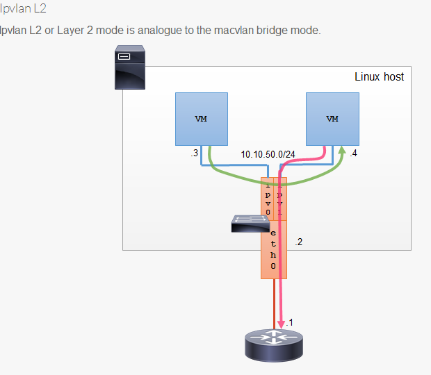

# [docker] macvlan最佳实战

## macvlan和ipvlan的对比

http://hicu.be/macvlan-vs-ipvlan

macvlan


ipvlan



参考:
https://yq.aliyun.com/articles/192998

http://hicu.be/docker-networking-macvlan-bridge-mode-configuration

https://sreeninet.wordpress.com/2016/05/29/docker-macvlan-and-ipvlan-network-plugins/

```
echo 1 > /proc/sys/net/ipv4/ip_forward

- 创建macvlan网络
docker network create -d macvlan \
    --subnet=192.168.14.0/24 \
    --gateway=192.168.14.2 \
    -o parent=eth0 mac_net1

    
docker run -itd --name b1 --ip=192.168.14.11 --network mac_net1 busybox
docker run -itd --name b2 --ip=192.168.14.12 --network mac_net1 busybox

  
- b2 ping b1(外网)是通的
$ docker exec b2 ping 192.168.14.11
PING 192.168.14.11 (192.168.14.11): 56 data bytes
64 bytes from 192.168.14.11: seq=0 ttl=64 time=0.062 ms

- b2 ping 宿主机ip,不通
$ docker exec b2 ping 192.168.14.133
^C


- 未创建新的网桥
[root@n2 ~]# brctl show
bridge name	bridge id		STP enabled	interfaces
docker0		8000.024243c0f3d5	no	

- mac地址和ip均不同
$ docker exec b1 ip a
39: eth0@if2: <BROADCAST,MULTICAST,UP,LOWER_UP,M-DOWN> mtu 1500 qdisc noqueue 
    link/ether 02:42:c0:a8:0e:0b brd ff:ff:ff:ff:ff:ff
    inet 192.168.14.11/24 scope global eth0
       valid_lft forever preferred_lft forever
       
$ docker exec b2 ip a
40: eth0@if2: <BROADCAST,MULTICAST,UP,LOWER_UP,M-DOWN> mtu 1500 qdisc noqueue 
    link/ether 02:42:c0:a8:0e:0c brd ff:ff:ff:ff:ff:ff
    inet 192.168.14.12/24 scope global eth0
       valid_lft forever preferred_lft forever
       
$ ip link show eth0
2: eth0: <BROADCAST,MULTICAST,UP,LOWER_UP> mtu 1500 qdisc pfifo_fast state UP mode DEFAULT qlen 1000
    link/ether 00:50:56:33:13:b6 brd ff:ff:ff:ff:ff:ff
```

访问:
参考: http://hicu.be/docker-networking-macvlan-bridge-mode-configuration


## 总结

容器的 interface 直接与主机的网卡连接，这种方案使得容器无需通过 NAT 和端口映射就能与外网直接通信（只要有网关），在网络上与其他独立主机没有区别。

## 这里有个hairpin mode 模式,对比下bridge

参考: http://cizixs.com/2017/02/14/network-virtualization-macvlan

macvaln的几种模式,一般我们用桥接即可.
https://hicu.be/bridge-vs-macvlan

```
$ brctl add help
never heard of command [add]
Usage: brctl [commands]
commands:
	addbr     	<bridge>		add bridge
	delbr     	<bridge>		delete bridge
	addif     	<bridge> <device>	add interface to bridge
	delif     	<bridge> <device>	delete interface from bridge
	hairpin   	<bridge> <port> {on|off}	turn hairpin on/off
```

bridge


vepa(Virtual Ethernet Port Aggregator) mode： 需要主接口连接的交换机支持 VEPA/802.1Qbg 特性。所有发送出去的报文都会经过交换机，交换机作为再发送到对应的目标地址（即使目标地址就是主机上的其他 macvlan 接口），也就是 hairpin mode 模式，这个模式用在交互机上需要做过滤、统计等功能的场景。


## Macvlan 802.1q Trunk Bridge 模式使用示例

参考: https://yq.aliyun.com/articles/192998


```
docker network  create  -d macvlan \
    --subnet=192.168.14.0/24 \
    --gateway=192.168.14.1 \
    -o parent=eth0.50 macvlan50

docker rm -fv b1 b2
docker run --net=macvlan50 -itd --name b1 busybox
docker run --net=macvlan50 -itd --name b2 busybox


docker network  create  -d macvlan \
    --subnet=192.168.15.0/24 \
    --gateway=192.168.15.1 \
    -o parent=eth0.60 macvlan60
docker rm -fv b3 b4
docker run --net=macvlan60 -itd --name b3 busybox
docker run --net=macvlan60 -itd --name b4 busybox
```

## 多个子网的 Macvlan 802.1q Trunking

```
docker network create -d ipvlan \
    --subnet=192.168.210.0/24 \
    --subnet=192.168.212.0/24 \
    --gateway=192.168.210.254  \
    --gateway=192.168.212.254  \
     -o ipvlan_mode=l2 ipvlan210
     
# 测试 192.168.210.0/24 容器间连接性
docker run --net=ipvlan210 --ip=192.168.210.10 -itd alpine /bin/sh
docker run --net=ipvlan210 --ip=192.168.210.9 -it --rm alpine ping -c 2 192.168.210.10

# 测试 192.168.212.0/24 容器间连接性
docker run --net=ipvlan210 --ip=192.168.212.10 -itd alpine /bin/sh
docker run --net=ipvlan210 --ip=192.168.212.9 -it --rm alpine ping -c 2 192.168.212.10
```

# 创建多个子网网段的macvlan网络

```
docker network  create  -d macvlan \
    --subnet=192.168.216.0/24  \
    --gateway=192.168.216.1  \
    --subnet=192.168.218.0/24 \
    --gateway=192.168.218.1 \
     -o parent=eth0.218 \
     -o macvlan_mode=bridge macvlan216

# 在第一个192.168.216.0/24网段创建一个容器
docker run --net=macvlan216 --name=macnet216_test --ip=192.168.216.10 -itd busybox

# 在第二个192.168.218.0/24网段创建容器
docker run --net=macvlan216 --name=macnet218_test --ip=192.168.218.10 -itd busybox

# 通过192.168.216.0/24的网段的容器Ping 在192.168.216.0/24网段中的第一个容器
docker run --net=macvlan216 --ip=192.168.216.11 -it --rm busybox
ping 192.168.216.10

# 通过192.168.218.0/24的网段的容器Ping 在192.168.218.0/24网段中的第一个容器
docker run --net=macvlan216 --ip=192.168.218.11 -it --rm busybox
ping 192.168.218.10
```