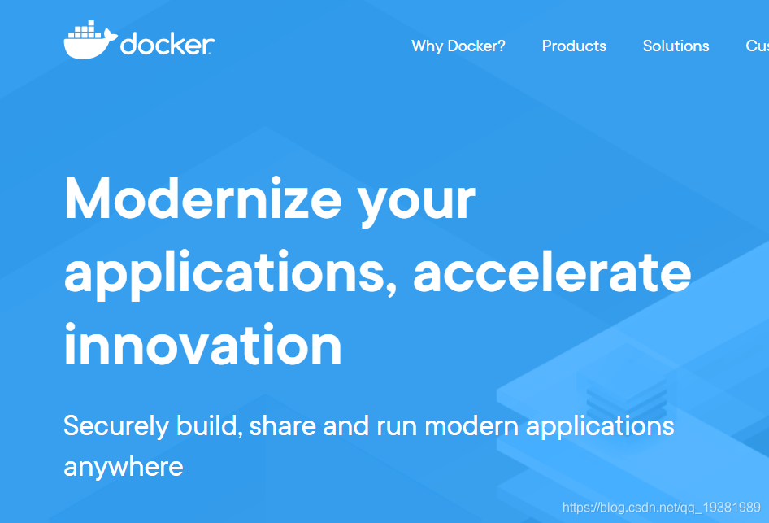

# docker run 的 -i -t -d参数

### docker run 的 -i -t -d

- - [前言](https://blog.csdn.net/qq_19381989/article/details/102781663#_1)
  - [这三个参数(-i, -t, -d)是啥意思](https://blog.csdn.net/qq_19381989/article/details/102781663#i_t_d_6)
  - [该如何组合应用这三个参数](https://blog.csdn.net/qq_19381989/article/details/102781663#_14)
  - [其他参数](https://blog.csdn.net/qq_19381989/article/details/102781663#_43)
  - [关于作者](https://blog.csdn.net/qq_19381989/article/details/102781663#_67)


## 前言


Docker 是一个开源的应用容器引擎，让开发者可以打包他们的应用以及依赖包到一个可移植的镜像中，然后发布到任何流行的 Linux或Windows 机器上，也可以实现虚拟化。

但是每次运行容器的时候都会遇到——“我是执行了docker run可是就是没有启动成功”，这是啥情况呢，一般都是(-i, -t, -d)这三个参数的使用问题，所以下面就详细介绍一下这-i，-t，-d都应用在什么情况下以及又应该怎么组合搭配使用

## 这三个参数(-i, -t, -d)是啥意思

| Options | Mean                                               |
| ------- | -------------------------------------------------- |
| -i      | 以交互模式运行容器，通常与 -t 同时使用；           |
| -t      | 为容器重新分配一个伪输入终端，通常与 -i 同时使用； |
| -d      | 后台运行容器，并返回容器ID；                       |

## 该如何组合应用这三个参数

例如：”我想在后台运行一个镜像“，当我执行下方命令的时候

```bash
docker run -d --name server somebody:dockerfile
1
```

通过docker ps查看是否运行成功，却发现，没有运行成功，这是什么情况呢？？后台运行不就是运用-d参数吗？其实主要原因就是这个镜像可能最后添加了CMD就类似

```bash
CMD ["/bin/bash"]
1
```

意思就是当你在后台运行的时候，这个镜像创建的容器会首先执行/bin/bash，这意味着，当在后台运行（-d）时，shell立即退出。所以除非命令未在前台运行，否则容器会立即停止
解决方法

1. 通过-i或者-t为-d提供一个伪”tty n“

> docker run -i -d images:tags

> docker run -t -d images:tags

> docker run -itd images:tags

1. 将 tail -f /dev/null 添加到命令中
   通过执行此操作，即使主命令在后台运行，容器也不会停止，因为tail会在前台继续运行。

> docker run -d centos tail -f /dev/null

另外一种情况（进入容器）也是如此，Docker官方更是提倡-i 和 -t搭配使用，使其行为类似于shell。

```bash
docker run -i -t <images:tags>
1
```

更多细节在官方文档有提到哦
[分离模式](https://docs.docker.com/engine/reference/run/#detached--d) and in [前台模式 (-t, -i or -it)](https://docs.docker.com/engine/reference/run/#foreground)

## 其他参数

| Options                           | Mean                                                         |
| --------------------------------- | ------------------------------------------------------------ |
| -a stdin                          | 指定标准输入输出内容类型，可选 STDIN/STDOUT/STDERR 三项；    |
| -d                                | 后台运行容器，并返回容器ID；                                 |
| -i                                | 以交互模式运行容器，通常与 -t 同时使用；                     |
| -P                                | 随机端口映射，容器内部端口随机映射到主机的高端口             |
| -p                                | 指定端口映射，格式为：主机(宿主)端口:容器端口                |
| -t                                | 为容器重新分配一个伪输入终端，通常与 -i 同时使用；           |
| –name=“nginx-lb”                  | 为容器指定一个名称；                                         |
| –dns 8.8.8.8                      | 指定容器使用的DNS服务器，默认和宿主一致；                    |
| –dns-search example.com           | 指定容器DNS搜索域名，默认和宿主一致；                        |
| -h “mars”                         | 指定容器的hostname；                                         |
| -e username=“ritchie”             | 设置环境变量；                                               |
| –env-file=[]                      | 从指定文件读入环境变量；                                     |
| –cpuset=“0-2” or --cpuset=“0,1,2” | 绑定容器到指定CPU运行；                                      |
| -m                                | 设置容器使用内存最大值；                                     |
| –net=“bridge”                     | 指定容器的网络连接类型，支持 bridge/host/none/container: 四种类型； |
| –link=[]                          | 添加链接到另一个容器；                                       |
| –expose=[]                        | 开放一个端口或一组端口；                                     |
| –volume , -v                      | 绑定一个卷                                                   |