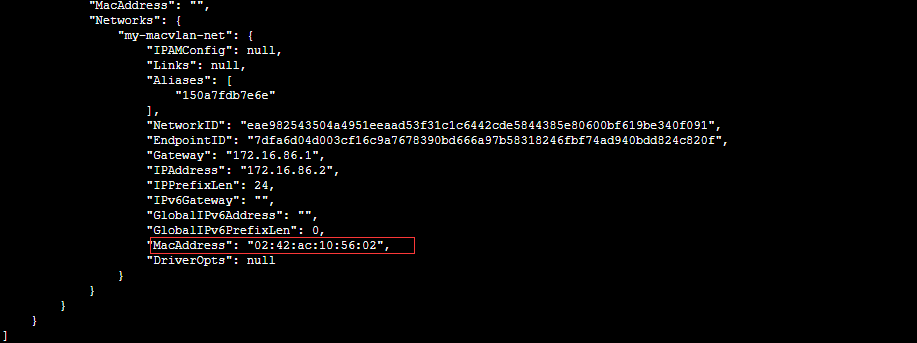

# docker从零开始网络（六）Macvlan

# 使用Macvlan网络

某些应用程序，尤其是遗留应用程序或监视网络流量的应用程序，希望直接连接到物理网络。在这种情况下，您可以使用`macvlan`网络驱动程序为每个容器的虚拟网络接口分配MAC地址，使其看起来像是直接连接到物理网络的物理网络接口。在这种情况下，您需要在Docker主机上指定一个物理接口，用于Macvlan，以及Macvlan的子网和网关。您甚至可以使用不同的物理网络接口隔离Macvlan网络。请记住以下事项：

- 由于IP地址耗尽或“VLAN传播”，很容易无意中损坏您的网络，在这种情况下，您的网络中有大量不同的唯一MAC地址。
- 您的网络设备需要能够处理“混杂模式”，其中一个物理接口可以分配多个MAC地址。
- 如果您的应用程序可以使用桥接器（在单个Docker主机上）或覆盖层（跨多个Docker主机进行通信），那么从长远来看，这些解决方案可能会更好。

## 创建一个macvlan网络

创建Macvlan网络时，它可以处于桥接模式或802.1q干线桥接模式。

- 在桥接模式下，Macvlan流量通过主机上的物理设备。
- 在802.1q中继桥接模式下，流量通过Docker在运行中创建的802.1q子接口。这使您可以在更细粒度的级别上控制路由和筛选。

### 桥接模式

要创建与给定物理网络接口桥接的Macvlan网络，请使用`--driver macvlan`该`docker network create`命令。您还需要指定`parent`，这是流量将在Docker主机上实际通过的接口。 网络名称是pub_net

```
[root@docker11 ~]# docker network create -d macvlan --subnet=172.16.86.0/24 --gateway=172.16.86.1 -o parent=eth0 pub_net
7479d90651e92d8971916e678dceaad5c6deb845b7af30802b028afa022c98d0
```

如果您需要排除在Macvlan网络中使用的IP地址，例如当已使用给定的IP地址时，请使用`--aux-addresses`：

```
$ docker network create -d macvlan  \
  --subnet=192.168.32.0/24  \
  --ip-range=192.168.32.128/25 \
  --gateway=192.168.32.254  \
  --aux-address="my-router=192.168.32.129" \
  -o parent=eth0 macnet32
```

192.168.32.128/25   意思就是地址范围从 192.168.32.128  255.255.255.128  网络名称是macnet32

### 802.1q中继桥接模式

如果指定`parent`包含点的接口名称，例如`eth0.50`，Docker将其解释为子接口`eth0`并自动创建子接口。

```
[root@docker11 ~]# docker network create -d macvlan \ --subnet=192.168.50.0/24 \ --gateway=192.168.50.1 \ -o parent=eth0.50 macvlan50
cd6369cc9f81ca163f1fcd6b7f36db61276f0f750133e0f8812ce56697874cdc
```

### 使用ipvlan而不是macvlan

在上面的示例中，您仍在使用L3网桥。您可以使用`ipvlan` ，然后获得L2桥接。指定`-o ipvlan_mode=l2`。 需要内核版本4.0或以上

```
$ docker network create -d ipvlan \
    --subnet=192.168.210.0/24 \
    --subnet=192.168.212.0/24 \
    --gateway=192.168.210.254  \
    --gateway=192.168.212.254  \
     -o ipvlan_mode=l2 ipvlan210
```

## 使用IPv6

如果已将[Docker守护程序配置为允许IPv6](https://docs.docker.com/config/daemon/ipv6/)，则可以使用双栈IPv4 / IPv6 Macvlan网络。

[root@docker11 ~]# docker network create -d macvlan \
\> --subnet=192.168.216.0/24 --subnet=192.168.218.0/24 \
\> --gateway=192.168.216.1 --gateway=192.168.218.1 \
\> --subnet=2001:db8:abc8::/64 --gateway=2001:db8:abc8::10 \
\> -o parent=eth0.218 \
\> -o macvlan_mode=bridge macvlan216
65a2dc885f5dd2778089ba636a2dc1050331a4f83f2b2ff3f509e6df5b348a3d


 

# 使用macvlan网络进行联网

本系列教程涉及连接到`macvlan`网络的网络独立容器。在这种类型的网络中，Docker主机在其IP地址接受对多个MAC地址的请求，并将这些请求路由到适当的容器。有关其他网络主题，请参阅 [概述](https://docs.docker.com/network/)。

## 目标

这些教程的目标是设置桥接`macvlan`网络并将容器连接到该网络，然后设置802.1q集群`macvlan`网络并为其附加容器。

## 先决条件

- 大多数云提供商阻止`macvlan`网络。您可能需要物理访问您的网络设备。
- 在`macvlan`网络驱动程序仅适用于Linux主机和Windows，或Windows Server dockerEE，不支持Mac的docker，。
- 您至少需要Linux内核版本3.9，建议使用4.0或更高版本。
- 这些示例假设您的以太网接口是`eth0`。如果您的设备具有不同的名称，请改用它。

## bridge的例子

在简单的网桥示例中，您的流量通过`eth0`，Docker使用其MAC地址将流量路由到您的容器。要联网网络上的设备，您的容器似乎已物理连接到网络。

1. 创建一个`macvlan`名为的网络`my-macvlan-net`。将`subnet`,, `gateway`和`parent`值修改为在您的环境中有意义的值。

```
[root@benjamincloud ~]# docker network create -d macvlan \
> --subnet=172.16.86.0/24 \
> --gateway=172.16.86.1 \
> -o parent=eth0 \
> my-macvlan-net
eae982543504a4951eeaad53f31c1c6442cde5844385e80600bf619be340f091
```

您可以使用`docker network ls`和`docker network inspect pub_net` 命令来验证网络是否存在且是否为`macvlan`网络。


 

 2.启动`alpine`容器并将其连接到`my-macvlan-net`网络。该 `-dit`标志在后台启动容器。该`--rm`标志表示容器在停止时被移除

 

```
[root@benjamincloud ~]# docker run --rm -itd --network my-macvlan-net --name my-macvlan-alpine alpine:latest ash
```

 

 


3.检查`my-macvlan-alpine`容器并注意`MacAddress`密钥中的`Networks`密钥：



4.通过运行几个`docker exec`命令，查看容器如何看到自己的网络接口。

```
[root@benjamincloud ~]# docker exec my-macvlan-alpine ip addr show eth0
19: eth0@if2: <BROADCAST,MULTICAST,UP,LOWER_UP,M-DOWN> mtu 1500 qdisc noqueue state UNKNOWN
    link/ether 02:42:ac:10:56:02 brd ff:ff:ff:ff:ff:ff
    inet 172.16.86.2/24 brd 172.16.86.255 scope global eth0
       valid_lft forever preferred_lft forever
[root@benjamincloud ~]# docker exec my-macvlan-alpine ip  route
default via 172.16.86.1 dev eth0
172.16.86.0/24 dev eth0 scope link  src 172.16.86.2
```

5.停止容器（Docker因`--rm`标志而删除它），然后删除网络。


```
[root@benjamincloud ~]# docker network rm my-macvlan-net
my-macvlan-net
```

 

## 802.1q集群桥示例

在802.1q中继网桥示例中，您的流量通过`eth0`（被叫`eth0.10`）子接口流动，Docker使用其MAC地址将流量路由到您的容器。要联网网络上的设备，您的容器似乎已物理连接到网络。

1. 创建一个`macvlan`名为的网络`my-8021q-macvlan-net`。将`subnet`,, `gateway`和`parent`值修改为 在您的环境中有意义的值。

```
[root@benjamincloud ~]# docker network create -d macvlan --subnet 172.16.86.0/24 --gateway 172.16.86.1 -o parent=eth0.10 my-8021q-macvlan-net
0c3d8cfdfc34a00a40317cf0d9d8db32b29a9477cde24e6458c99a1a1592ec65
```


 

 2.启动`alpine`容器并将其连接到`my-8021q-macvlan-net` 网络。该`-dit`标志在后台启动容器，但让你重视它。该`--rm`标志表示容器在停止时被移除。

```
[root@benjamincloud ~]# docker run --rm -itd \
> --network my-8021q-macvlan-net \
> --name my-second-macvlan-alpine \
> alpine:latest \
> ash
6971038a66ebf529072308d9160c7322e85d58c2c52956006f4f3dead502f594
```

3.检查`my-second-macvlan-alpine`容器并注意`MacAddress` 密钥中的`Networks`密钥：

 

4.通过运行几个`docker exec`命令，查看容器如何看到自己的网络接口。


5.停止容器（Docker因`--rm`标志而删除它），然后删除网络。

 

```
[root@benjamincloud ~]# docker stop my-second-macvlan-alpine
my-second-macvlan-alpine
[root@benjamincloud ~]# docker network rm my-8021q-macvlan-net
my-8021q-macvlan-net
```

 

转载于:https://www.cnblogs.com/benjamin77/p/9508033.html