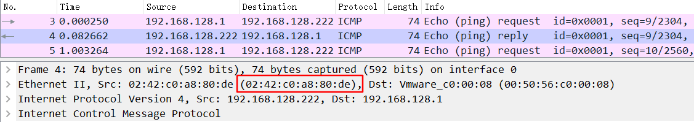
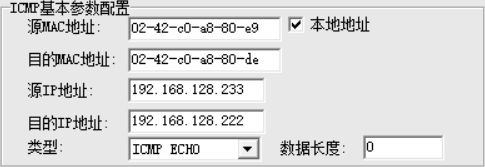
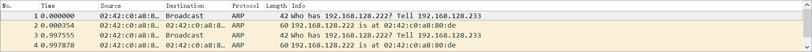
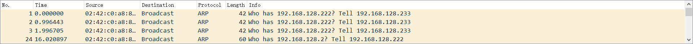

# docker网络之macvlan

macvlan接口类型简单说类似于子接口，但相比子接口来说，macvlan接口拥有自己独立的mac地址，因此使用macvlan接口可以允许更多的二层操作。macvlan有四种模式：*VEPA，bridge，\*Private和\*Passthru***

macvlan接口会监听并接收链路上到达本mac地址的报文，因此macvlan（除bridge外）仅能向外部网络发送报文，并接受目的为本机mac的报文。

```
                                    +---------------+
                                    | network stack |
                                    +---------------+
                                        |  |  |  |
                              +---------+  |  |  +------------------+
                              |            |  +------------------+  |
                              |            +------------------+  |  |
                              |                               |  |  |
                              |            aa  +----------+   |  |  |
                              | eth0     +-----| macvlan0 |---+  |  |
                              |         /      +----------+      |  |
 Wire   +------+       +---------------+   bb  +----------+      |  |
--------| eth0 |------/ if dst mac is /--------| macvlan1 |------+  |
        +------+     +---------------+ \       +----------+         |
                                        \  cc  +----------+         |
                                         +-----| macvlan2 |---------+
                                               +----------+
```

****模拟环境：windows主机上安装vmware centos虚拟机作为host主机，centos上安装docker****

****VEPA模式**：在这种模式下，macvlan设备不能直接接收在同一个物理网卡的其他macvlan设备的数据包，但是其他macvlan设备可以将数据包通过物理网卡发送出去，然后通过hairpin设备返回的给其他macvlan设备，用于管理内部vm直接的流量，并且需要特殊设备支持。**

使用如下命令创建一个容器的vepa模式的macvlan，名称为vepamv,其中192.168.128.0和192.168.128.2分别为docker所在的host主机eth0的网段和网关。

```
docker network create -d macvlan --subnet=192.168.128.0``/24` `--gateway=192.168.128.2 -o parent=eth0 -o macvlan_mode=vepa vepamv
```

使用上述网络运行2个容器

```
docker run -itd --net=vepamv--ip=192.168.128.222 --name=centos1-2 f322035379ab ``/bin/bash

docker run -itd --net=vepamv --ip=192.168.128.233 --name=centos1-3 f322035379ab ``/bin/bash
```

查看网络信息，可以看到驱动类型为macvlan，macvlan模型为vepa，两个网卡有独立的mac地址，底层物理网卡为eth0

```
[root@localhost ~]# docker network inspect evapmv
[
    {
        "Name": "vepamv",
        "Id": "84af6a040cf1e1063c122ed9b80b421ef2896d31100c87bec9cde7a0e8690833",
        "Created": "2018-09-16T22:16:23.938521926+08:00",
        "Scope": "local",
        "Driver": "macvlan",
        "EnableIPv6": false,
        "IPAM": {
            "Driver": "default",
            "Options": {},
            "Config": [
                {
                    "Subnet": "192.168.128.0/24",
                    "Gateway": "192.168.128.2"
                }
            ]
        },
        "Internal": false,
        "Attachable": false,
        "Containers": {
            "49eb565de8f9ec41ba69285c6ced2971a861a104247dc10c257ce3dd7a74d006": {
                "Name": "centos1-3",
                "EndpointID": "adc576f3cfa1c5b6649f3d322ba11487e8ef3eadebeed72eb830f55a8a5768f6",
                "MacAddress": "02:42:c0:a8:80:e9",
                "IPv4Address": "192.168.128.233/24",
                "IPv6Address": ""
            },
            "5f0fe3a769ca17717afea9f1d444b00a4380289b2744d02d5ade260e7e687868": {
                "Name": "centos1-2",
                "EndpointID": "caa0766bb243e43986c1ee435b9d2666c615b92c06964c749d5e93ba7ef8849f",
                "MacAddress": "02:42:c0:a8:80:de",
                "IPv4Address": "192.168.128.222/24",
                "IPv6Address": ""
            }
        },
        "Options": {
            "macvlan_mode": "vepa",
            "parent": "eth0"
        },
        "Labels": {}
    }
]
```

在centos1-2中ping centos1-3发现无法ping通，因为本地环境上并没有开启hairpin模式的交换机或路由器，报文发送到链路上之后无法返回来。即无法在internal内部进行报文传输

```
[root@0dd61dcf26f3 /]# ping 192.168.128.222
PING 192.168.128.222 (192.168.128.222) 56(84) bytes of data.
From 192.168.128.233 icmp_seq=1 Destination Host Unreachable
From 192.168.128.233 icmp_seq=2 Destination Host Unreachable
```

但在external network的机器（192.168.128.1）是可以直接访问该容器的（首先该容器的IP属于external network）

```
D:/> ping 192.168.128.222
PING 192.168.128.222 (192.168.128.222) 56(84) bytes of data.
64 bytes from 192.168.128.222: icmp_seq=1 ttl=64 time=0.080 ms
64 bytes from 192.168.128.222: icmp_seq=1 ttl=64 time=0.080 ms
```

抓包如下，可以看到centos1-2的源mac地址与上述的mac地址是一致的。

 

使用IPOP构包模拟hairpin的交换机，模拟从192.168.128.233 发送arp请求192.168.128.222，报文如下：



使用抓包工具可以看到192.168.128.222回复了来自192.168.128.223的arp请求



 

**private模式：**该模式类似于VEPA，但在VEPA基础上添加了新的特性，即如果两个macvlan在同一个网卡上，这两个macvlan接口无法通信，即使使用启用hairpin的交换机或路由器。仍然使用上述条件构造从192.168.128.222到192.168.128.233的arp请求报文，可以看到192.168.128.222并没有回复192.168.128.233的arp请求。但是从windows机器直接ping 192.168.128.222是可以ping通的。private模式下隔离了来自同网卡的macvlan的广播报文。



 

**passthru模式：**该模式仅允许一块网卡上面部署一个macvlan接口，其他使用macvlan的容器将启动失败，但只要不使用macvlan，该容器还是可以正常启动。如果需要在单个物理网卡上启动多个macvlan_mode=passthru的容器，可以使用子接口方式，参见 https://blog.csdn.net/daye5465/article/details/77412619。

```
[root@localhost home]# docker run -itd --net=passmv f322 /bin/bash
17b0f2c446671f716bcf136e9c9d8c781ec84901c87e1d4ae0a20aa98e5fb710
/usr/bin/docker-current: Error response from daemon: failed to create the macvlan port: invalid argument.
[root@localhost home]# docker run -itd f322 /bin/bash
6aac5b6a284b1d5c2294936d7943007947a602fc7cdcc133c32b5e861ed17865
```

　

**bridge 模式（docker默认模式）****：**在这种模式下，寄生在同一个物理设备的macvlan设备可以直接通讯，不需要外接的hairpin设备帮助，使用如下的命令创建一个bridge的macvlan网络

```
docker network create -d macvlan --subnet=192.168.226.0/24 --gateway=192.168.226.2 -o parent=eth0 -o macvlan_mode=bridge bridmv
```

使用bridge可以保证在不使用hairpin设备的前提下实现inter-network和external-network的连通，查看docker的bridge信息如下

```
[root@localhost netns]# docker network inspect bridmv
[
    {
        "Name": "bridmv",
        "Id": "b2920c8721701d47ac891aa8528d95f60e6a71a1a7485d0e2f21bae30f8604bf",
        "Created": "2018-09-18T09:16:34.549499448+08:00",
        "Scope": "local",
        "Driver": "macvlan",
        "EnableIPv6": false,
        "IPAM": {
            "Driver": "default",
            "Options": {},
            "Config": [
                {
                    "Subnet": "192.168.226.0/24",
                    "Gateway": "192.168.226.2"
                }
            ]
        },
        "Internal": false,
        "Attachable": false,
        "Containers": {
            "031e1de7ed2cf13c25083e98d9cee131ea00a466fd169a0531c70818a25c7a7f": {
                "Name": "centos2",
                "EndpointID": "b95efe7ddb8d2c4ce9228c06f019601c18daedbf7fc79462939efba128e84936",
                "MacAddress": "02:42:c0:a8:80:e9",
                "IPv4Address": "192.168.128.233/24",
                "IPv6Address": ""
            },
            "8e23e7011f7cbc0962ba975974ae313dd4dab10a4114775b689ba70ae88dac72": {
                "Name": "centos1",
                "EndpointID": "d2fb36b842f89128e3a862fc70624d4946b703bf0bb921fd11839d7f775fa8e0",
                "MacAddress": "02:42:c0:a8:80:de",
                "IPv4Address": "192.168.128.222/24",
                "IPv6Address": ""
            }
        },
        "Options": {
            "macvlan_mode": "bridge",
            "parent": "eth0"
        },
        "Labels": {}
    }
]
```

查看/var/run/docker/netns，有2个ns，这两个就是192.168.128.222和192.168.128.233的容器网络空间

```
[root@localhost netns]# ll /var/run/docker/netns/
total 0
-r--r--r--. 1 root root 0 Sep 18 09:18 59b305d0d01e
-r--r--r--. 1 root root 0 Sep 18 09:18 a41362fa7ed2
```

macvlan的bridge无法使用brctl show获得相关信息。查看容器网卡信息如下，可以看到Ip地址是与两个容器对应的，在容器的eth后面有一个@if2，表示有一个接口与该接口对应，根据macvlan的原理，该接口为macvlan所在的host主机的eth0接口

```
[root@localhost netns]# ip netns exec 59b305d0d01e ip a
1: lo: <LOOPBACK,UP,LOWER_UP> mtu 65536 qdisc noqueue state UNKNOWN group default qlen 1000
    link/loopback 00:00:00:00:00:00 brd 00:00:00:00:00:00
    inet 127.0.0.1/8 scope host lo
       valid_lft forever preferred_lft forever
    inet6 ::1/128 scope host
       valid_lft forever preferred_lft forever
18: eth0@if2: <BROADCAST,MULTICAST,UP,LOWER_UP> mtu 1500 qdisc noqueue state UNKNOWN group default
    link/ether 02:42:c0:a8:80:e9 brd ff:ff:ff:ff:ff:ff link-netnsid 0
    inet 192.168.226.233/24 scope global eth0
       valid_lft forever preferred_lft forever
    inet6 fe80::42:c0ff:fea8:e2e9/64 scope link
       valid_lft forever preferred_lft forever
[root@localhost netns]# ip netns exec a41362fa7ed2 ip a
1: lo: <LOOPBACK,UP,LOWER_UP> mtu 65536 qdisc noqueue state UNKNOWN group default qlen 1000
    link/loopback 00:00:00:00:00:00 brd 00:00:00:00:00:00
    inet 127.0.0.1/8 scope host lo
       valid_lft forever preferred_lft forever
    inet6 ::1/128 scope host
       valid_lft forever preferred_lft forever
19: eth0@if2: <BROADCAST,MULTICAST,UP,LOWER_UP> mtu 1500 qdisc noqueue state UNKNOWN group default
    link/ether 02:42:c0:a8:80:de brd ff:ff:ff:ff:ff:ff link-netnsid 0
    inet 192.168.226.222/24 scope global eth0
       valid_lft forever preferred_lft forever
    inet6 fe80::42:c0ff:fea8:e2de/64 scope link
       valid_lft forever preferred_lft forever
```

在host主机上查看，网卡序号为2的正是macvlan接口所在的网卡eth0，即使用host的eth0作为了bridge(--parent指定)

[](javascript:void(0);)

```
[root@localhost netns]# ip link
1: lo: <LOOPBACK,UP,LOWER_UP> mtu 65536 qdisc noqueue state UNKNOWN mode DEFAULT group default qlen 1000
    link/loopback 00:00:00:00:00:00 brd 00:00:00:00:00:00
2: eth0: <BROADCAST,MULTICAST,UP,LOWER_UP> mtu 1500 qdisc pfifo_fast state UP mode DEFAULT group default qlen 1000
    link/ether 00:0c:29:f1:38:bf brd ff:ff:ff:ff:ff:ff
3: virbr0: <NO-CARRIER,BROADCAST,MULTICAST,UP> mtu 1500 qdisc noqueue state DOWN mode DEFAULT group default qlen 1000
    link/ether 52:54:00:51:d1:17 brd ff:ff:ff:ff:ff:ff
4: virbr0-nic: <BROADCAST,MULTICAST> mtu 1500 qdisc pfifo_fast master virbr0 state DOWN mode DEFAULT group default qlen 1000
    link/ether 52:54:00:51:d1:17 brd ff:ff:ff:ff:ff:ff
5: docker0: <NO-CARRIER,BROADCAST,MULTICAST,UP> mtu 1500 qdisc noqueue state DOWN mode DEFAULT group default 
    link/ether 02:42:71:8b:5a:6e brd ff:ff:ff:ff:ff:ff
```

[](javascript:void(0);)

相比与docker 的bridge，macvlan类型的bridge下，只要多个容器在同一个子网IP范围内就可以通信，而无需在同一个bridge下，也即macvlan模拟真实物理网卡的功能。macvlan同bridge一样，都是linux原生支持的，可以手动实现自己的macvlan通信，具体配置操作参见：[linux 网络虚拟化：macvlan](https://cizixs.com/2017/02/14/network-virtualization-macvlan/)

 

总结：通过以上示例可以看出，macvlan类型的接口可以当作正常的host接口使用，如果要组建跨网络访问，则需要路由器或交换机的支持，如hairpin，以及路由等。

参考：

https://blog.csdn.net/daye5465/article/details/77412619

https://blog.csdn.net/dog250/article/details/45788279

https://backreference.org/2014/03/20/some-notes-on-macvlanmacvtap/

https://superuser.com/questions/1205346/macvtap-interface-created-on-top-of-macvlan-interface-of-a-docker-container-cann

https://docs.docker.com/network/macvlan/#8021q-trunk-bridge-mode

https://docs.docker.com/v17.09/engine/userguide/networking/get-started-macvlan/#macvlan-bridge-mode-example-usage

https://hicu.be/bridge-vs-macvlan