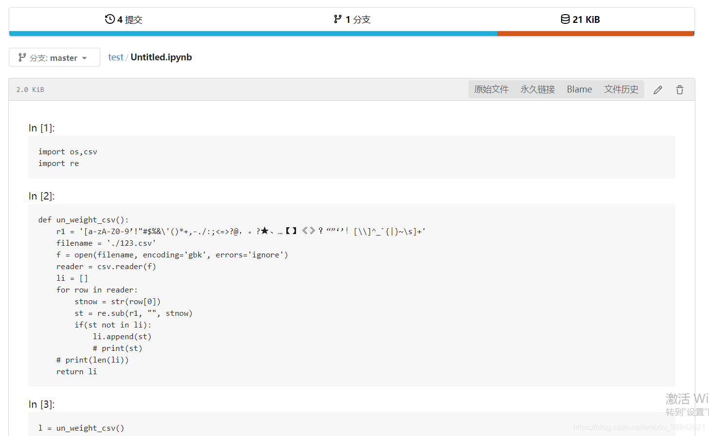
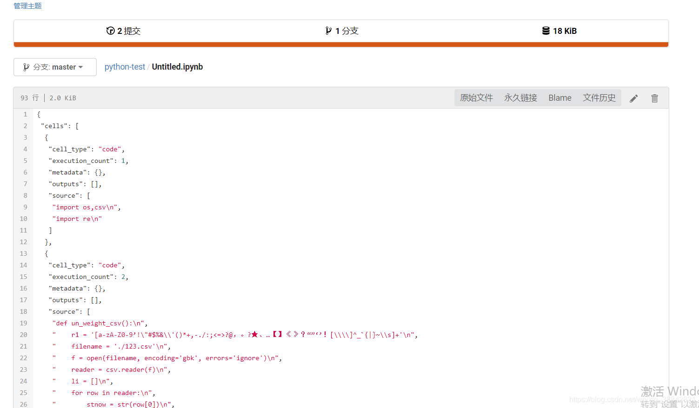

## gitea学习+部署笔记

https://blog.csdn.net/weixin_38842821/article/details/107573800


### gitea使用心得

- [gitea部署](https://blog.csdn.net/weixin_38842821/article/details/107573800#gitea_1)
- - [docker 安装gitea](https://blog.csdn.net/weixin_38842821/article/details/107573800#docker_gitea_2)
  - [基于docker进行修改](https://blog.csdn.net/weixin_38842821/article/details/107573800#docker_23)
  - [docker compose](https://blog.csdn.net/weixin_38842821/article/details/107573800#docker_compose_103)
- [添加jupyter支持](https://blog.csdn.net/weixin_38842821/article/details/107573800#jupyter_171)
- - [修改后效果图：](https://blog.csdn.net/weixin_38842821/article/details/107573800#_173)
  - [未修改的效果图：](https://blog.csdn.net/weixin_38842821/article/details/107573800#_175)
  - [修改流程](https://blog.csdn.net/weixin_38842821/article/details/107573800#_178)
- [密码规范化修改](https://blog.csdn.net/weixin_38842821/article/details/107573800#_204)

# gitea部署

## docker 安装gitea

gitea整体部署在服务器上，比较麻烦，官方提供了现成的docker镜像，直接使用就可以了。
简单分为三步(参考[gitea官方文档](https://docs.gitea.io/zh-cn/install-with-docker/)）

1. pull镜像（相当于基础镜像）：

   ```
   docker pull gitea/gitea:latest
   ```

2. 如果要将git和其它数据持久化，你需要创建一个目录来作为数据存储的地方；
    然后就可以运行 docker 容器了，这很简单。 当然你需要定义端口数数据目录：

  ```
  sudo mkdir -p /var/lib/gitea
  docker run -d --name=gitea -p 10022:22 -p 10080:3000 -v /var/lib/gitea:/data gitea/gitea:latest
  ```

3. 容器已经运行成功，在浏览器中访问 http://hostname:10080 就可以看到界面了。你可以尝试在上面创建项目，clone操作

   ```
   git clone ssh://git@hostname:10022/username/repo.git.
   ```

注意：目前端口改为非3000时，需要修改配置文件 LOCAL_ROOT_URL = http://localhost:3000/。

## 基于docker进行修改

因为在Dockerfile中：

```
###################################
#Build stage
FROM golang:1.14-alpine3.12 AS build-env

ARG GOPROXY
ENV GOPROXY ${GOPROXY:-direct}

ARG GITEA_VERSION
ARG TAGS="sqlite sqlite_unlock_notify"
ENV TAGS "bindata $TAGS"
ARG CGO_EXTRA_CFLAGS

#Build deps
RUN apk --no-cache add build-base git nodejs npm

#Setup repo
COPY . ${GOPATH}/src/code.gitea.io/gitea
WORKDIR ${GOPATH}/src/code.gitea.io/gitea

#Checkout version if set
RUN if [ -n "${GITEA_VERSION}" ]; then git checkout "${GITEA_VERSION}"; fi \
 && make clean-all build

FROM alpine:3.12
LABEL maintainer="maintainers@gitea.io"

EXPOSE 22 3000

RUN apk --no-cache add \
    bash \
    ca-certificates \
    curl \
    gettext \
    git \
    linux-pam \
    openssh \
    s6 \
    sqlite \
    su-exec \
    tzdata \
    gnupg

RUN addgroup \
    -S -g 1000 \
    git && \
  adduser \
    -S -H -D \
    -h /data/git \
    -s /bin/bash \
    -u 1000 \
    -G git \
    git && \
  echo "git:$(dd if=/dev/urandom bs=24 count=1 status=none | base64)" | chpasswd

ENV USER git
ENV GITEA_CUSTOM /data/gitea

VOLUME ["/data"]

ENTRYPOINT ["/usr/bin/entrypoint"]
CMD ["/bin/s6-svscan", "/etc/s6"]

COPY docker/root /
COPY --from=build-env /go/src/code.gitea.io/gitea/gitea /app/gitea/gitea
RUN ln -s /app/gitea/gitea /usr/local/bin/gitea
```

```
COPY . ${GOPATH}/src/code.gitea.io/gitea
WORKDIR ${GOPATH}/src/code.gitea.io/gitea
```

其中这两句话表明了将当前工作目录中所有文件都复制进docker镜像内gitea目录中去，然后设定其为docker工作目录。

有些云服务器公司，采用的高效便捷开发模式就是，代码放在宿主机上（就是外面），然后用dockerfile映射进去，保证docker内是独立于外界并且可以做到实时更新的。

通过上述模式，我就在想能不能利用这种方法进行开发，既能减少docker的部署流程，还能保证环境的独立性。

## docker compose

1. dockerfile: 构建镜像；
2. docker run: 启动容器；
3. docker-compose: 启动服务；


docker-compose与Dockerfile的区别在于：dockerfile只能启动一个镜像，有时一个服务需要多个镜像合作才能完成，这时候就需要docker-compose来组织协调这些镜像一起工作了。
例如wordpress，单个dockerfile的确可以搭建起来，但是需要其他镜像的时候，前端要有 nginx，数据库 mysql, 邮件服务等等，当然你可以把所有这些都弄到一个镜像里去，但这样做就无法复用了。

更常见的是, nginx, mysql, smtp 都分别是个镜像，然后这些镜像合作，共同服务一个项目。
docker-compose 就是解决这个问题的。你的项目需要哪些镜像，每个镜像怎么配置，要挂载哪些 volume, 等等信息都包含在 docker-compose.yml 里。
要启动服务，只需要 docker-compose up 就行，停止也只需要 docker-compse stop/down。相比如docker来说简单很多。
个人感觉就类似与微服务了，各个镜像独立开来为一个项目服务；然后各自独立开发，不会影响到其他镜像。

docker-compose是编排容器的。

例如，你有一个php镜像，一个mysql镜像，一个nginx镜像。

如果没有docker-compose，那么每次启动的时候，你需要敲各个容器的启动参数，环境变量，容器命名，指定不同容器的链接参数等等一系列的操作，相当繁琐。而用了docker-composer之后，你就可以把这些命令一次性写在docker-composer.yml文件中，以后每次启动这一整个环境（含3个容器）的时候，你只要敲一个docker-composer up命令就ok了。


[docker-compose 语法说明](https://www.cnblogs.com/freefei/p/5311294.html)
若要使用docker-compose，需要把之前的docker服务停掉。
vi docker-compose.yml

```
version: "2"

networks:
 gitea:
   external: false

services:
 server:
   image: gitea/gitea:latest
   environment:
    - USER_UID=1000
    - USER_GID=1000
   restart: always
   networks:
    - gitea
   volumes:
    - ./gitea:/data
   ports:
    - "3000:3000"
    - "222:22"
   depends_on:
    - db

 db:
   image: mysql:5.7
   restart: always
   environment:
    - MYSQL_ROOT_PASSWORD=gitea
    - MYSQL_USER=gitea
    - MYSQL_PASSWORD=gitea
    - MYSQL_DATABASE=gitea
   networks:
    - gitea
   volumes:
    - ./mysql:/var/lib/mysql
 # 文章作者: Ciwei
 # 文章链接: https://ciweigg2.github.io/2018/08/15/docker-an-zhuang-gitea/
 # 版权声明: 本博客所有文章除特別声明外，均采用 CC BY 4.0 许可协议。转载请注明来源 Ciwei !
```

然后运行docker-compose.yml文件

```
docker-compose up -d
# -d的意思就是后台运行
```

# 添加jupyter支持

这一块的效果和最初理解的不太一样，最终效果就是ipynd类型的代码浏览的时候，可以转化成jupyter notebook风格。

### 修改后效果图：



### 未修改的效果图：



## 修改流程

进入docker内部，用二进制安装的不需要此步骤

```
docker exec -it your_images_id /bin/bash

sed -i 's/dl-cdn.alpinelinux.org/mirrors.aliyun.com/g' /etc/apk/repositories
# 换源，加快apk速度，不然贼慢
apk add --no-cache curl jq python3 py3-pip
apk --no-cache add asciidoctor freetype freetype-dev gcc g++ libpng python-dev py-pip python3-dev py3-pip py3-pyzmq
# 如果遇到报错就一个个装
pip3 install --upgrade pip
pip3 install -U setuptools
pip3 install jupyter matplotlib docutils 
# 可以加上清华源 -i https://pypi.tuna.tsinghua.edu.cn/simple
```

安装完成测试下jupyter
之后编辑app.ini文件，末尾添加上

```
[markup.jupyter]
ENABLED = true
FILE_EXTENSIONS = .ipynb
RENDER_COMMAND = "jupyter nbconvert --stdout --to html --template basic "
IS_INPUT_FILE = true
```

然后ctrl + p + q挂起docker，然后docker restart your_image_id即可

## 密码规范化修改

gitea默认账户注册的时候密码是要由 至少一个大写字母 + 至少一个小写字母 + 至少一个数字 + 至少一个特殊符号组成的。国外已经有学者提出这样的设计是不符合密码设计原则的，会增加破解的可能性。
对于用户来说这也是一个很不友好的设计，到时候修改/忘记密码的可能性很大。因此修改为 至少一个小写字母+至少一个数字 这两部分组成，修改方式为

```
vim xxx/app.ini
```

修改如下[security]部分代码，添加上

```
PASSWORD_COMPLEXITY = lower,digit
```

重启docker