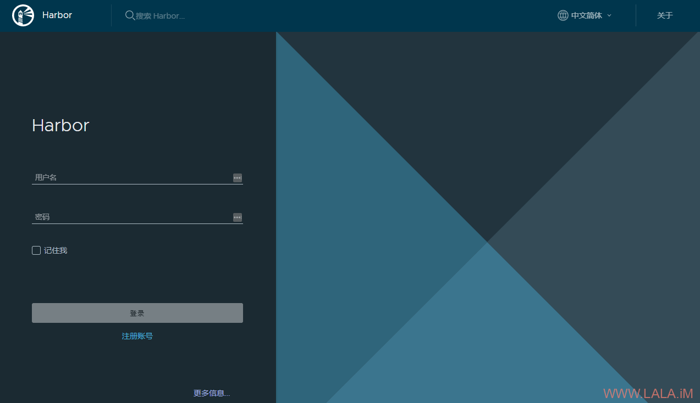
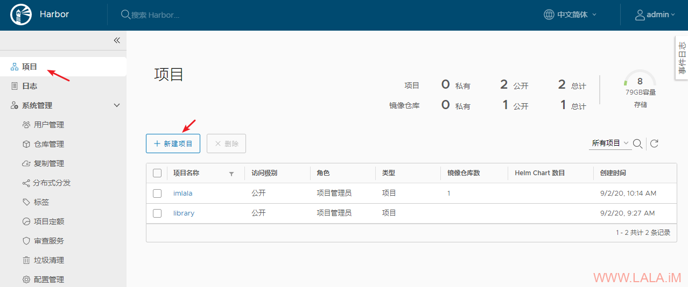
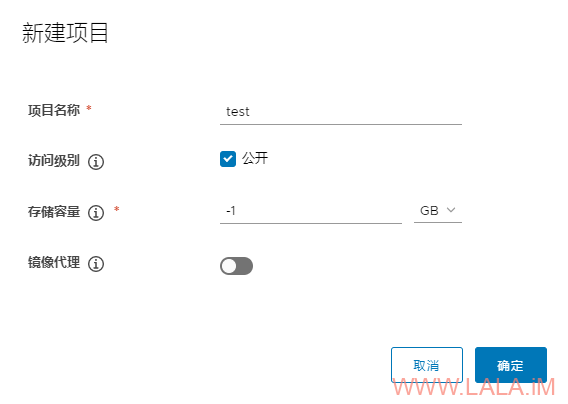
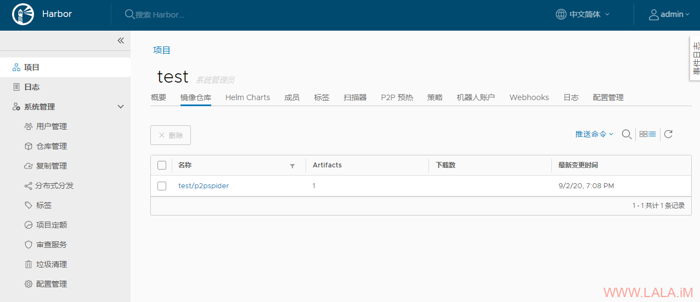
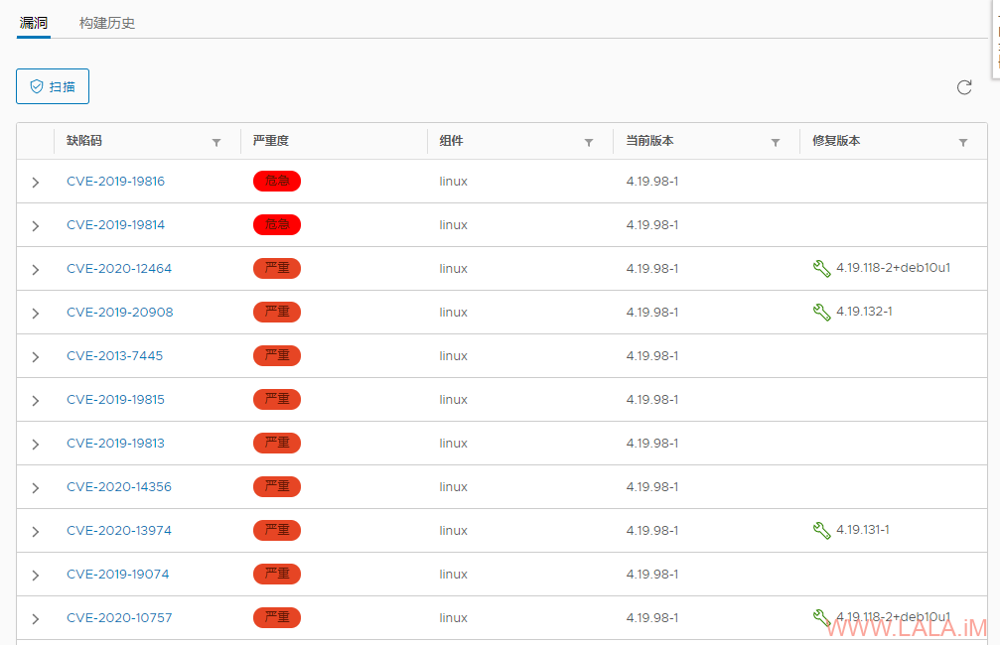

## 使用Harbor搭建Docker镜像仓库

https://lala.im/7371.html


前段时间docker更新了他们的镜像仓库服务条款，简单点说就是不再为你永久保存镜像了，具体的可以看这里：

https://www.docker.com/pricing/resource-consumption-updates

然后我想应该有自建镜像仓库的工具吧，果然Google一下就发现了一个非常不错的替代品：Harbor

这里我就在Debian10上搭建一个玩玩，有几个前提条件还是要提前说一下：

1.机器配置至少要2H4G40GDISK。

2.端口需要用到80/443/4443，不能有其他程序占用这些端口，如果有防火墙记得放行。

3.Docker引擎版本17.06.0以上，Docker Compose版本1.18.0以上，低于这个版本号的不支持。

安装docker和docker-compose：

```
apt -y update
apt -y install curl
curl -sSL https://get.docker.com/ | sh
systemctl start docker
systemctl enable docker
curl -L https://github.com/docker/compose/releases/download/1.26.2/docker-compose-`uname -s`-`uname -m` -o /usr/local/bin/docker-compose
chmod +x /usr/local/bin/docker-compose
```

这里我需要给harbor配置ssl，所以安装一个certbot：

```
apt -y install certbot
```

直接用certonly模式去签一个证书：

```
certbot certonly --standalone -d reg.imlala.best
```

签发好的证书路径：

```
/etc/letsencrypt/live/reg.imlala.best/fullchain.pem
/etc/letsencrypt/live/reg.imlala.best/privkey.pem
```

下载harbor的离线安装包/解压/进入到harbor的目录：

```
cd /opt
wget https://github.com/goharbor/harbor/releases/download/v2.1.0-rc1/harbor-offline-installer-v2.1.0-rc1.tgz
tar xvf harbor-offline-installer-v2.1.0-rc1.tgz
cd harbor
```

复制一份配置文件：

```
cp harbor.yml.tmpl harbor.yml
```

编辑配置文件：

```
nano harbor.yml
```

需要改动的地方如下：

```
# 换成你的域名
hostname: reg.imlala.best

http:
  port: 80

https:
  port: 443
# 换成你刚才生成的证书
  certificate: /etc/letsencrypt/live/reg.imlala.best/fullchain.pem
  private_key: /etc/letsencrypt/live/reg.imlala.best/privkey.pem

# 设置你的管理员密码
harbor_admin_password: password

database:
# 设置你的数据库密码
  password: password

# 数据存储路径
data_volume: /data
```

修改好配置后，就可以使用下面的jio本开始安装了：

```
./install.sh --with-notary --with-clair --with-chartmuseum
```

现在访问你的域名，如果正常的话应该可以看到如下登录界面：

[](https://lala.im/wp-content/uploads/2020/09/lala.im_2020-09-02_17-05-27.png)

这里先简单说一下如何管理harbor：

```
cd /opt/harbor
docker-compose stop # 停止harbor
docker-compose start # 启动harbor
```

如果要修改harbor的配置，先删除harbor所有的容器：

```
docker-compose down -v
```

修改你的配置：

```
nano harbor.yml
```

修改完成之后执行下面的命令使其生效：

```
./prepare
```

prepare还可以用来管理notary/clair/chartmuseum。

例如我之前的配置是安装了clair，那这时候我想把clair给关了就可以执行下面的命令来实现：

```
./prepare --with-notary --with-chartmuseum
```

重新创建并启动harbor：

```
docker-compose up -d
```

下面简单介绍一下harbor的使用方法。

首先新建一个项目，这里的项目就相当于是一个镜像存储库：

[](https://lala.im/wp-content/uploads/2020/09/lala.im_2020-09-02_17-14-46.png)

可以设置这个存储库是公开还是私有：

[](https://lala.im/wp-content/uploads/2020/09/lala.im_2020-09-02_17-15-53.png)

现在我们就可以在另外一台机器内登录harbor：

```
docker login reg.imlala.best
```

给镜像打一个tag：

```
docker tag imlala/p2pspider:latest reg.imlala.best/test/p2pspider:latest
```

然后就可以push到我们的镜像仓库了：

```
docker push reg.imlala.best/test/p2pspider:latest
```

在harbor上也可以看到我们push过来的镜像：

[](https://lala.im/wp-content/uploads/2020/09/lala.im_2020-09-02_19-10-26.png)

harbor可以使用clair来分析镜像内的漏洞，这是一个很不错的功能：

[](https://lala.im/wp-content/uploads/2020/09/lala.im_2020-09-02_19-14-04.png)