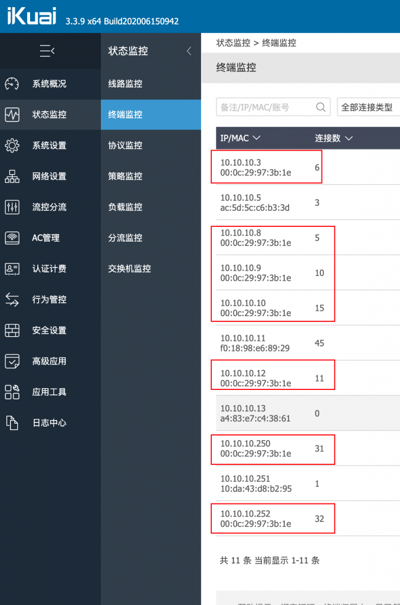
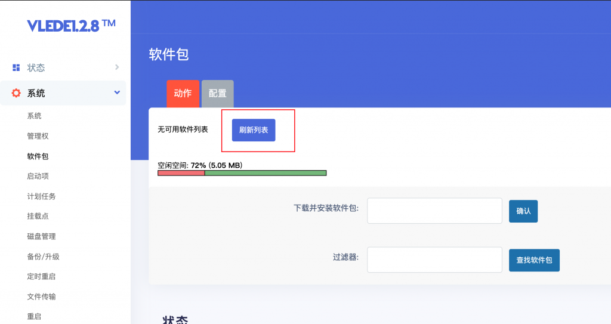
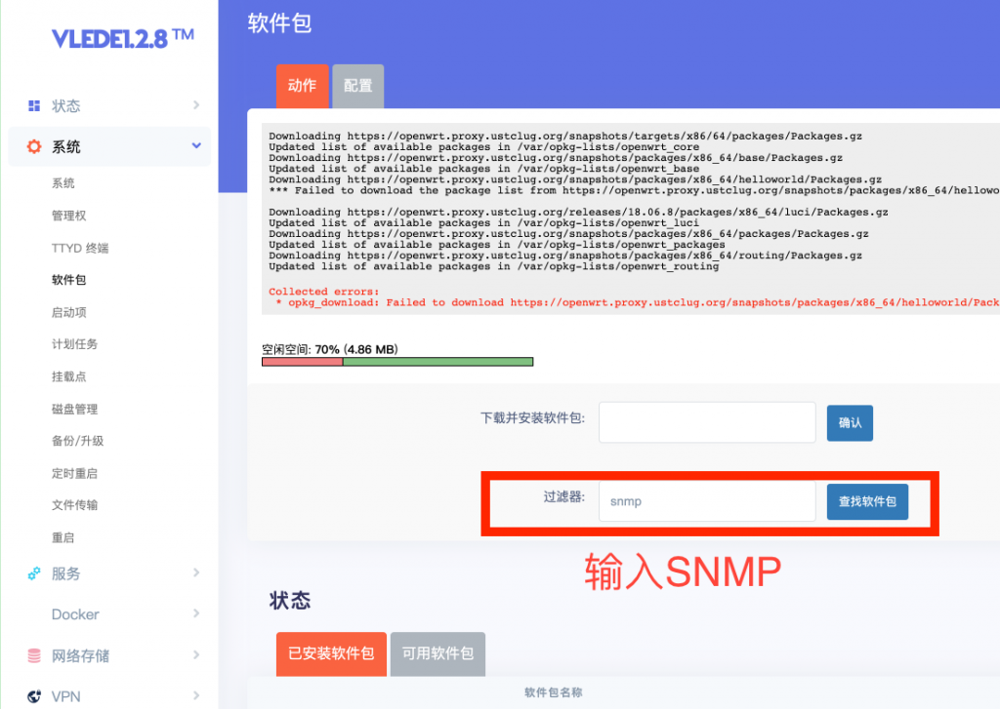
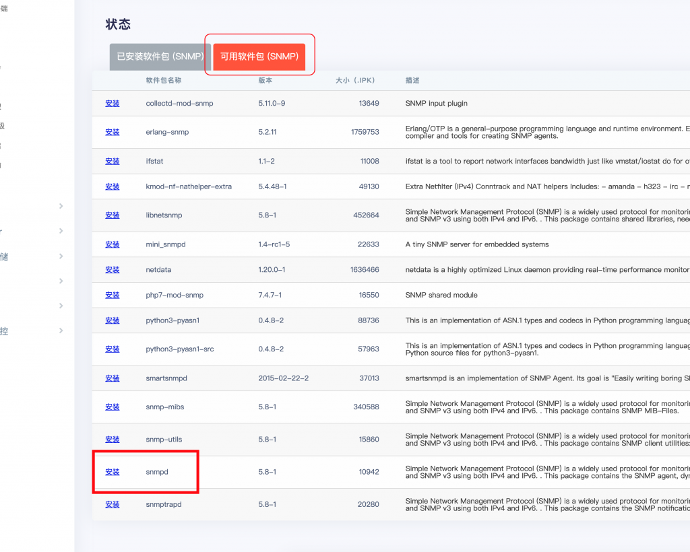
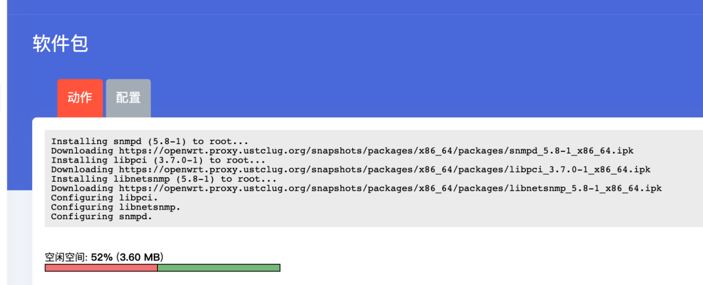
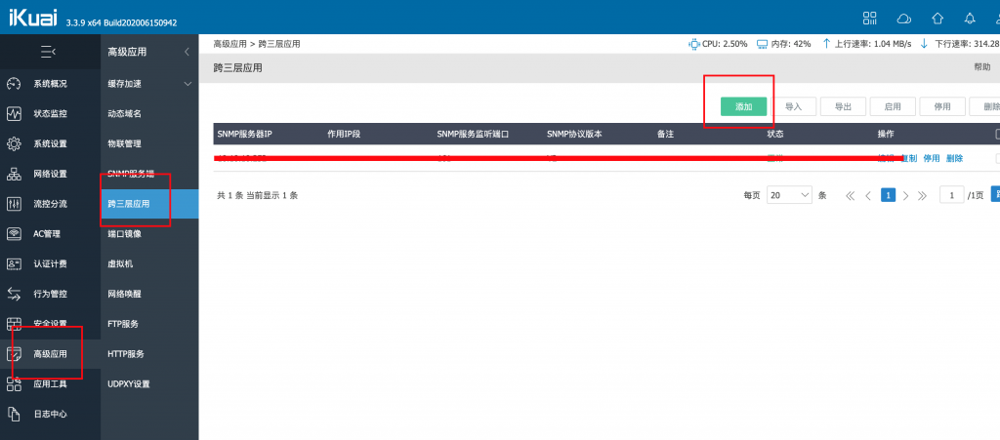
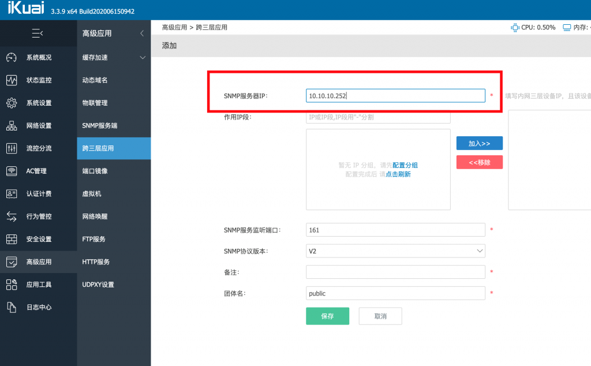
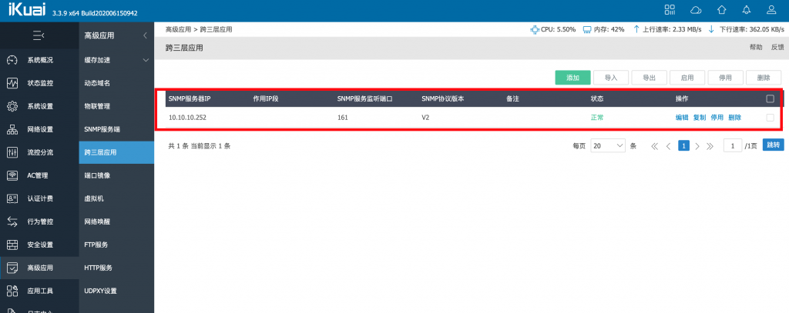
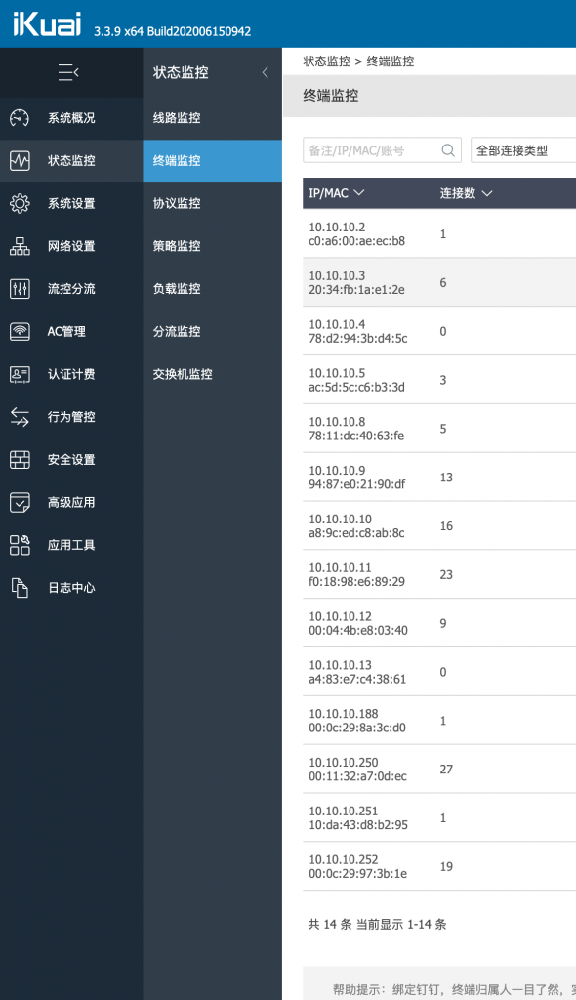
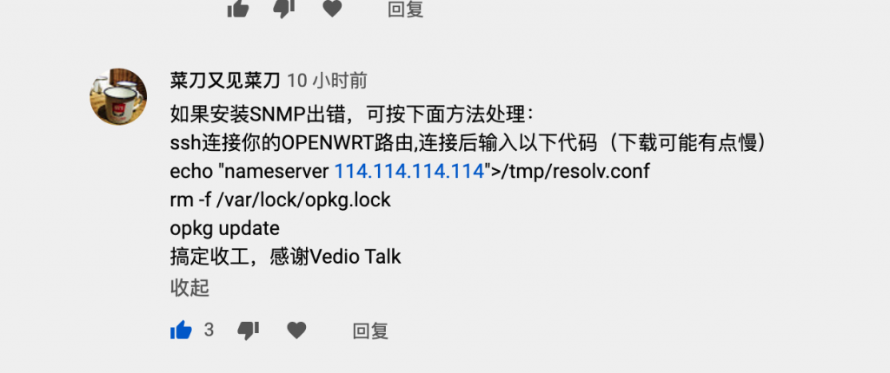

# 修复在爱快+OpenWrt（LEDE）双软路由下显示MAC地址重复的问题

## 这年头比较流行用一台机器做个All In One，所以用爱快+OpenWrt（LEDE）跑双软路由的人非常多，但是经常会遇到一个问题，就是爱快的终端监控上显示有很多相同的MAC地址；

[](https://wp.qiniu.gxnas.com/wp-content/uploads/2020/06/f01a9c969da0b48052820124f2ad0620.png)

## 解决的方法如下：

## 一、进入openwrt后台，系统 – 软件包-刷新列表

[](https://wp.qiniu.gxnas.com/wp-content/uploads/2020/06/0fb9865f6f44da2d5e02b59bb8a11fa3.png)

## 

## 二、在过滤器里面搜索SNMP

[](https://wp.qiniu.gxnas.com/wp-content/uploads/2020/06/88022bc2f4f74ebdb05829f2f9d4ec3b.png)

在可用安装包里面安装SNMP

[](https://wp.qiniu.gxnas.com/wp-content/uploads/2020/06/7972f1c7f04a27c9307fb38f33610e4a.png)

[](https://wp.qiniu.gxnas.com/wp-content/uploads/2020/06/07e11ee6aa2f70c7c411e610882a08ee.png)

## 

## 三、安装好后回到爱快配置 高级应用-第三层应用，添加一条

[](https://wp.qiniu.gxnas.com/wp-content/uploads/2020/06/147cd913a0f0ec8227d35424deb00101.png)

里面就填入你openwrt的后台地址即可，其他就不用填其他的

[](https://wp.qiniu.gxnas.com/wp-content/uploads/2020/06/ce9847db462550f683db44995bfe5391.png)

[](https://wp.qiniu.gxnas.com/wp-content/uploads/2020/06/0d9efdea2e4c7616b0b8d961ba3d801b.png)

## 

## 四、现在回到爱快监控里面看，MAC地址已经显示正确了且不重复了

[](https://wp.qiniu.gxnas.com/wp-content/uploads/2020/06/ddea943ac24c32962e568853bade943e.png)

------

如果安装SNMP出错，可按下面方法处理：
ssh连接你的OPENWRT路由,连接后输入以下代码（下载可能有点慢）

```
echo "nameserver 114.114.114.114">/tmp/resolv.conf
rm -f /var/lock/opkg.lock
opkg update
```

安装SNMP出错方法有youtube上的[菜刀又见菜刀](https://www.youtube.com/channel/UCKaNtm4kLis3ci7ujuXciaw)提供

[](https://wp.qiniu.gxnas.com/wp-content/uploads/2020/06/d1a072c5062dd9f14fd1a7f5a1770abe.png)

 

------

原文地址：https://www.vediotalk.com/archives/18310