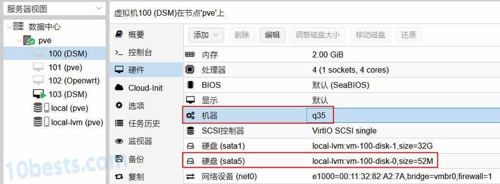
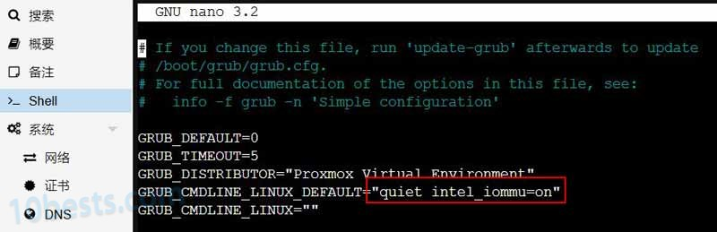
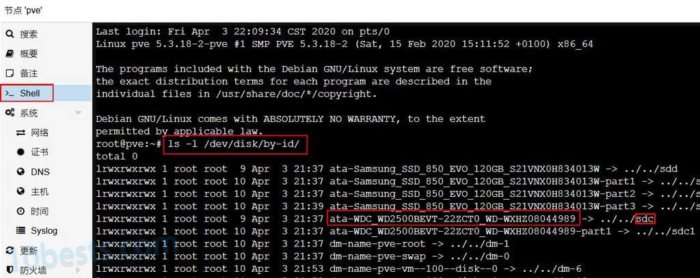

# 在Promox VE（PVE）虚拟机安装黑群晖并开启硬盘休眠的方法

Promox VE(PVE)虚拟环境安装虚拟黑群晖，也能实现像EXSi直通SATA控制器那样实现硬盘休眠，而且硬盘管理比EXSi要灵活。PVE虚拟黑群晖硬盘休眠的关键也是隐藏引导磁盘和SATA控制器直通，本文将详细介绍PVE虚拟机安装黑裙并开启硬盘休眠的详细步骤。


 

**先上结论：**上图一共5块硬盘和虚拟硬盘，分别在PVE虚拟环境下通过以下5种方式添加给黑裙，而且都能一起实现休眠：

- 直通SATA控制器（包括eSATA）
- 映射的单个硬盘（包括eSATA）
- 直接添加虚拟磁盘
- 直通USB控制器
- 直通单个USB硬盘

其中最惊喜的是在完全隐藏群晖引导盘后，PVE虚拟黑裙就算添加了虚拟磁盘也不影响硬盘休眠。在群晖的“存储空间管理员”里面也能看到虚拟磁盘的S.M.A.R.T信息，这就不难理解了：PVE提供给群晖假的S.M.A.R.T信息，让群晖硬盘得以休眠。


#### 

#### **一、虚拟机环境设置**

1、黑群晖虚拟机的硬件配置入下图，机器是默认的“i440fx”，引导盘是“sata0”：


2、**把虚拟机的“机器”改成“q35”**，默认的“i440fx”在用Jun引导的第三项“VMWARE/ESXi”引导的时候会无限要求重装DSM系统或找不到硬盘。

3、**引导盘先“分离”再“编辑”，改到sata5**，PVE虚拟环境的SATA控制器最多只能添加6个SATA硬盘，sata5是最后一个，便于隐藏引导盘。改完以后“硬件”配置如下图：



#### 

#### 

#### 二、**直通SATA控制器**

**编辑/etc/default/grub开启PVE直通：**

打开PVE节点的shell，输入命令：

```
nano /etc/default/grub
```


```
在里面找到：GRUB_CMDLINE_LINUX_DEFAULT="quiet"
intel CPU修改为：GRUB_CMDLINE_LINUX_DEFAULT="quiet intel_iommu=on"
amd cpu请改为：GRUB_CMDLINE_LINUX_DEFAULT="quiet amd_iommu=on"
```



编辑完成后按“Ctrl + X” > “Y” > “回车”，确认保存并退出。

```
再更新一下配置：update-grub
```

**编辑/etc/modules加载硬件直通相关模块：
**
到这里先不要重启，在PVE的shell中输入：

```
nano /etc/modules
```

查看modules中是否有这些模块，如果没有就添加到文件末尾。修改好重启PVE系统使设置生效。

```
vfio
vfio_iommu_type1
vfio_pci
vfio_virqfd 
```


**添加SATA控制器**：

重启之后PVE硬件直通的设置就生效了，点击“DSM虚拟机” > 硬件 > 添加 > PCI设备 > 选选择SATA控制器，最后点击“添加”把SATA控制器添加给群晖虚拟机。

然后用同样的步骤给群晖虚拟机添加USB控制器或者单独的USB设备


#### 

#### 

#### 三、**映射单个硬盘**

打开PVE节点的shell，输入命令：

```
ls -l /dev/disk/by-id/
```

就能看到系统当前所有未直通SATA控制器下的硬盘和分区，其中“ata”开头的就是SATA硬盘的ID，复制备用；最后面的“sdx”是盘符，后面也要用到。



输入以下命令映射单个硬盘给虚拟机-：

```
qm set 100 --sata0 /dev/disk/by-id/ata-WDC_WD2500BEVT-22ZCT0_WD-WXHZ08044989
```

“qm set”其实是类似与EXSi RDM的磁盘映射，后面的参数“100”是群晖虚拟机的编号，“sata0”表示添加到SATA控制器的第一块硬盘，“/dev/disk/by-id/”表示按硬盘的ID添加，最后面加上硬盘的ID。

添加成功够就能在虚拟机的硬件选项卡看到“sata0”磁盘映射：


#### 

#### 

#### 四、**添加eSATA硬盘**

接下来把直通的SATA控制器上的磁盘2改成eSATA设备：

启用群晖系统的SSH服务，用putty SSH登录到群晖，

```
先提权:sudo -i
编辑synoinfo.conf配置文件：
vi /etc.defaults/synoinfo.conf
修改下面两个参数：
internalportcfg="0xffd"
esataportcfg="0xff002"
```

这两个参数都是16进制，“0xffd”对应二进制值“111111111101”，右数第2个0表示第二个SATA接口不是内部SATA接口；"0xff002"对应二进制值“11111111000000000010”，右数第2个1表示第二个SATA接口是eSATA接口。

关于群晖内部SATA接口改eSATA接口的方法可以看这篇文章：《[群晖系统挂载NTFS硬盘](https://wp.gxnas.com/242.html)》。

至此，我们的黑群晖虚拟机“DSM”上就挂了6块硬盘，总共是五种磁盘，后面会全部实现休眠：

- sata0：单个映射的硬盘
- sata1：直接添加的虚拟磁盘
- sata5：黑群晖引导盘
- 直通的SATA控制器上的SATA磁盘
- 直通的SATA控制器上的eSATA磁盘
- USB控制器上的USB移动硬盘

#### 

#### 

#### 五、**改变默认引导项**

重启黑群晖虚拟机，这次选择引导盘的第三个启动项，引导选项一闪而过，请疯狂按键盘箭头向下“↓”键：

选择这个启动项才能使后面隐藏引导磁盘的配置生效。


#### 

#### 

#### 六、**隐藏引导磁盘**

在PVE的SHELL里面输入命令，**先看看PVE物理机上有哪些SATA控制器**：

```
lspci -n | grep "0106"
```


SSH登录到群晖，**再看看虚拟群晖有哪些SATA控制器**：

```
lspci -v | grep "0106"
```


总共有三个，前面两个是一样的，应该是PVE的虚拟SATA控制器，**第三个“8086 5ae3”PVE里面能找到一样的，应该是直通过来的**，所以引导盘“sata5”应该是在前两个控制器上。

**再看引导盘的grub配置文件的这一行：**

```
set sata_args='sata_uid=1 sata_pcislot=5 synoboot_satadom=1 DiskIdxMap=0C SataPortMap=1 SasIdxMap=0'
```

“DiskIdxMap=0C”表示第一个SATA控制器上的磁盘序号从13开始算，“SataPortMap=1”表示第一个SATA控制器只有一个SATA磁盘；而DS3617XS默认只有12个SATA接口，**看来引导配置文件默认已经隐藏了第一个SATA控制器的“sata5”磁盘，但是群晖系统里面还能看到引导盘，因此肯定引导盘在第二个控制器！**

**修改grub配置文件**

SSH登录到群晖，修改引导配置文件“grub.cfg”，找到下面这行，改成：

```
set sata_args='sata_uid=1 sata_pcislot=5 synoboot_satadom=1 DiskIdxMap=0F0700 SataPortMap=656 SasIdxMap=0'
```

 


修改完成后重启群晖就看不到引导盘了，这时第三个SATA控制器的6个接口对应硬盘1~6；第二个SATA控制器的前5个SATA接口对应硬盘7~12，引导盘“sata5”在第二个SATA控制器的第六个接口，刚好隐藏了；第三个SATA控制器对应硬盘16~21。


打开群晖控制面板 > 硬盘休眠，启用SATA硬盘休眠和USB硬盘休眠，并勾选硬盘休眠日志。

关闭群晖的管理UI，过一段时间再登陆就能看到第一张图的硬盘休眠唤醒记录，包括内置硬盘和USB硬盘的唤醒记录。


#### 

#### 

#### 七、**映射硬盘的休眠控制**

虽然有休眠记录，但是用手去摸映射的硬盘（sata0），发现它并没有停转，推测群晖只是停止映射硬盘的读写，而原物理硬盘的控制权还在PVE那里，所以要由PVE来控制原物理硬盘的休眠：

```
hdparm -S 180 /dev/sdc
```

其中参数“180”对应15分钟（180/12），“sdc”是物理硬盘的盘符，通过命令“ls -l /dev/disk/by-id/”查看，前文有提到。

这样映射的磁盘可以停转了，但还会频繁唤醒，谷歌了下还有个守护进程“pvestatd”在频繁读写硬盘，这个进程会定时询问各个虚拟机、磁盘和容器的状态并发送到各个节点导致硬盘唤醒，可以直接关闭它：

```
pvestatd stop #停用该服务无法新建虚拟机，需要时使用pvestatd start开启
```

也可以使用lvm的metadata的缓存，如果开启的话，就会缓存lvm的信息，不再频繁读取硬盘：

```
修改/etc/lvm/lvm.conf文件
设置use_lvmetad = 1
```

#### 

#### 

#### 八、**隐藏引导盘的参数说明**

SataPortMap： 定义每个SATA控制器上有多少个硬盘。

SataPortMap=656，表示第一个控制器上有6个sata，第二个有5个，第三个控制器上有6个；本例中引导盘在第二个控制器上的第六个“sata5”，刚好隐藏**。**

DiskIdxMap： 定义每个SATA控制器第一个SATA接口映射到的索引位置，后面参数是16进制，每个控制器截取两位，比如DiskIdxMap=07表示第一个SATA控制器的第一个SATA硬盘在群里系统里为“硬盘7”，DiskIdxMap=0A00，表示第一个SATA控制器从0A（十进制11）开始索引，第一个控制器从00（十进制0）开始索引。

本例中DiskIdxMap=0F0700，排序后就是：

1:SATA30 - 2:SATA31 - 3:SATA32 - 4:SATA33 - 5:SATA34- 6 :SATA35 - 7:空

8:SATA20 - 9:SATA21 - 10:SATA22 - 11SATA23 -:12SATA24 -:13SATA25 --- SATA1X。

**更新：后续进一步测试发现“SataPortMap”参数起作用，“DiskIdxMap”只能整理磁盘顺序，不能彻底隐藏引导盘。**

#### 

#### 

#### 九、试验平台

本教程首先在华擎J3455-ITX平台上完成试验，这块主板做虚拟机All-in-one需要扩展一块PCIE-X1网卡。

另外在双网口的华擎（ASRock）Z390M-ITX/ac主板 也搭建成功，这块主板有m2接口，我把PVE装在闪迪CZ430酷豆U盘上，m2直通给Win10做HTPC用，还有一条PCI-EX 16接口准备上万兆网卡。

至此，PVE安装虚拟黑群晖并实现硬盘休眠的的详细教程就结束了，虽然5种给虚拟群晖添加硬盘的方式都能实现休眠，但是这里还是推荐以SATA控制器直通为主，其他方式为辅，以保障数据安全。

 

------

原文出处：https://www.10bests.com/dsm-hdd-hibernation-on-pve/