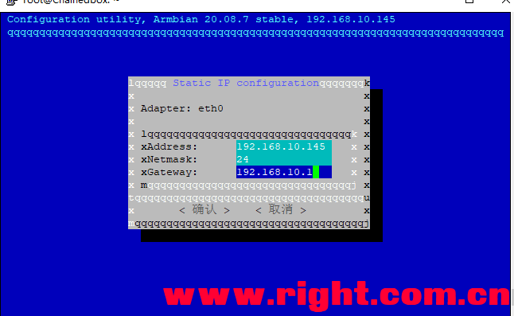
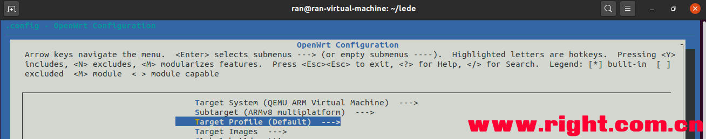
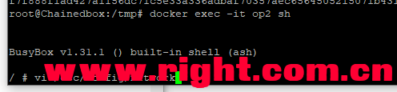
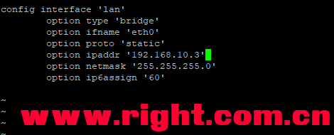
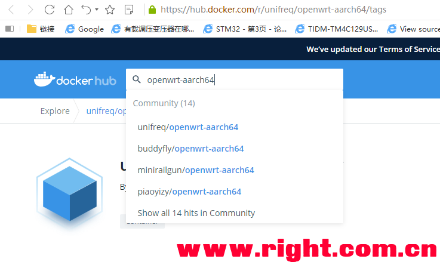

## 我家云轻NAS兼顾docker旁路由

https://www.right.com.cn/forum/thread-4053820-1-1.html

相关帖子 我家云硬改折腾记录+硬改指难+改USB2.0或换JMS578带3.5盘+omv设置休眠+风扇降噪
https://www.right.com.cn/forum/thread-3486158-1-1.html
科普一下Ride_Wind大佬打包我家云最新固件使用
https://www.right.com.cn/forum/thread-4053775-1-1.html

我的我家云一般都不用来bt,因为ram太小又没有保护硬盘的缓存机制，bt我一般是用PC PrimoCache开1g ram缓存加迅雷下载或PC端qbt，所以我的我家云只是PT，smb，docker openwrt。

下面讲讲我家云 Ride_Wind 大佬的固件下，我家云网卡开启混杂模式的一机双用，既是旁路由又是NAS：
1 固定我家云armbian 的IP，（如果不用docker下的 openwrt 开DHCP可跳过）：
ssh连接我家云 用户名root 密码1234 执行 armbian-config
选择 network 回车，选择 IP 回车，选择eth0 回车，按左选择Static 静态IP 回车，Gateway 网关要和主路由一致，address 地址改为自己喜欢的，网段和网关一致，回车确认，菜单返回后可esc退出。

2 打开网卡混杂模式
ssh执行

1. ip link set eth0 promisc on

*复制代码*

3 设置网络[根据个人情况]，开启一卡多IP

ssh执行

1. docker network create -d macvlan --subnet=192.168.10.0/24 --gateway=192.168.10.1 -o parent=eth0 macnet

*复制代码*

我的主路由lan IP是192.168.10.1，所以大家根据自己IP修改参数，Gateway 和上面armbian的Gateway 要一致指向主路由；
如果你主路由192.168.1.1那么修改如下

1. docker network create -d macvlan --subnet=192.168.1.0/24 --gateway=192.168.1.1 -o parent=eth0 macnet

*复制代码*

4 docker拉取镜像，拉取镜像可以有两个方法，这里产生一个分支
使用自己编译的openwrt文件，文件名openwrt-armvirt-64-default-rootfs.tar，编译cpu类型选择如下图：

这里提供一个我编译的轻量级openwrt固件，
链接：https://pan.baidu.com/s/1Kl9rt7s_kN6ypwmK9NO9nQ
提取码：26b9

将本地文件openwrt-armvirt-64-default-rootfs.tar通过winscp等工具复制到我家云tmp目录，
ssh执行

1. cd /tmp
2. docker import openwrt-armvirt-64-default-rootfs.tar.gz openwrt:R20.10.05

*复制代码*

5运行镜像创建容器
ssh执行

1. docker run --name op2 --restart always -d --network macnet --privileged openwrt:R20.10.05 /sbin/init

*复制代码*

6修改docker里的openwrt的IP
ssh执行

1. docker exec -it op2 sh

*复制代码*

BusyBox v1.31.1 执行如图

1. vi /etc/config/network

*复制代码*

这里要确保设置的我家云旁路由IP和主路由的IP在同一个网段内。我的主IP路由IP 192.168.10.1，就设置了旁路由IP 192.168.10.3
输入i开始编辑，编辑完成之后按ESC退出编辑，然后输入:wq（不要忘记冒号）回车保存。
现在退回到BusyBox v1.31.1 这个界面了，这里输入exit退出容器回到我家云的armbian终端。

7重启openwrt 容器
ssh执行

1. docker restart op2

*复制代码*

8现在可以通过192.168.10.3进入openwrt
用户名root 密码password，进入后就可以设置是否关掉DHCP了（强调一个网段内只能有一个主动DHCP服务器，如果主路由主动DHCP，旁路由就要关闭主动DHCP服务。）
lan 网关指向主路由192.168.10.1 就设置好旁路由模式了。

9增加防火墙规则重启openwrt，完成
openwrt的管理后台，打开网络→防火墙→自定义规则，添加

1. iptables -t nat -I POSTROUTING -o eth0 -j MASQUERADE

*复制代码*

10删除openwrt镜像

进入omv控制台，用户名admin 密码 openmediavault
点击docker容器下要删除的容器，点击开始下拉菜单 停止，等待，删除按键生效，可执行删除，后可删除源镜像。

下面是分支二
4用docker仓库的镜像
ssh执行

1. docker pull unifreq/openwrt-aarch64:latest

*复制代码*

搜索一下docker网站，还有别的镜像可供选择

5运行镜像创建容器
ssh执行

1. docker run --name op2 --restart always -d --network macnet --privileged unifreq/openwrt-aarch64:latest

*复制代码*

6修改docker里的openwrt的IP
ssh执行

1. docker exec -it op2 /bin/bash

*复制代码*

余下步骤和上面步骤6的重合，这里不在复述。
bash-4.4#下执行

1. vi /etc/config/network

*复制代码*