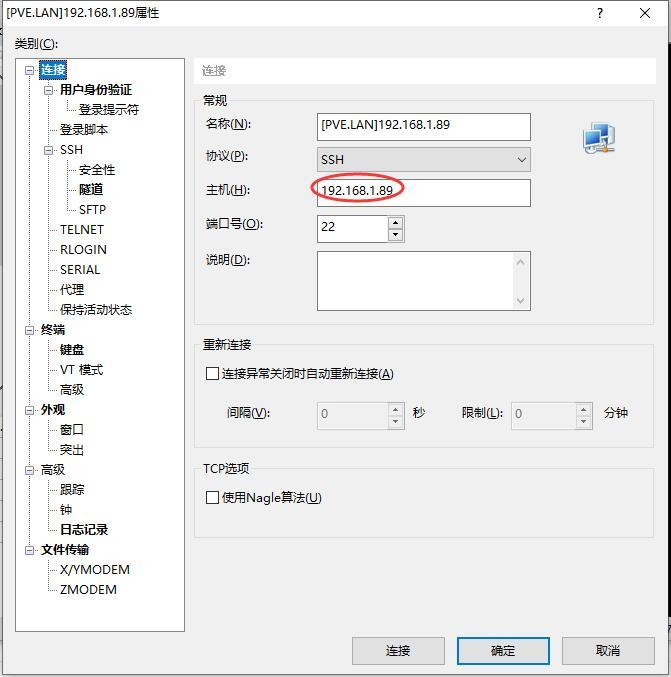
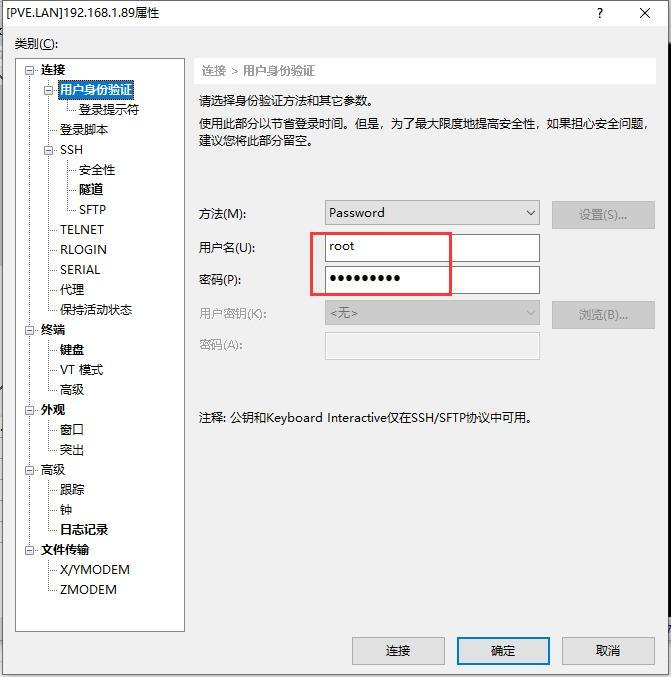
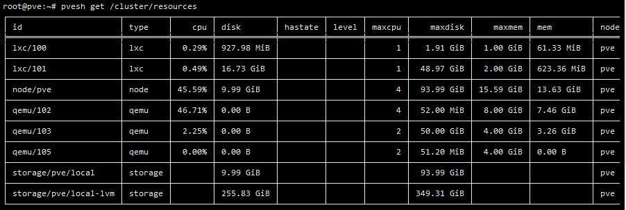
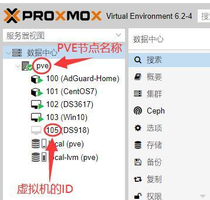
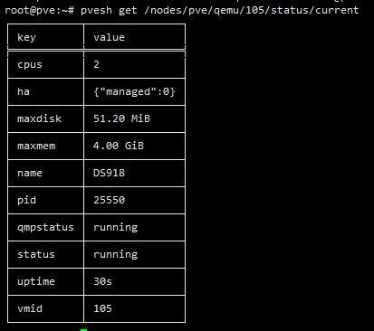
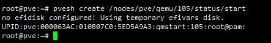
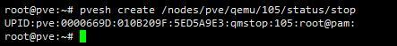

# 教你在PVE下用命令行查看虚拟机运行状态、启动虚拟机和停止虚拟机

用PVE的人都知道：从菜单上对虚拟机关机有时会遇到无法关机的情况，要点好多次才行，甚至有时关不掉，怎么办？博主教你到SSH下敲命令处理：

一、在电脑上用XSHELL软件登录到PVE的SSH状态，需要设置好PVE的IP地址，用户名和密码；

[](https://wp.qiniu.gxnas.com/wp-content/uploads/2020/06/cd1bae8d835435bf5d0de88149c8f331.jpg)

[](https://wp.qiniu.gxnas.com/wp-content/uploads/2020/06/00386bda561d9d6e2260a397a385e7b1.jpg)

 

 

二、我们先输入一条命令查看一下虚拟机的运行状态

```
pvesh get /cluster/resources
```

 

 

[](https://wp.qiniu.gxnas.com/wp-content/uploads/2020/06/7ef0b7f67b79ef8341e31c2ad08f3d20.jpg)

 

三、用浏览器登录PVE图形界面，查看PVE节点名称和我们需要操作的虚拟机ID，记下来，后面要用到这两个参数；

[](https://wp.qiniu.gxnas.com/wp-content/uploads/2020/06/b969542c2f6cba75156ffed773cf5801.jpg)

 

 

四、取得虚拟机当前状态

```
pvesh get /nodes/PVE节点名称/qemu/虚拟机的id/status/current
```

 

 

[](https://wp.qiniu.gxnas.com/wp-content/uploads/2020/06/d875d51eba70514e60c5ab64c06ab787.jpg)

 

五、启动虚拟机的命令

```
pvesh create /nodes/PVE节点名称/qemu/虚拟机的id/status/start
```

 

[](https://wp.qiniu.gxnas.com/wp-content/uploads/2020/06/3534b2282023a8d4926ef7a7cd09532c.jpg)

 

 

六、关闭虚拟机的命令

```
pvesh create /nodes/PVE节点名称/qemu/虚拟机的id/status/stop
```

 

 

[](https://wp.qiniu.gxnas.com/wp-content/uploads/2020/06/6d4a9729cf2b82952d4264f8a2cb38f9.jpg)

 