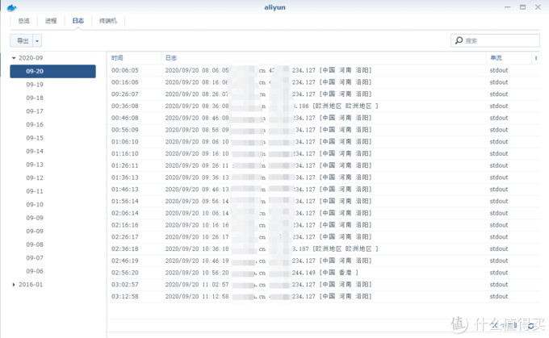
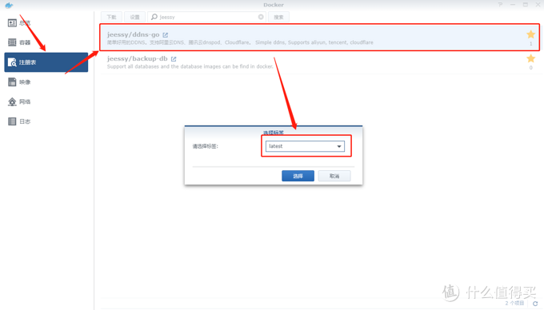
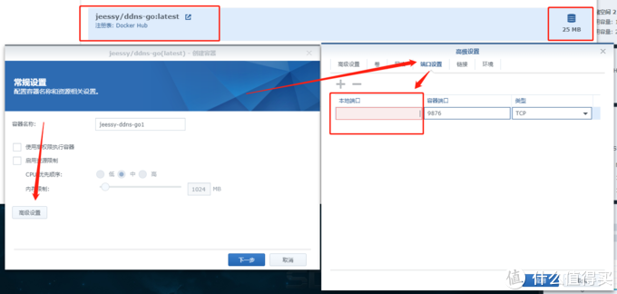
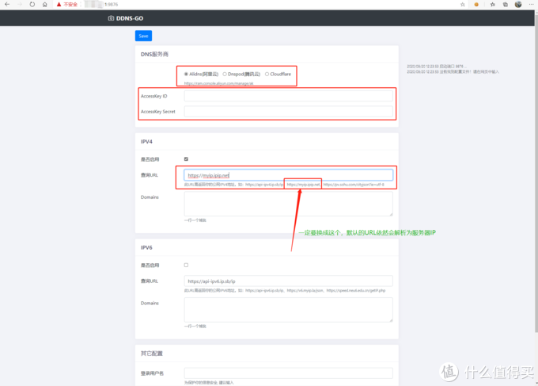
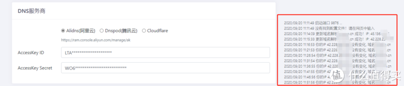

# 群晖Docker容器，有Web界面的IPv4 v6 DDNS！

https://post.smzdm.com/p/a99wd4o0/

### 【写作说明】

主路由换了小米AX[360](https://pinpai.smzdm.com/6059/)0之后用[群晖](https://pinpai.smzdm.com/2315/)的Docker容器chenhw2/aliyun-ddns-cli解决动态IP访问的问题，但是最近在[路由器](https://www.smzdm.com/fenlei/luyouqi/)上添加了小猫咪之后域名偶尔无法访问，查看日志后发现是解析到线路IP，所以想找个可以自定义IP查询URL的容器，然后就发现了**jeessy/ddns-go**这个**超级简单的带****Web管理****、支持****Alidns(阿里云) Dnspod([腾讯](https://pinpai.smzdm.com/19011/)云) Cloudflare、支持IPv4、IPv6、支持多个域名同时解析的Docker容器**！

### 【正文】

- **前提条件**

1、**公网IP**（必须的）

2、**阿里云**或者**腾讯云**域名，AccessKey和secureKey（教程在社区有很多，就不写了）

3、**群晖** （没有去哪装Docker，哈哈）

- **教程开始**

  1、打开**Docker**，在**注册表**内搜索： **jeessy，**双击打开**jeessy/ddns-go**并选择**Latest**版本下载！

2、在**映像**[内确](https://pinpai.smzdm.com/41582/)认下载的镜像正确后双击打开，默认web端口**9876**，需要修改的话点开**高级设置**、**端口设置**、修改**本地端口**后点应用启动即可！

3、在**容器**内确认该容器启动后在浏览器地址栏输入**群晖IP:端口**即可访问web管理界面

进到web界面就很简单了，选服务商之后填参数就行了，需要注意的是查询URL要改成图中那个，不然还会解析为国外的IP

4、设置保存成功后即可在web界面右边看到解析日志如下图：

默认5分钟更新一次

## 【注意】

**Web界面最下方可以设置登陆用户名的密码，如果开启了IPV6或者将web端口开放外网的强烈建议开启用户名密码登录！！！**