# Openwrt下挂docker版甜糖CDN N1/我家云/ARM设备 -保姆级原创教程

本教程的初衷：当初使用N1只是当旁路由挂一下留学去一下广告太过于浪费性能，所以就想着反正设备都是开机的，不如挂个甜糖星愿利用空闲的上传每天还能得2-3块钱。虽然有点少，但是也能补贴点宽带费，设备既能当路由也能挂甜糖。经过测试，本教程适用于arm设备的单臂路由、主路由、以及旁路由模式，而且可以达到有高收益网络。
**本教程非常简单的，只需学会复制粘贴。嘿嘿嘿**

我的实验环境（这里的内容看看就好，不需要一样的）：

公网ip (这个好像不是非必须的。移动宽带有人都可以挂。优质网络)
主路由K2P（拨号路由，需要upnp功能或DMZ功能。不要在光猫上拨号。upnp和DMZ设置方法各不相同我就不发教程了。百度应该都有的。）
斐讯N1（固件版本是F大的41+版本，如果你们按照教程走，有不一样的地方走不下去了，请换这个固件版本。）
U盘（大于等于32G的U盘或其它存储设备。要求是能在N1的usb2.0上稳定运行并且U盘的写入速度大于宽带的上传速度。上传大的建议上硬盘，U盘一般写入速度普遍7-10m/s）

**旁路由的需要N1和拨号路由同网段，而单臂和主路由是不需要upnp也是可以可以的**

**一般f大的固件都是自带docker的，可以直接走我的教程，不需要自己初始化docker，本教程不支持U盘启动的openwrt。
**

挂了几天终于有收益了，以下是50m上传一天的收益,100颗星星等于1RMB，满10RMB可提现：

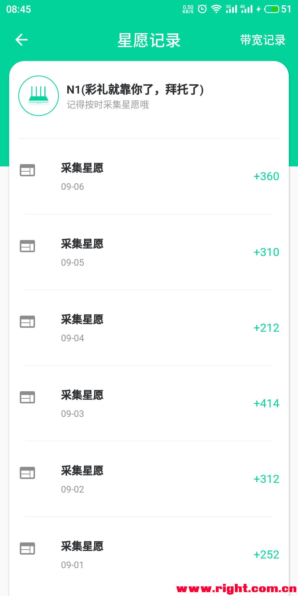

教程开始（以N1盒子为例）
1.U盘挂载（通用步骤）
（这一步主要是想让大家的存储设备都挂载到/mnt/ssd1这个路径上，采用uuid挂载的好处在于不会因为热插拔或重启设备导致挂载路径发生改变）
将U盘插入到N1上，然后进入N1后台-系统-挂载点进行设置，请看下面图片教程将U盘挂载到/mnt/ssd1

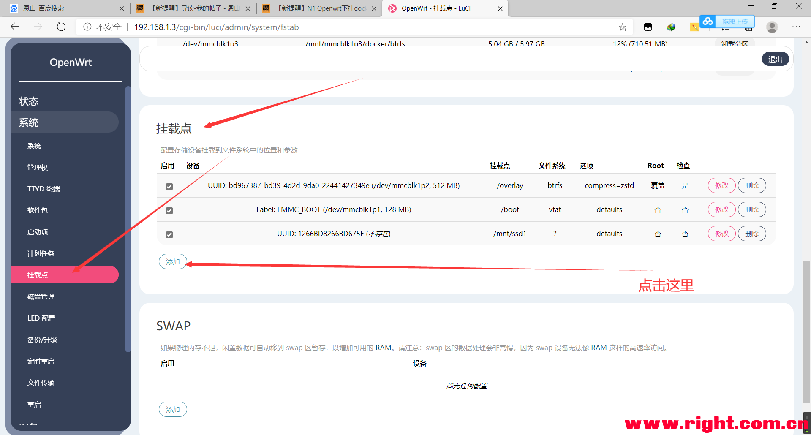

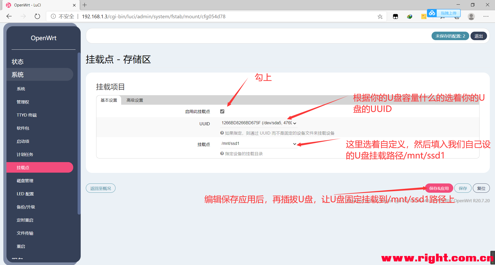

这一步很多人会漏了拔掉U盘，再插回去N1的操作。这个必须做

#### 本帖隐藏的内容

2.开放1024以上的端口（单臂模式或主路模式由步骤，旁路由模式直接走第3步）
进入N1的openwrt后台的，然后进入路径 网络--防火墙--通讯规则 ，然后下拉找到打开路由器端口 这个位置，如下图打开**1024-65535端口。**

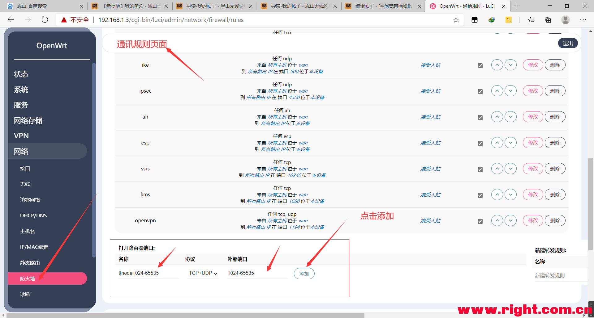

3.下载docker镜像并运行新容器（通用步骤）
利用putty或N1的Openwrt固件自带的TTYD终端连接N1的SSH。
按顺序执行以下命令：    

1. docker run -v /mnt/ssd1:/mnts -d --name ttnode --net=host -i -t --privileged=true --restart=always 744287383/linux-arm64-ttnode /start.sh        #第一次执行命令需要下载镜像。如果下载镜像非常慢的，请按下CTRL+C来中断下载，然后再次执行这条命令重新下载  #/mnt/ssd1为硬盘的挂载路径，:/mnts这个冒号和路径的不能改动，ttnode为容器的名字。                                            

*复制代码*

\#第一次执行命令需要下载镜像。如果下载镜像非常慢的，请按下CTRL+C来中断下载，然后再次执行这条命令重新下载，直到下载变快。
（这一步容易出现的错误有两点，第一点是：提示无法连接链接 检查docker是否运行，
第一点解决方法：出现这个问题大多数是因为你的openwrt是U盘启动的，没有把openwrt写入emmc中。还有一种可能是你的docker没启动，大多数是前者的问题
第二点是：提示docker的存储空间不足，
第二点解决方法：导致这个问题出现的原因是你走了docker初始化的那个教程。大多数固件自带的docker已经是在运行的了，不需要再初始化。重新刷一次固件直接走本教程就好）
出现报错了，要把错误信息复制到百度翻译，这样你就知道报错是什么原因了。

执行完之后是这样子的，不太一样也没关系，只要不报错就好：

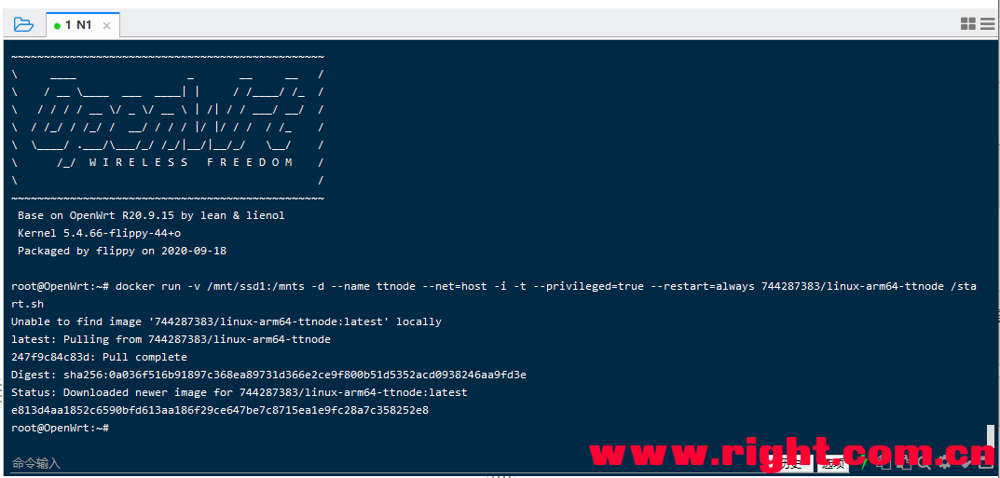

执行到这里，你的甜糖服务端就算是挂起来了，需要等待5分钟后才能绑定设备。

4.手机甜糖客户端APP绑定N1设备（通用步骤）
手机甜糖客户端APP下载：[hide]
https://cloud.189.cn/t/vmiaeuuaemQr（访问码：vt69）（苹果用户请去AppStore搜索“甜糖”下载即可。）

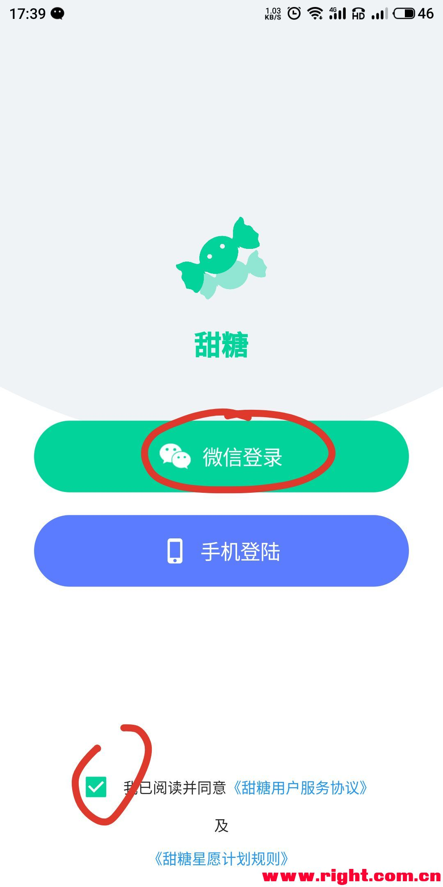

在个人信息中完成手机号绑定后，并且填上内部邀请码123463，只有填上我的邀请码才能获取结算的收益。

绑定设备

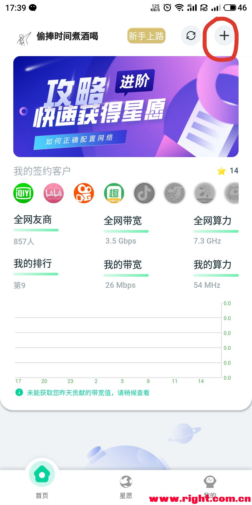

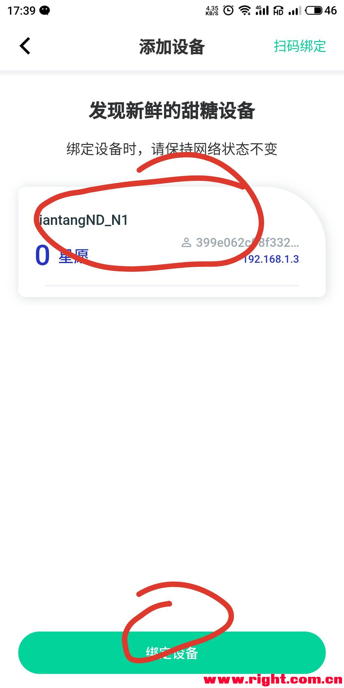

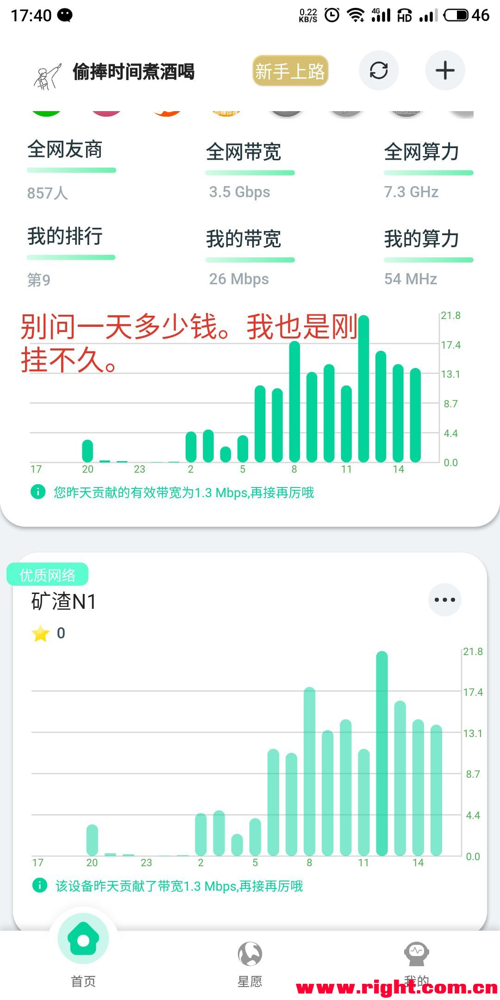

U盘需要一直插在N1上，因为甜糖需要将缓存写入U盘。

欢迎加入我们的QQ交流群：976784785 1104134068
教程都走到这里了，你该不会是想白嫖吧？？？赶紧填上邀请码加群。

教程到此结束，以下内容是解决一些问题的方法以及进阶玩法

更换存储设备
因为有些人用U盘挂上了想要更换成硬盘挂上，又不会用docker。所以跟着下面教程。

1.插上硬盘，然后按照本教程的步骤1完成硬盘的挂载先。
2.重启甜糖容器

甜糖容器限制内存的方法（防止机器跑死）：
看图吧，不想码字了。

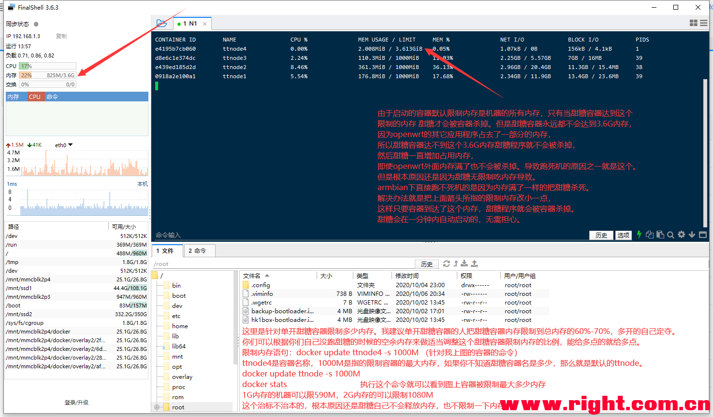

命令：(图片命令打错了，请复制下面的命令 图片命令的-s 改成-m 没有说明的参数不要改)

1. docker update ttnode --memory-swap -1 -m 1080M                                                           #内存大小根据图片里说的自己定夺。

*复制代码*

1. docker stats

*复制代码*

还有一种方法就是挂载swap当虚拟内存，自己折腾，小白勿扰。建议缓存盘不要给太大，很占运行内存的。

甜糖手机客户端app无法搜索到局域网设备解决办法：
连接N1的ssh执行以下命令：

1. docker exec -it ttnode /bin/bash                                #进入容器的命令，ttnode是容器名。修改成自己的容器的名字

*复制代码*

1. /usr/node/ttnode -p /mnts                                      #执行甜糖的命令

*复制代码*

执行结果如下：

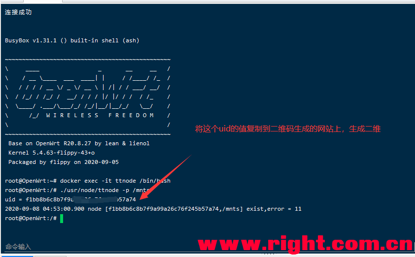

将得到的uid复制粘贴到这个二维码生成的网站，二维码生成后请用甜糖客户端app扫码绑定设备：[二维码生成请点击这里](http://2v.dedecms.com/)

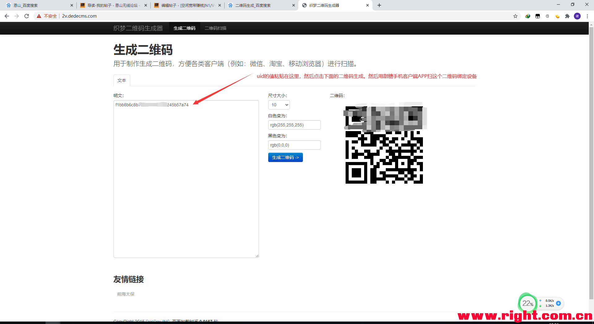

甜糖多开进阶篇：（这下面开始不是小白教程了，小白就不要折腾了）
看得懂就玩，看不懂就算了。（填了我的邀请码并且上传大于50M的可以手把手教，其它的自己群里讨论）。

本帖隐藏的内容

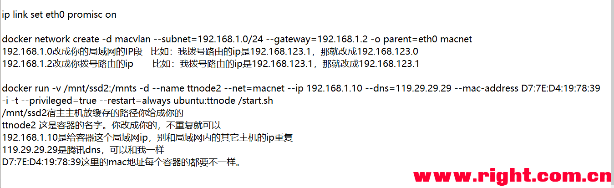

1. ip link set eth0 promisc on                                                  #如果lan口没有取消桥接的请用br-lan替换掉命令中eth0，不是openwrt系统的请用ifconfig查看网口名称

*复制代码*

1. docker network create -d macvlan --subnet=192.168.1.0/24 --gateway=192.168.1.2 -o parent=eth0 macnet                           #如果lan口没有取消桥接的请用br-lan替换掉命令中eth0，不是openwrt系统的请用ifconfig查看网口名称

*复制代码*

1. docker run -v /mnt/ssd1:/mnts -d --name ttnode --net=macnet --ip 192.168.1.254 --dns=119.29.29.29 -i -t --privileged=true --restart=always 744287383/linux-arm64-ttnode /start.sh         

*复制代码*

参考文献：（感谢以下文章的作者）

[[N1盒子\] N1 F大OpenWrt下Docker Centos7_宝塔自启动分享](https://www.right.com.cn/forum/thread-3773137-1-1.html)
[[N1盒子\] [2020-8-15]★41+版N1_OP_U盘直刷包，及贝壳云_OP_线刷包](https://www.right.com.cn/forum/thread-981406-1-1.html)
[[N1盒子\] 【0814更新】【白嫖盒子】新玩法，甜糖星愿计划armbian方案出炉啦，更省心更好用~](https://www.right.com.cn/forum/thread-4044876-1-1.html)
[万能百度](http://www.baidu.com/)