# Ros从入门到精通 篇一 

#家用Ros系列教程# 

## 篇一：Ros安装，奶妈级，适合刚接触软路由的同学，轻松上手

**创作立场声明：**家用Ros从入门到精通系列教程最新开放的专栏，本篇更多的是针对准备入门或刚入门的新手朋友观看，老白与大佬不喜勿喷哦，同时也建议各位多给建议，再次感谢大家。

## 前言

1. 大家好**，**我是大斑马，曾经踩坑无数，如今填平归来，作为一枚老白，谈不上技术人才，仅凭一腔热血及爱好给大家带来一些分享总结，望大家多多支持哈，不喜勿喷，手下留情，多多指导，相互学习，感谢。
2. 今天开始给大家带来家用Ros从入门到精通系列教程，分别为**《Ros下载与安装》**、**《Ros基础配置及拨号上网》**、**《Ros DDNS设置》**、**《Ros端口转发设置及完美回流方案（2种方案）》**、**《Ros VPN设置及使用（L2TP与IKEV2）》**、《未完待续》。
3. 本系列所有教程里有原创也有引用，引用部份会注明出处，在次先感谢填坑路上遇到的各路大神，感谢！同时作为个人总结与分享也希望大伙多多指导，交流且相互学习比啥都重要，对吧？

## 引言 

Ros是啥？有啥好处？用Ros会起飞？在这里，Ros是什么这个不过多介绍了，新手朋友可以百度“MikroTik”先了解，毕竟能点进来的朋友肯定知道ROS是干啥的，对吧？至于Ros有啥好处，这个容我想想。。。这么说吧，除了英文设置界面以及配置繁琐之外，真的没有什么缺点（仅是个人观点哦），至于用Ros会不会起飞，这个前提条件你得有大水管啊（宽带速度）另外还要设置得当，同比与其他软路由系统我个人认为最好没有之一，总之，好不好用，你得用了才懂。PS：第一次发表文章，有些激动，感觉我好啰嗦。。。
接下来，看教程吧！

## 教程开始 

本教程基于**esxi平台**下搭建，之后会陆续补充其他平台的相关教程，如PVE、Hyber-V等。

### 1、先展示一下我的硬件情况：

[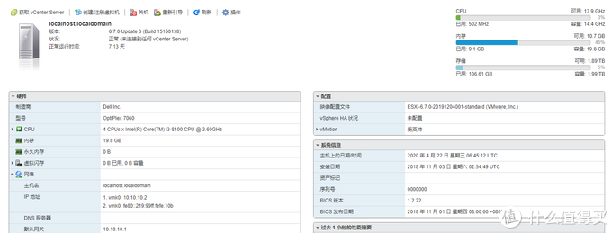](https://post.smzdm.com/p/awx0x282/pic_2/)

**dell 7060准系统，CPU:i3-8100，[内存](https://www.smzdm.com/fenlei/neicun/)：20**（一条16g，一条4g）整体性能还是不错滴，后续会有硬件篇，到时再跟大家分享。

### 2、Ros下载 

首先登陆Ros官网https://mikrotik.com/，如图进入下载选择界面：

[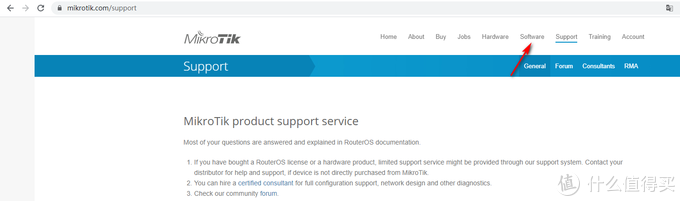](https://post.smzdm.com/p/awx0x282/pic_3/)

下拉，找到Cloud Hosted Router板块内容，此板块是Ros专门针对虚拟机做的云平台系统，这里我们选择**VMDK image的6.46.5稳定版**：

[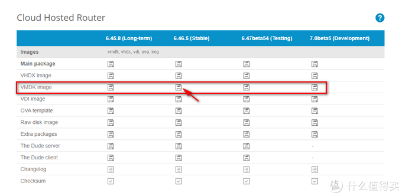](https://post.smzdm.com/p/awx0x282/pic_4/)

到此下载固件结束，我们进入Esxi安装环节。

### 3、Esxi搭建与配置 

进到Esxi的web界面，我们先上传固件到Esxi，选择**储存-数据储存浏览-上传**，选择刚下载好的Ros固件包，在这里我要啰嗦一句哦，我建议大家像我一样创建一个[文件夹](https://www.smzdm.com/fenlei/wenjianjia/)专门存放固件，这样方便管理，同时页面也整洁；不需要专门为单个虚拟机创建文件夹，因为当你创建且配置好任何虚拟机后，Esxi都会为你创建相应的文件夹，所以按照我的整理思路就好啦，好。。。我们继续：

[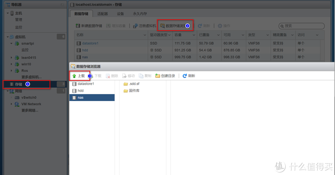](https://post.smzdm.com/p/awx0x282/pic_5/)

上传完固件我么们开始创建虚拟机并配置它，点**虚拟机-创建虚拟机-创建新虚拟机-下一步**：

[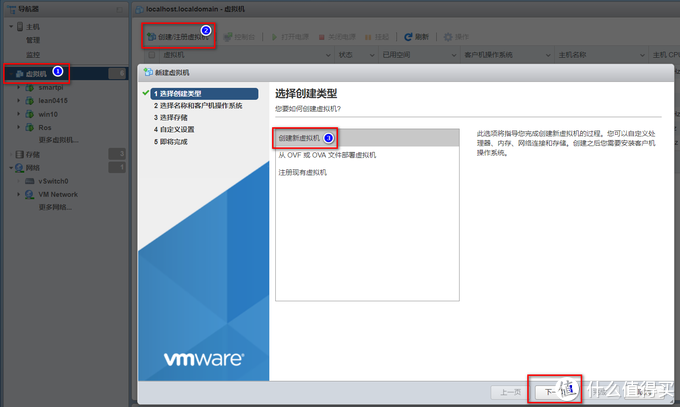](https://post.smzdm.com/p/awx0x282/pic_6/)

下一步后到这个页面，名称大家随意，我这里填mikrotik，兼容性保持不变（我这里是6.7U3版本，7.0虽然出来了，但是听说兼容性不是很好，特别是针对网吧，所以暂时不升级，后续会有相关升级教程），**客户机操作系统系列选Linux，客户机操作系统版本选其他3.x Linux (64)位：**

[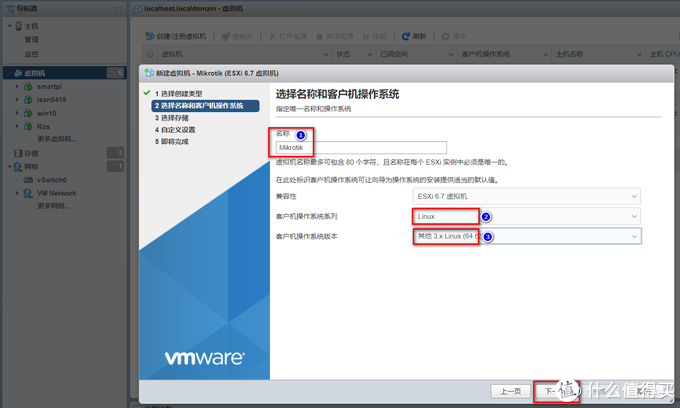](https://post.smzdm.com/p/awx0x282/pic_7/)

再次点下一步后进入储存下选择，我在这里有三个盘，一个是120G的M2大固态，一个是2.5寸的[机械硬盘](https://www.smzdm.com/fenlei/jixieyingpan/)。一个是NAS分出来的iSCSI盘，这里我选第一个，大家视自己情况而定：

[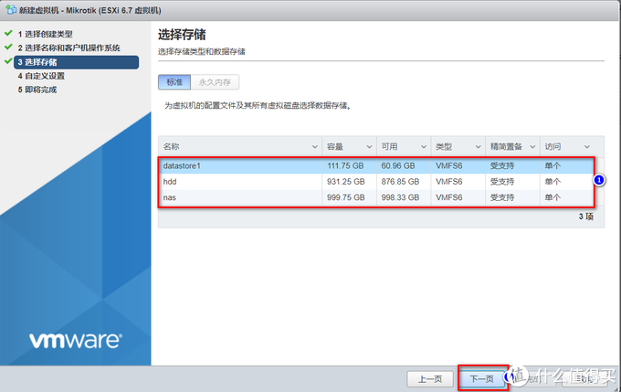](https://post.smzdm.com/p/awx0x282/pic_8/)

下一步后进入自定义设置界面，首先我们配置[硬盘](https://www.smzdm.com/fenlei/yingpan/)，关联刚才下载好的Ros固件，**第一步删掉系统配置的16G硬盘，第二步点添加硬盘，第三步选现有硬盘：**

[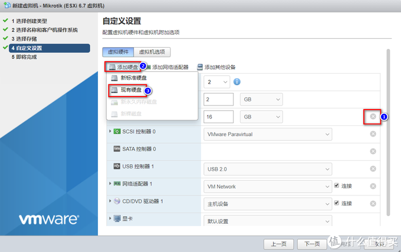](https://post.smzdm.com/p/awx0x282/pic_9/)

进入到这个界面选择刚刚上传到固件库文件夹的Ros固件，选定好点选择：

[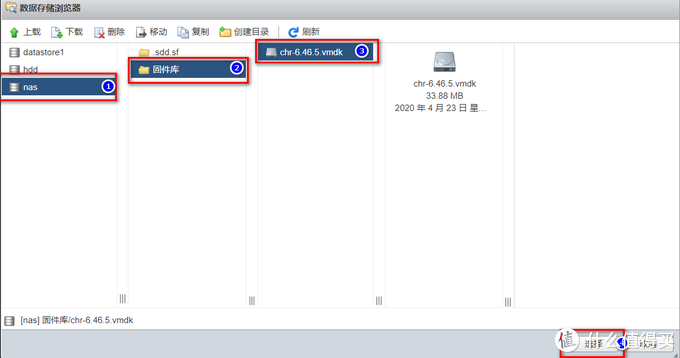](https://post.smzdm.com/p/awx0x282/pic_10/)

这样Ros的固件已经关联到我们新创建的虚拟机了，接下来我们设置CPU及内存，这里我建议大家跟我设置一样，CPU核心分2个，内存给2g，经过我长时间的使用及调试，发现这个配置最稳最好，给多了或给少了都差点意思，当然这只是建议，你可以根据你主机的配置而定，同时也建议你多尝试哦，这里我设置**2个CPU，2g内存**：

[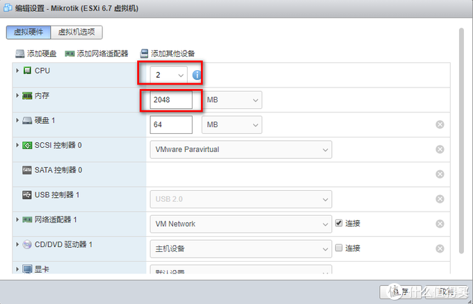](https://post.smzdm.com/p/awx0x282/pic_11/)

借来下我们设置网卡，说明一下，我的主机[主板](https://www.smzdm.com/fenlei/zhuban/)只有一个千兆网口，做虚拟机肯定是不够滴，所以我某鱼购买了I350-T2的双千兆网卡，好用到飞起，建议大家网口不够的可以买一个扩充网口，同时，我直通了i350-T2其中的一个网口，剩下的一个以及主板自带的网口做了聚合使用。

可以看到，系统已经给我们配置了一个虚拟网口WM network，我们把它作为lan口，然后我们添加直通的网口，点**添加其他设备-PCI设备**：

在新添加的PCI设备选择我们直通的网口，我这里只直通了一个，选择只有一个，点选就好了。这里我又要啰嗦了，我建议直通网口的话，直通一个就行，用直通的口做wan口拨号，剩余的网口组成链路，实测这样配置稳定性最高，速度最快，直通了太多口稳定性降低，还经常出现BUG，没有必要：

[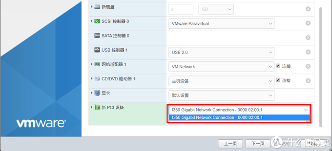](https://post.smzdm.com/p/awx0x282/pic_13/)

最后我们做一些微调，这里要注意的是，如果直通了网口给到Ros用（不止是Ros，所有虚拟机配置了直通内容包括网口、sata口或者集显等等给到任何虚拟机，都需要勾选预留所有客户机内存，这里我们给到Ros直通网卡，所以我们要勾选上：

[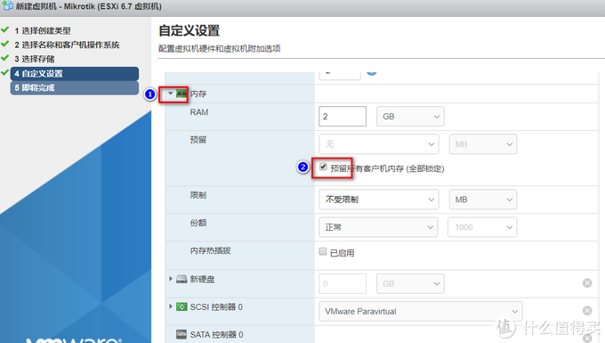](https://post.smzdm.com/p/awx0x282/pic_14/)

点击新硬盘的倒三角，我们需要改一下控制器位置，把它选成**IDE控制器0**，如果不选择此项，无法打开Ros虚拟机哦：

[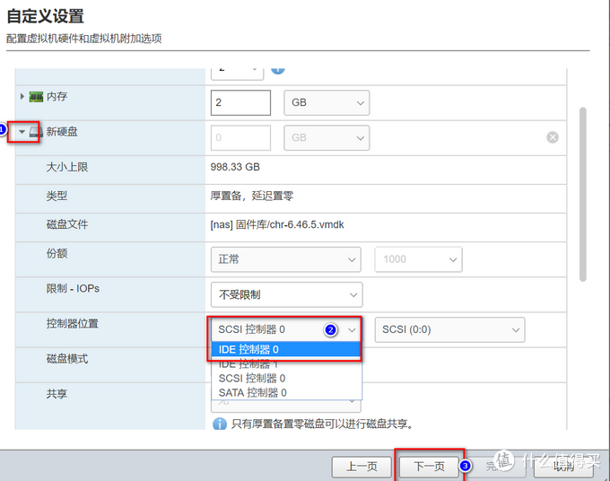](https://post.smzdm.com/p/awx0x282/pic_15/)

到此，所有设置全部完成，我们点下一步，然后完成。

### 4、进入Ros配置后台

我们配置完Ros，回到Esxi的主页面，找到刚才新建的Ros虚拟机，点**打开电源**：

[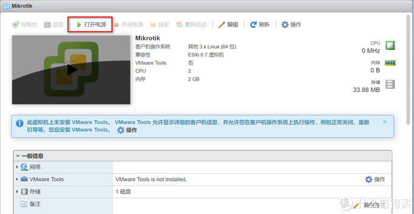](https://post.smzdm.com/p/awx0x282/pic_16/)

耐心等待5-8秒，然后我们用winbox软件进入后台：

软件给大家打包好了：

链接：https://pan.baidu.com/s/1bk8xXkGOEybOAe1_lPMNjg

提取码：3icw

打开软件，可以看到地址，由于我们还没有设置IP，我们用MAC地址登录，选择IP是0.0.0.0的这条（新装的朋友有有且只有一条，唯一的一条)，选定后点connect进入：

[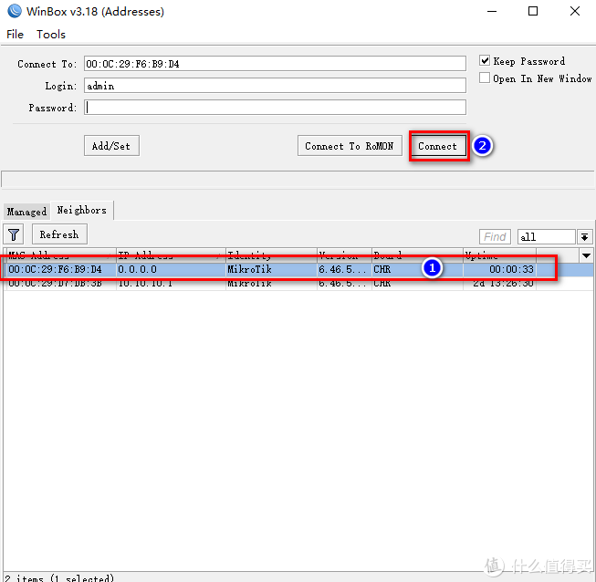](https://post.smzdm.com/p/awx0x282/pic_18/)

成功进入后是这个界面：

[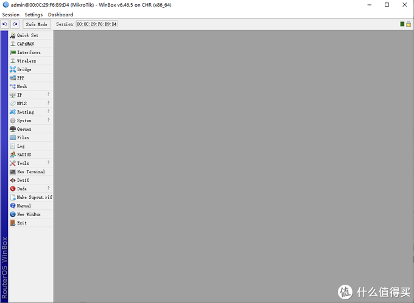](https://post.smzdm.com/p/awx0x282/pic_19/)

到这里，本篇Ros固件下载、虚拟机安装及配置、成功进入Ros结束。

下一篇-篇二将针对新装的Ros进行配置及拨号上号，敬请期待，谢谢大家。

## 总结 

安装过程对于新手朋友来说是有些复杂，但是按照本篇教程一步步进行安装配置，绝对没有任何问题，同时也欢迎大家正式进入软路由Ros的世界。

喜欢的朋友记得点赞、点赞、点赞，收藏、收藏、收藏哦。

未经授权，不得转载