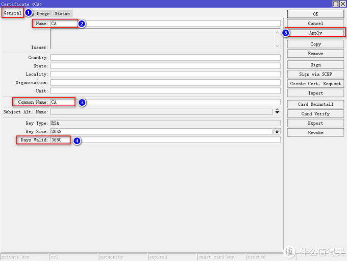
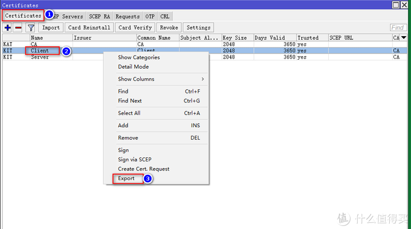
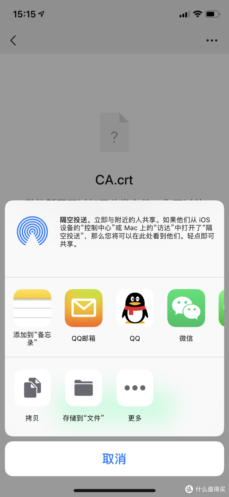
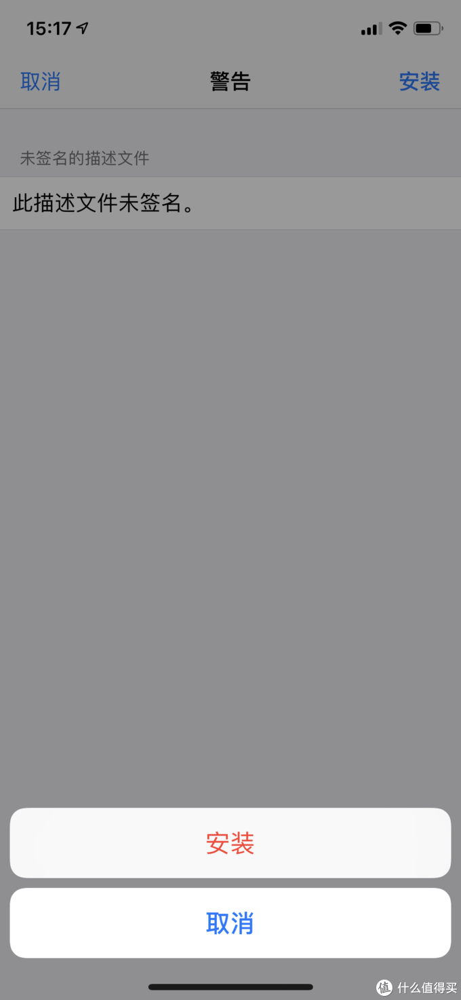

# Ros从入门到精通 篇七

## Ros之VPN配置及使用，IKEv2连接模式，全世界回家，更稳定，更高效，强烈推荐！！！

**创作立场声明：**家用Ros从入门到精通系列教程是最新开放的专栏，本篇更多的是针对准备入门或刚入门的新手朋友，老白与大佬不喜勿喷哦，同时也建议各位多多指导与建议，再次感谢大家。

## 前言

1. 大家好，我是大斑马，曾经踩坑无数，如今填平归来，作为一枚老白，谈不上技术人才，仅凭一腔热血及爱好给大家带来一些分享总结，望大家多多支持哈，不喜勿喷，手下留情，多多指导，相互学习，感谢
2. 今天开始给大家带来家用Ros从入门到精通系列教程，分别为[《Ros下载与安装》](https://post.smzdm.com/p/awx0x282/)、[《Ros基本配置及拨号上网》](https://post.smzdm.com/p/ag8782mm/)、[《Ros DDNS设置》](https://post.smzdm.com/p/ax0202l9/)、《Ros端口转发设置及完美回流方案：[方案一](https://post.smzdm.com/p/ar0v0x2q/)、[方案二](https://post.smzdm.com/p/awx0xv8m/)》、《Ros之VPN配置及使用： [L2TP](https://post.smzdm.com/p/a3gvokw5/) 与 IKEV2 》、《未完待续》
3. 本系列所有教程里有原创也有引用，引用部份会注明出处，在此感谢填坑路上遇到的各路大神，感谢！同时作为个人总结与分享也希望大伙多多指导，交流与相互学习比啥都重要，你说对吧？

## 引言

在前面的教程中，分别教会了大家如何建立Ros、如何简单配置Ros使其正确上网、Ros利用阿里云域名绑定动态IP（DDNS）以及Ros端口转发及完美回流，还不清楚的朋友可以先去看我前面的教程：

https://post.smzdm.com/p/awx0x282/

https://post.smzdm.com/p/ag8782mm/

https://post.smzdm.com/p/ax0202l9/

https://post.smzdm.com/p/ar0v0x2q/

https://post.smzdm.com/p/awx0xv8m/

在上一篇已经给大家介绍了VPN之L2TP的连接模式，还不清楚的同学可以去看一下：

https://post.smzdm.com/p/a3gvokw5/

**本篇我再给大家介绍一种新的VPN模式--IKEv2，这种连接模式相比与L2TP，稳定性更强，效率也更高，强力推荐哦，**好了，话不多说，我们开始操作起来。

## 教程开始 

老规矩，先上效果图：

在[手机](https://www.smzdm.com/fenlei/zhinengshouji/)上连接好VPN，可以使用4G网络通过内网地址访问[群晖](https://pinpai.smzdm.com/2315/)WEB：

也可以访问旁路由Openwrt的后台：

同样，也可以用app访问内网项目，如群晖DS File：

总之，通过VPN回家，实现我们各种远程访问的功能，非常方便哦，是不是很心动？心动不如行动，我们开始吧！！！

## 教程开始

## 1、IKEv2配置 

**老规矩，建议大家所有设置的命名与我一样，可避免后续一系类的问题。**

### 1、创建证书

**首先我们创建CA证书**。进入**System--Certificates**，点击上菜单栏Certificates，点击加号，Name填入CA，Common Name填入CA，Day Valid改成3650，接着点击Apply：

紧着这点击Sign，意思就是签发证书，大家跟着我操作，在弹出来的界面Certificate选CA，其他不变，然后点击Start：

**创建Server证书**。点击General，Name输入Server，Common输入Server，Days Valid同样修改为3650；点击Key Usage，勾选tls server，其他选项不勾，接着点击Apply：

设置完Server证书，我们点sign，签发证书，Certificate选Server，CA选CA，最后点击Start：

最后回到General选项卡，在此页面下的Trusted勾选上，最后点击OK：

**创建Client证书**。与Server证书创建方法一致，把Server命名改成Client；勾选tls client，其他不勾选。看图操作：

到这里，**证书全部创建完毕**，分别为**CA、Server以及Client**。

### 2、创建地址池（pool） 

这一步的目的是给通过VPN连接回家的设备分配内网ip，我们进入IP--Pool，接着点击加号，Name填入IKEv2-pool，addresses填入内网IP段，这里的IP段与家里内网IP段区分开，我家里的IP段为10.10.10.X，这里我设置成192.168.88.X。如果大家对IP段不是很清楚，我给大家分享一个网站，按需填入便会自动生成：

以上图为例，IP address填写你起始的IP，我起始IP为192.168.88.100，MacK Bits是屏蔽位，这里大家不需要明白原理，我这里填入28，要注意的是，这里选择什么一定要记住哦，后面需要用到，最后得出的IP段就是192.168.88.97--192.168.88.110，Subnet ID：192.168.88.96这个IP地址也要记住，后面需要用到哦，Subnet ID是子网编号的意思，大家知道就行**。我强烈建议，大家跟我设置一样即可，在还不熟悉前，自己DIY有可能会造成错误哦。**

IP生成器：

http://www.subnet-calculator.com/

确认无误，点击OK即可：

### 3、设置IPsec

进入**IP--IPsec**，新建一个模式，点击上菜单栏Mode Configs，点击加号，**这里有两个地方需要大家注意，Address Prefix Length这里填入的28就是刚才我们设置IP段的时候选择的MacK Bits，大家根据自己设置来修改，如果大家跟我设置一样，那就按我的设置即可，Static DNS填入自己的DNS[服务器](https://www.smzdm.com/fenlei/fuwuqi/)，如果你用Ros的DNS服务器，那这里填入Ros的IP地址，如果你用的是其他的，填入相应IP即可，这里我用的是Ros的DNS服务器，Ros的IP为10.10.10.1。**具体设置请看图：

接着我们设置方案，点击上菜单栏Proposals，点加号，如下图设置：

我们继续，创建一个新的组，点击上菜单栏Groups，然后点击加号，设置如下：

接着我们新建一个策略，点击上菜单栏Plicies，然后点击加号，**这里有一点需要注意，Dst.Address填入我们刚才设置IP段的时候生成的Subnet ID，IP的后面别忘了加上/28，**具体配置如下：

接着，我们设置对等配置资料，点击上菜单栏profiles，点击加号，具体设置见下图：

设置完对等配置，我们设置对等，点击上菜单栏Peers，点击加号，如下图设置：

最后一步，我们设置一个身份，点击上菜单栏Identities，点击加号，如下图设置：

到这里IKEv2的所有设置全部完成，我们接下来进入第二部分内容--客户端配置。

## 2、客户端配置 

### 1、证书导出 

我们进入**System--Certificates**，点击上菜单栏Certificates。我们**只需要导入CA这书与Client证书**，右键CA证书，选择Export，具体如下图设置：

接着我们导出Client证书，**这里需要注意的是，Type选项里，如果你是安卓设备，则选择pem，如果你是[苹果](https://pinpai.smzdm.com/1687/)设备，就选择PKCS12；Export Passphrase这里填入一个密码，用于接下来客户端安装证书时填入，我这里设置12345678。**具体如下图操作：

紧接着，我们回到左菜单栏，点击Files，将我们刚才生成的证书导到电脑上，方法很简单，选中我们的证书，点击左键不放手，直接拖到电脑即可：

名字有些长，看着不方便，我们可以给他改个名：

### 2、客户端配置及连接 

老规矩，我还是**以苹果手机为例**，[安卓手机](https://www.smzdm.com/fenlei/androidshouji/)同理（尴尬啊，家里没有安卓设备，等后续我借台手机再补上安卓的详细设置，但是其实差不多的哦）。

通过微信或者QQ等软件将证书导入到手机，接着分别安装CA证书与Client证书，大家看我操作：

下载CA证书，存入到苹果手机自带的文件App中：

同理，下载Client证书，存入到文件APP中：

手机已经成功下载好证书：

接下来我们安装证书。我们先安装CA证书：

这里输入手机的密码

这样，CA证书安装好了，接下来我们安装Client证书：

这里输入我们刚才导出证书时的设置的密码，我设置的是12345678

好啦，CA证书与Client证书全部全部安装完成，我们开始进行最后的配置。

打开**设置--通用--VPN--添加VPN配置**，接入选项卡后，选择IKEv2，描述这里随意填写，我填的是IKEv2-home，服务器输入你通过我《[Ros之DDNS设置](https://post.smzdm.com/p/ax0202l9/)》教程中教大家绑定的域名，或者直接输入你的公网IP，远程ID输入Server，本地ID输入Client，**注意大小写，必须与Ros配置IKEv2时一致**，用户鉴定选无，证书选择我们安装的Client证书，最后点击右上角完成：

好啦，教程结束，愉快的玩耍去吧，噜噜噜噜噜噜噜！！！！！

## 总结

1. **IKEv2相比于L2TP，稳定性更高，效能更强，值得您食用哦**
2. 本篇《Ros之VPN配置及使用---IKEv2》，已经结束啦，建议朋友们耐心看完，绝对对你有所帮助。如果有任何问题都可以留言给我，我都会一一回复，同时，如果你有更好的方法，或者我的方法有问题，都可以给我留言哦，分享希望得到认可，同时也希望得到进步。不忘初心，我还在路上，加油！！！
3. **如果你喜欢我的文章，千万别忘了点关注哦，这个对我很重要；你的支持是我前进的动力（最近广大朋友支持力度不够啊，动力不足了，哎，难顶），谢谢大家！！
   **
4. **同时也千万别忘了点赞点赞点赞，收藏收藏收藏，有碎银子也别吝啬哦，哈哈哈哈，再次感谢大家！！！**