# Ros从入门到精通 篇三

#家用Ros系列教程#

## 篇三：Ros之DDNS设置；外网轻松访问；全世界回家的先决条件。

**创作立场声明：**家用Ros从入门到精通系列教程最新开放的专栏，本篇更多的是针对准备入门或刚入门的新手朋友观看，老白与大佬不喜勿喷哦，同时也建议各位多给建议，再次感谢大家。

## 前言

1. 大家好，我是大[斑马](https://pinpai.smzdm.com/1859/)，曾经踩坑无数，如今填平归来，作为一枚老白，谈不上技术人才，仅凭一腔热血及[爱好](https://pinpai.smzdm.com/35731/)给大家带来一些分享总结，望大家多多支持哈，不喜勿喷，手下留情，多多指导，相互学习，感谢。
2. 今天开始给大家带来家用Ros从入门到精通系列教程，分别为[《Ros下载与安装》](https://post.smzdm.com/p/awx0x282/)、[《Ros基本配置及拨号上网》](https://post.smzdm.com/p/ag8782mm/)、《Ros DDNS设置》、《Ros端口转发设置及完美回流方案（2种方案）》、《Ros VPN设置及使用（L2TP与IKEV2）》、《未完待续》。
3. 本系列所有教程里有原创也有引用，引用部份会注明出处，在此感谢填坑路上遇到的各路大神，感谢！同时作为个人总结与分享也希望大伙多多指导，交流且相互学习比啥都重要，对吧？

## 引言

在前两篇教程里，分别教会了大家如何建立Ros及如何简单配置Ros使其正确上网，还不清楚的朋友可以先去看我前两篇教程：

[**Ros从入门到精通 篇一：#家用Ros系列教程# 篇一：Ros安装，奶妈级，适合刚接触软路由的同学，轻松上手**](https://post.smzdm.com/p/awx0x282)小编注：此篇文章来自#原创新人#活动，成功参与活动将获得额外50金币奖励。前言大家好，我是大斑马，曾经踩坑无数，如今填平归来，作为一枚老白，谈不上技术人才，仅凭一腔热血及爱好给大家带来一些分享总结，望大家多多支持哈，不喜勿喷，手下留情，多多指导，相互学习，感谢。今天开始给大家带来家用Ros从入门到精[BIgZeBra](https://zhiyou.smzdm.com/member/7255256373/)|*赞*57*评论*32*收藏*315[查看详情](https://post.smzdm.com/p/awx0x282)[**Ros从入门到精通 篇二：#家用Ros系列教程#篇二：Ros基本配置及拨号上网，简单易懂，一看就会，开始起飞！！！**](https://post.smzdm.com/p/ag8782mm)小编注：此篇文章来自#原创新人#活动，成功参与活动将获得额外50金币奖励。前言大家好，我是大斑马，曾经踩坑无数，如今填平归来，作为一枚老白，谈不上技术人才，仅凭一腔热血及爱好给大家带来一些分享总结，望大家多多支持哈，不喜勿喷，手下留情，多多指导，相互学习，感谢。今天开始给大家带来家用Ros从入门到精[BIgZeBra](https://zhiyou.smzdm.com/member/7255256373/)|*赞*30*评论*19*收藏*76[查看详情](https://post.smzdm.com/p/ag8782mm)

本篇主要教大家如何配置及使用Ros的DDNS功能，使其能绑定我们的动态公网IP，通过我们指定的域名访问各种内容，今天的教程是后续外网轻松访问以及全世界回家功能的基础（都需要《篇四：Ros端口转发及完美回流》来实现），也是先决条件，所以说它很重要哦。

### 1、前提 

你需要有公网IP。你的家庭宽带[运营商](https://www.smzdm.com/fenlei/taocanjiliuliangka/)需要给你提供公网IP，可以是动态（废话，现在基本都是动态IP。。。），如果没有或者是大内网那只能通过内网穿透来现实咯，后续也会有相关教程；能否得到公网IP，除了地区原因外，剩下就得靠你的“手腕”了哈哈，总之想尽一切办法“夺”回属于我们的公网IP，非常有必要哦。

你需要有一个域名。域名服务商太多太多了，大家可以根据自己的喜好选择，我本人常年使用的是阿里云的域名，普通域名价格也不算贵，控制台也还算OK，总之还不错，也推荐大家使用。

### 2、本次教程以阿里云的域名作为操作演示，在Ros端的配置是一样的，区别在于其他域名服务商的入口及名称叫法不同，但是配置方法都大同小异，所以希望大家能举一反三。

## 教程开始 

### 1、阿里云DDNS配置 

首先我们先进入[阿里云官网](https://go.smzdm.com/7d07ff0e8040630e/ca_bb_yc_163_70791221_10289_0_185_0)，点击**控制台**，输入账号密码后进入：

进入控制台后我们点击左上角**三条杠**，找到**产品与服务**，在右侧**搜索“访问控制”**：

[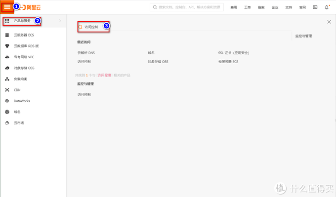](https://post.smzdm.com/p/ax0202l9/pic_3/)

进入访问控制界面，我们点击**用户**，然后点击右侧**创建用户**：

[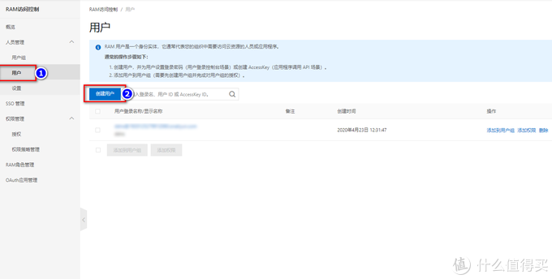](https://post.smzdm.com/p/ax0202l9/pic_4/)

接着在登录名称这里填入你想写的名称，这里随意，但是**要记住**哦，我这里统一填写aliyun，右边的显示名称也填上，同样aliyun，下面的**编程访问勾选**，最后点确定：

[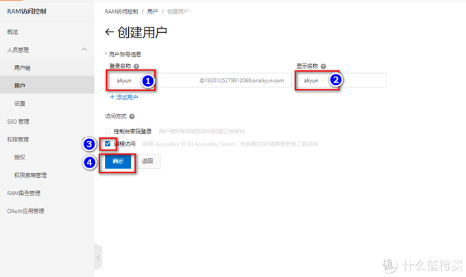](https://post.smzdm.com/p/ax0202l9/pic_5/)

紧着这回到我们左边栏，点击**权限策略管理**，然后点击**创建权限策略**：

[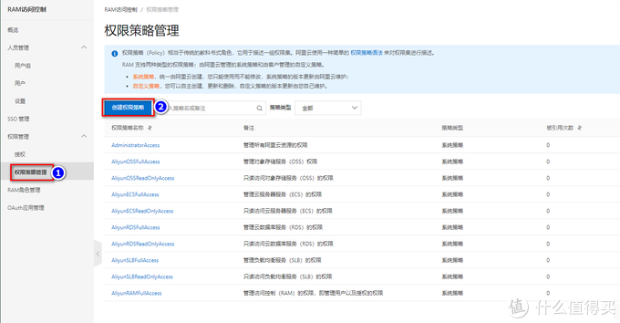](https://post.smzdm.com/p/ax0202l9/pic_6/)

在策略名称填入aliyun，这个名称要记住，后面需要用到，所以建议大家所有需要填写的名称都统一一下，这样方便记忆，在下面的配置模式**勾选脚本配置**，然后粘贴我给大家提供的代码，代码如下：

> {
>
> "Version": "1",
>
> "Statement": [
>
> {
>
> "Action": [
>
> "alidns:AddDomainRecord",
>
> "alidns:DescribeDomainRecords",
>
> "alidns:UpdateDomainRecord"
>
> ],
>
> "Resource": "acs:alidns:*:*:domain/**gxvivo.cn**",
>
> "Effect": "Allow"
>
> }
>
> ]
>
> }

将上述代码中加粗的内容“**gxvivo.cn**”**修改成你自己的域名**，然后在策略内容里粘贴进去：

[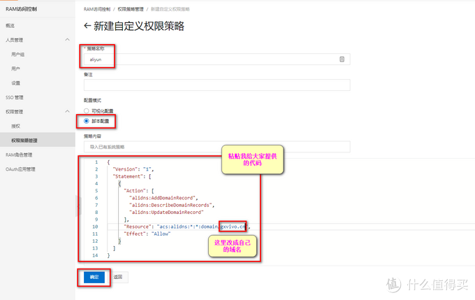](https://post.smzdm.com/p/ax0202l9/pic_7/)

接着回到左边栏。点击**授权**，然后点击右侧**新增授权**：

[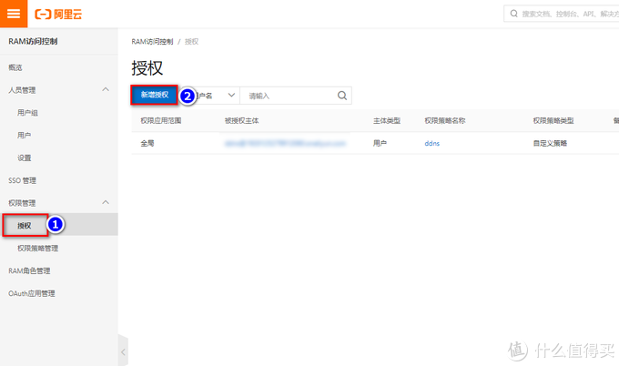](https://post.smzdm.com/p/ax0202l9/pic_8/)

在弹出来的页面中，**被授权主体**输入刚才我们设置的统一名称aliyun，输入后它会**自动检索**到刚刚我们建立的策略，点选它，紧接着点击第二步的下三角，选择**自定义策略**，然后在下面点选**权限策略名称aliyun**，接着在右边会出来已选择项目，确定选好了，我们点击下面的确定：

[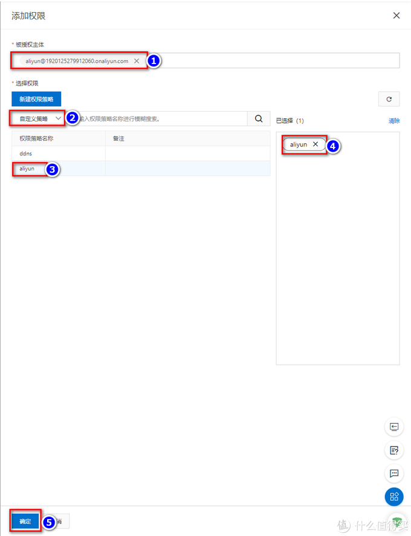](https://post.smzdm.com/p/ax0202l9/pic_9/)

点击确定后，回到授权主界面就能看到我们刚才授权的条目，接着我们点击**被授权主体内容**：

[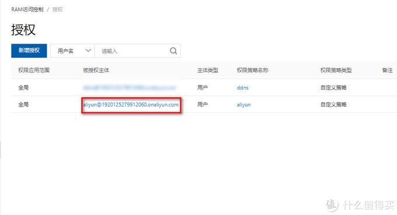](https://post.smzdm.com/p/ax0202l9/pic_10/)

我们首先先**删除**系统自动帮我们生成的AccessKey：

[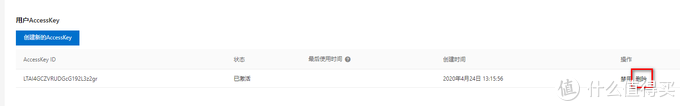](https://post.smzdm.com/p/ax0202l9/pic_11/)

删除后，我们点击**创建新的AccessKey**，重新创建一条新的，点击后系统会自动弹出新建的AccessKey，**大家千万注意，别手快点击确定，已经要把里面的ID与Secret给复制粘贴到自己的[记事本](https://www.smzdm.com/fenlei/bijiben/)，保存后，因为密码只能看一遍，所以，切记切记切记！**这个设定真的有点滑稽，特许为了安全性吧，咱不管了，保存好就行：

[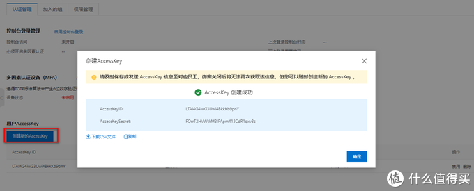](https://post.smzdm.com/p/ax0202l9/pic_12/)

到这里，阿里云上的配置结束，我们回到Ros进行设置。

### 2、Ros相应设置 

用我们之前篇章中提供的winbox软件进入Ros后台：

点选**System-Scripts**：

[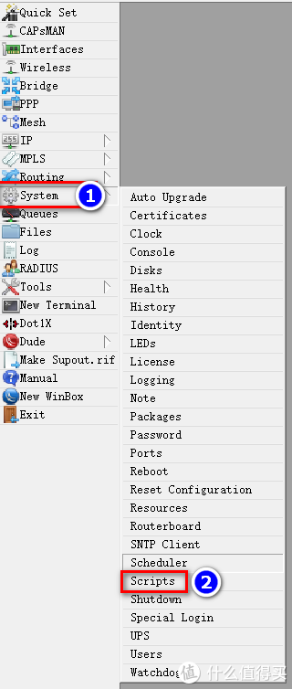](https://post.smzdm.com/p/ax0202l9/pic_14/)

紧接着点选**Scripts选项卡**，然后点击**加号**，在弹出来的界面中，首先填入**name**，**这里的名称随意填，****但是需要记住，后面同样需要用到**，我这里还是统一用aliyun，然后在下面的代码编辑框把我提供给大家的代码粘贴进去：

> \#aliyun Access Key
>
> :local id "**LTAI4G4iwG3Uwi4BkkKb9pnY**"
>
> :local secret "**FOrrT2HVWtkM3IPApm413CdR1qxv8c**"
>
> \#domain
>
> :local domain "**gxvivo.cn**"
>
> :local record "**www**"
>
> \#PPPoE-out
>
> :local pppoe "**pppoe-out1**"
>
> :local ipaddr [/ip address get [/ip address find interface=$pppoe] address]
>
> :set ipaddr [:pick $ipaddr 0 ([len $ipaddr] -3)]
>
> :global aliip
>
> :if ($ipaddr != $aliip) do={
>
> :local result [/tool fetch url="http://u.myxzy.com/alidns/?id=$id&secret=$secret&domain=$domain&record=$record&ip=$ipaddr" as-value output=user];
>
> :if ($result->"status" = "[finish](https://pinpai.smzdm.com/6485/)ed") do={
>
> :if ($result->"data" = "0") do={
>
> :set aliip $ipaddr
>
> :log info "alidns update ok";
>
> } else={
>
> :log info "alidns update error";
>
> }
>
> }
>
> }

代码中，加粗的地方修改成你自己的信息，**一共5个地方**。**local id**与**local secret**就是我们刚才创建AccessKey的ID与secret，**local domain**这里填入改成自己的域名，**local record**这里填写自己的二级地址，这里可以按需随意填写，但是你填什么将来用域名访问你的地址就是什么，比如，我的域名是gxvivo.cn，我在local record填写www，我完整的域名地址就是www.gxvivo.cn，如果我填写ttt，那么同理我完整的域名地址就是ttt.gxvivo.cn，这么说明白了吧，友仔们，最后**local pppoe**就是填写你创建Ros拨号时自己命名的名称，如果不记得或者不清楚，可以看一下我[篇二](https://post.smzdm.com/p/ag8782mm/)，看完你就清楚啦：

[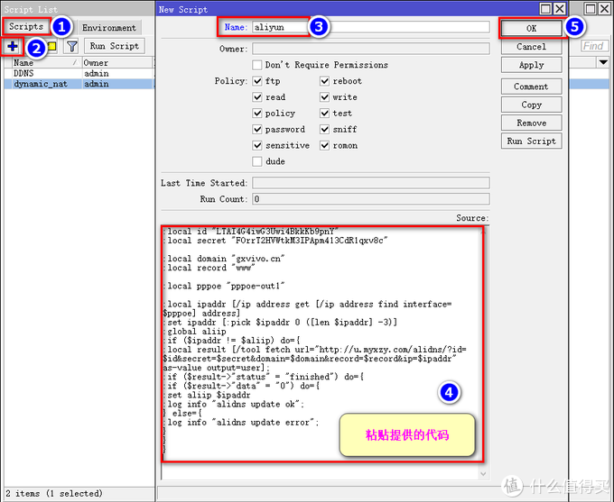](https://post.smzdm.com/p/ax0202l9/pic_15/)

我们脚本文件设置好后，接着我们创建一个定时任务，让它定时去执行我们绑定阿里云域名的策略脚本，点选**System-Ccheduler**：

[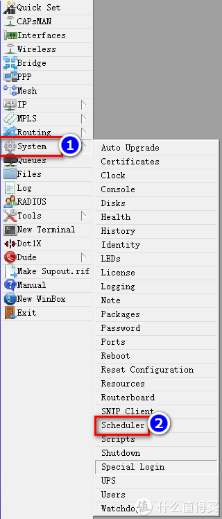](https://post.smzdm.com/p/ax0202l9/pic_16/)

点击加号，在弹出来的界面name设置自己想要的名称，这里随意，这次真的可以随意了，也不用记，随便写，然后在下面的**Start Time选项卡中选项startup**，就是立即执行的意思，接着在下面的**Interval中修改下时间**，这里我改成3分钟，意思就是每隔三分钟执行一次，然后在下面的代码框输入我给大家提供的代码，最后所以设置的总体意思就是每隔三分钟，立即执行下面这段代码，这段代码就是去执行刚刚我们设置Script，这么说，能明白吧？代码如下：

> /system script run **aliyun**

**加粗的内容**修改成你刚才设置**Script的名称**，也就是我让大家记住的那个名称，我这里统一的名称都是aliyun，全部设置完整，点击OK：

[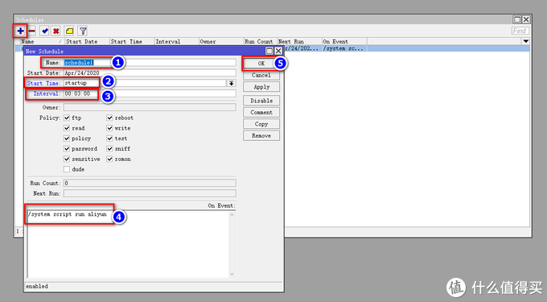](https://post.smzdm.com/p/ax0202l9/pic_17/)

到这里，Ros之DDNS阿里云设置全部完成啦，友仔们可以挺愉快的去耍啦，噜噜噜噜噜噜噜！！！。

## 总结 

### 1、效果 

通过域名外网刚问我的win10虚拟机：

[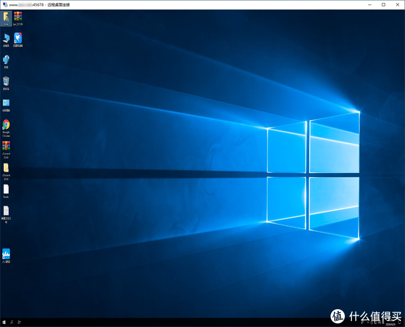](https://post.smzdm.com/p/ax0202l9/pic_18/)

同样也可以访问我们的NAS：

[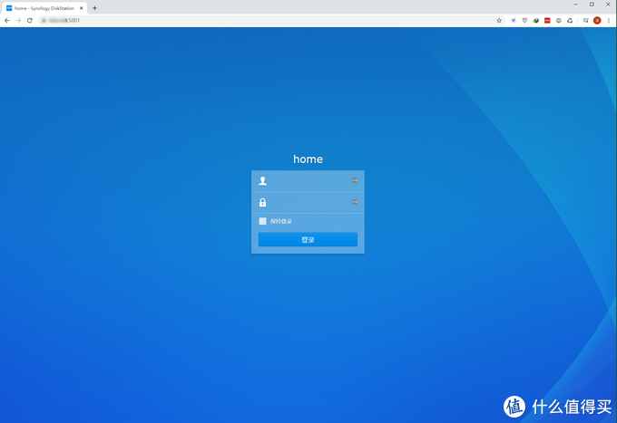](https://post.smzdm.com/p/ax0202l9/pic_19/)

看没木有，是不是贼方便，贼舒服？无论你IP怎么变，我们都能通过域名正常访问哦。

### 2、下篇预告 

当然，要想实现上述功能，还需要在**Ros里做端口转发以及回流**，这部份内容将在**篇四**中告诉大家，敬请期待哦。

最后感谢大家耐心观看，如果对大家有帮助，不要忘了点赞点赞点赞，收藏收藏收藏哦，如果有碎银子，也不要吝啬嘛，来来来，赏点咯，哈哈哈。

**我们下篇（篇四：Ros端口转发及完美回流）见，bye！**