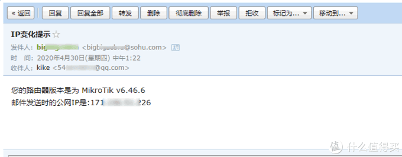
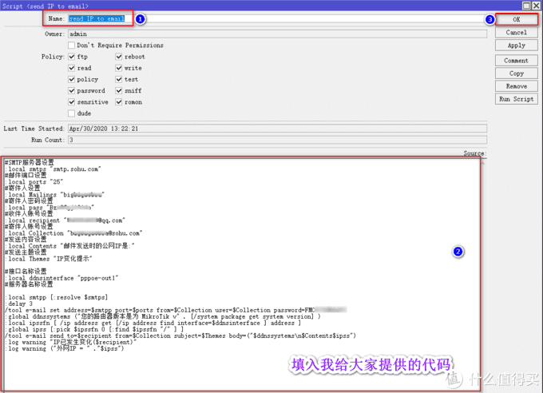
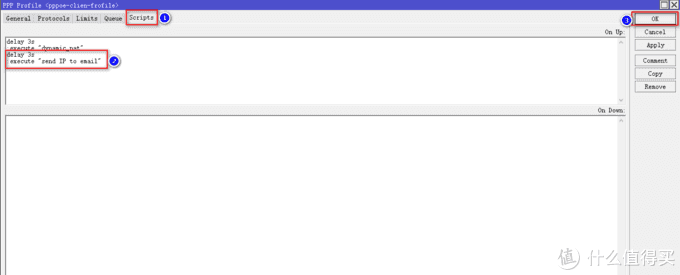

# Ros从入门到精通 篇九

## Ros之IP变动，发送提醒到邮箱；家用宽带，动态IP变动，捆绑拨号，实时更新。

**创作立场声明：**家用Ros从入门到精通系列教程是最新开放的专栏，本篇更多的是针对准备入门或刚入门的新手朋友，老白与大佬不喜勿喷哦，同时也建议各位多多指导与建议，再次感谢大家。

## 前言

1. 大家好，我是大[斑马](https://pinpai.smzdm.com/1859/)，曾经踩坑无数，如今填平归来，作为一枚老白，谈不上技术人才，仅凭一腔热血及[爱好](https://pinpai.smzdm.com/35731/)给大家带来一些分享总结，望大家多多支持哈，不喜勿喷，手下留情，多多指导，相互学习，感谢
2. 今天开始给大家带来家用Ros从入门到精通系列教程，分别为[《Ros下载与安装》](https://post.smzdm.com/p/awx0x282/)、[《Ros基本配置及拨号上网》](https://post.smzdm.com/p/ag8782mm/)、[《Ros DDNS设置》](https://post.smzdm.com/p/ax0202l9/)、《Ros端口转发设置及完美回流方案：[方案一](https://post.smzdm.com/p/ar0v0x2q/)、[方案二](https://post.smzdm.com/p/awx0xv8m/)》、《Ros之VPN配置及使用： [L2TP](https://post.smzdm.com/p/a3gvokw5/) 与 [IKEV2](https://post.smzdm.com/p/av7zrgg4/) 》、《[Ros之系统备份到e-mail](https://post.smzdm.com/p/apz3xp0x/)》、《Ros之IP变动发送提醒到e-mail》、《Ros之标记的灵活运用》、《Ros之光速DNS[服务器](https://www.smzdm.com/fenlei/fuwuqi/)》、《未完待续》
3. 本系列所有教程里有原创也有引用，引用部份会注明出处，在此感谢填坑路上遇到的各路大神，感谢！同时作为个人总结与分享也希望大伙多多指导，交流与相互学习比啥都重要，你说对吧？

## 引言

**在前面的教程中，分别教会了大家如何建立Ros、如何简单配置Ros使其正确上网、Ros利用阿里云域名绑定动态IP（DDNS）、Ros端口转发及完美回流、Ros如何配置VPN实现全世界回家（L2TP与IKEv2）以及Ros的系统配置信息发送至邮箱进行备份，刚进来的朋友不妨回头看看我之前的文章，一定对你有所帮助哦。**

[《篇一：Ros安装》](https://post.smzdm.com/p/awx0x282):

[《篇二：Ros基本配置及拨号上网》](https://post.smzdm.com/p/ag8782mm)：

[《篇三：Ros之DDNS设置》](https://post.smzdm.com/p/ax0202l9)： 

[《篇四：Ros端口转发及](https://post.smzdm.com/p/ar0v0x2q)[完美](https://post.smzdm.com/p/ar0v0x2q)[回流--上篇》](https://post.smzdm.com/p/ar0v0x2q)： 

[《篇五：Ros端口转发及](https://post.smzdm.com/p/awx0xv8m)[完美](https://post.smzdm.com/p/awx0xv8m)[回流--下篇》](https://post.smzdm.com/p/awx0xv8m)：

[《篇六：Ros之VPN配置及使用--L2TP》](https://post.smzdm.com/p/a3gvokw5)：

[《篇七：Ros之VPN配置及使用--IKEv2》](https://post.smzdm.com/p/av7zrgg4)：

[《篇八：Ros之系统备份到e-mail》](https://post.smzdm.com/p/apz3xp0x/)：

目前就家庭宽带网络环境而言，主要分为两种，一种是大内网，一种就是公网，大内网的环境有很多限制，比如无法做端口映射，只能通过内网穿透来实现，相比于大内网，公网的限制就少了很多，也给了我们更多的玩法，但是就目前而言，绝大部分的公网都是动态的，也就是一段时间或者重新拨号后IP会改变，虽然我们可以通过DDNS来绑定域名，实现实时数据对接，但是由于目前api接口都不太完善，数据无法实时更新，IP变动后经常无法通过域名访问，给我们带来了困扰，所以本篇教程主要分享，当我们的公网IP发生变动后，实时的通过邮箱发送IP提醒给我们，让我们拥有“安全感”，哈哈哈。

**1、大内网的朋友，此篇教程不适用与你们哦，但是如果你非要设置，也是可以的，只是IP变动提醒对你意义不大哦。**

**2、本人使用的宽带[运营商](https://www.smzdm.com/fenlei/taocanjiliuliangka/)是电信，1年前才“夺”来的公网IP，也是费了不少劲；域名:端口的方式与IP:端口的方式就目前而言，我更倾向与后者，所以实时的知道我的动态IP，于我而言非常重要。**

## 教程开始

### 1、前提条件：

**本篇教程涉及到的方法，是在之前教程的基础上进行的，所以你需要回头看一下《篇五：Ros端口转发及完美回流--下篇》与《篇八：Ros之系统备份到e-mail》，这个很重要哦！！！**

老规划，先上效果图：

### 2、脚本配置

用**winbox**进入Ros后台：

**进入System--Scripts**，点击**Scripts**，点击加号，Name输入一个名称，这个名称需要记住，后边要用到，我这里填入send IP to email，大家可以跟我一样，在脚本框中输入我给我大家提供的代码，代码如下：

> \#SMTP服务器设置
>
> :local smtps "**smtp.sohu.com**"
>
> \#邮件端口设置
>
> :local ports "**25**"
>
> \#寄件人账号
>
> :local Mailings "**bigzebra**"
>
> \#寄件人密码
>
> :local pass "**123456789**"
>
> \#收件人账号设置
>
> :local recipient "**88888@qq.com**"
>
> \#寄件人账号设置
>
> :local Collection "**bigzebra@sohu.com**"
>
> \#发送内容设置
>
> :local Contents "邮件发送时的公网IP是:"
>
> \#发送主题设置
>
> :local Themes "IP变化提示"
>
> \#接口名称设置
>
> :local ddnsinter[face](https://pinpai.smzdm.com/51904/) "**pppoe-out1**"
>
> \#服务器名称设置
>
> :local smtpp [:resolve $smtps]
>
> :delay 3
>
> /tool e-mail set address=$smtpp port=$ports from=$Collection user=$Collection password=**输入你在邮箱中开启POP3/SMTP服务时弹出来的密钥**
>
> :global ddnssystems ("您的[路由器](https://www.smzdm.com/fenlei/luyouqi/)版本是为 MikroTik v" . [/system package get system version] )
>
> :local ipssfn [ /ip address get [/ip address find interface=$ddnsinterface ] address ]
>
> :global ipss [:pick $ipssfn 0 [:find $ipssfn "/" ] ]
>
> /tool e-mail send to=$recipient from=$Collection subject=$Themes body=("$ddnssystemsn$Contents$ipss")
>
> :log warning "IP已发生变化($recipient)"
>
> :log warning ("外网IP = " ."$ipss")

我用sohu邮箱作为寄件邮箱，常用的QQ邮箱作为收件邮箱，**代码中加粗部份需修改成你自己的信息**。**如果你跟我一样，寄件用的是sohu邮箱，SMTP服务器与SMTP端口则不需要修改，如果使用的是126或163邮箱，则需要根据邮箱提供的信息修改，详细进入邮箱设置里可以看得到，这里不赘述哦；寄件人账号与寄件人密码填入你寄件邮箱的账号与密码；收件人账号设置与寄件人账号设置输入你收件邮箱与寄件邮箱完整的邮箱地址；接口名称设置修改成你自己的名称，Ros进入Interfaces便能看到，如果还是不清楚，建议你看一下我篇二的文章哦；最后一处修改为你在邮箱中开启POP3/SMTP服务时弹出来的密钥，这个很重要哦，别忘了。**

确认无误，点击OK：

### 3、profile设置

回到Ros后台，点击左菜单栏**PPP**，点击上菜单栏**profiles**，找到我们在《篇五：Ros端口转发及完美回流--下篇》新建的条目，我命名为pppoe-clien-frofile，双击打开它，在弹出的界面点**scripts**，添加一条指令，指令如下：

> delay 3s
>
> :execute "send IP to email"

send IP to email为刚才设置脚本scripts时的命名，如果与我一致，则不需用修改，对于这一步的操作有不理解的朋友，一定要去看一下《篇五：Ros端口转发及完美回流--下篇》这篇教程，里面有详细的解释说明，意思就是每当重新拨号，3秒后系统就会执行以send IP to email命名的Scripts脚本，总的来说，就是跟拨号捆绑在了一起，非常舒服，及时性很高哦。设置完点击OK即可：

是不是很简单，哈哈，赶紧操作起来吧！！！

## 总结

1. 从此以后，你的公网IP一旦发生变化，就会有一条IP提示发送到你的邮箱，让你时时刻刻都有“安全感”。
2. 本篇《Ros之IP变动，发送提醒到邮箱》，已经结束啦，建议朋友们耐心看完，绝对对你有所帮助。**如果有任何问题都可以留言给我，我都会一一回复，同时，如果你有更好的方法，或者我的方法有问题，都可以给我留言哦，分享希望得到认可，同时也希望得到进步。不忘初心，我还在路上，加油！！！**
3. **如果你喜欢我的文章，千万别忘了点关注哦，这个对我很重要；你的支持是我前进的动力（最近广**[**大朋**](https://pinpai.smzdm.com/35837/)**友支持力度不够啊，动力不足了，哎，难顶），谢谢大家！！**
4. **同时也千万别忘了点赞点赞点赞，收藏收藏收藏，有碎银子也别吝啬哦，哈哈哈哈，再次感谢大家！！！**