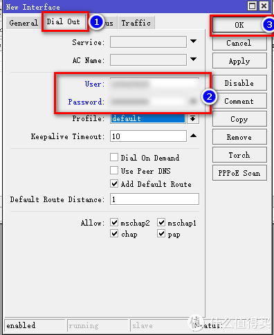

# Ros从入门到精通 篇二

#家用Ros系列教程#

## 篇二：Ros基本配置及拨号上网，简单易懂，一看就会，开始起飞！！！

**创作立场声明：**家用Ros从入门到精通系列教程最新开放的专栏，本篇更多的是针对准备入门或刚入门的新手朋友观看，老白与大佬不喜勿喷哦，同时也建议各位多给建议，再次感谢大家。

## 前言

1. 大家好，我是大斑马，曾经踩坑无数，如今填平归来，作为一枚老白，谈不上技术人才，仅凭一腔热血及[爱好](https://pinpai.smzdm.com/35731/)给大家带来一些分享总结，望大家多多支持哈，不喜勿喷，手下留情，多多指导，相互学习，感谢。
2. 今天开始给大家带来家用Ros从入门到精通系列教程，分别为[《Ros下载与安装》](https://post.smzdm.com/p/awx0x282/)、《Ros基本配置及拨号上网》、《Ros DDNS设置》、《Ros端口转发设置及完美回流方案（2种方案）》、《Ros VPN设置及使用（L2TP与IKEV2）》、《未完待续》。
3. 本系列所有教程里有原创也有引用，引用部份会注明出处，在次先感谢填坑路上遇到的各路大神，感谢！同时作为个人总结与分享也希望大伙多多指导，交流且相互学习比啥都重要，对吧？

## 引言

本篇为篇二：Ros基本设置及拨号上网，上篇篇一：Ros下载与安装中已经教大家如果下载Ros固件，如何配置Ros虚拟机，还不会朋友可以可以先去看下：

[**Ros从入门到精通 篇一：#家用Ros系列教程# 篇一：Ros安装，奶妈级，适合刚接触软路由的同学，轻松上手**](https://post.smzdm.com/p/awx0x282)小编注：此篇文章来自#原创新人#活动，成功参与活动将获得额外50金币奖励。前言大家好，我是大斑马，曾经踩坑无数，如今填平归来，作为一枚老白，谈不上技术人才，仅凭一腔热血及爱好给大家带来一些分享总结，望大家多多支持哈，不喜勿喷，手下留情，多多指导，相互学习，感谢。今天开始给大家带来家用Ros从入门到精[BIgZeBra](https://zhiyou.smzdm.com/member/7255256373/)|*赞*57*评论*32*收藏*315[查看详情](https://post.smzdm.com/p/awx0x282)

本篇主要教大家如何正确的配置Ros各项参数，使其正确上网。虽然Ros后台管理全是英文，很多朋友一看就晕，但其实上手后很容易操作，那么接下来跟着我操作起来吧。

## 教程开始 

### 1、Ros基本配置 

首先我们用篇一给到的**winbox软件**进入后台：

进入Ros的后台后我们先来命名网口，区分lan口与wan口，点击左侧选项**interfaces：**

进来后我们可以看到有两个网口，没有看篇一的朋友可能不清楚哦，我这里**注明一下**，我给Ros配置了2个网口，一个虚拟网口，打算把它做lan口，还有一个I350-T2直通的网口，把它做wan口。在这里我也**建议各位友仔们**，给新建的Ros配置网口的时候，没必要分配太多网口，给2个网口即可，一个做lan一个做wan，一方面区分网口的时候更方便区分，另一方面后续拨号上网以后lan口直接接上[交换机](https://www.smzdm.com/fenlei/jiaohuanji/)，家里其他设备连接交换机使用，这样的数据交互才舒服哈啊哈。

首先我们需要区分网口以及修改对应的名称，先把lan口找出来。大家可以看到ether1是有数据在走的，那它就是我们要找的lan口，因为它是内部数据交互的接口，我们也是通过这个接口来访问Ros的后台，所以他有数据在流动。大家在区分网口的时候，只要**Tx与Rx**有数据在走的，那这个网口就是我们要找的lan口，我们把它改名为lan：

剩下的网口就是我们拨号用的wan口，我们也把它改名为wan（PS：这样很好区分lan口与wan口，对吧？所以我一开始建议大家给Ros分配2个网口即可，如果你分配太多网口，你直接确定lan口，wan口就很难区分出来。）：

区分好lan口与wan口以后，接下来我们修改Ros的IP，点击左侧**IP-addresses**：

进入Addesses List后我们点击加号进行添加设置，在Addesses设置我们的Ros的固定IP，这里我设置成**10.10.10.1，后面加上/24**，10.10.10.1/24的意思是IP为10.10.10.1，子网掩码为255.255.255.0，它只是合成一条参数而已。**network选项不用填**，**Interface选项中下拉找到我们刚才命名的lan**，然后点击OK，IP就设置好啦：

设置完IP，我们设置IP池，我们把IP池范围设置成**10.10.10.100-10.10.10.200**。这里肯定有新手朋友不理解IP池是啥，设置有啥用？我给大家打个比喻，方便大家理解，Ros把它当成你的酒店，Ros的IP就是酒店的地址，客人可以根据酒店的地址找到酒店，IP池就是酒店的房间，你可以规定客人住在哪些房间，10.10.10.100-10.10.10.200，意思就是你规定客人只能住进100号至200号房，其余房间暂不提供哈哈，这么说，应该能明白把？？？（PS：这么多房间，这么大的酒店，你是大户人家啊），另外name随意命名，我这里命名pool1：

设置好IP池，我们接下来设置DHCP Server，设置这个的目的就是给你酒店的前台工作人员授权，让他们按照你的要求，把客人分配到你定好的IP池里。点击**IP-DHCP Server**：

进来以后，选择上菜单栏**DHCP**，然后点击**加号**。选项**Generic**选项，**Name**随意填写，**Interface**选择lan，**Adresses Pool**选择刚才设置的IP池，其他选项保持默认，点OK：

接下来继续在这个页面设置，选择上菜单栏Network，我们设置网关与DNS[服务器](https://www.smzdm.com/fenlei/fuwuqi/)，这里的Adress设置为**10.10.10.0这个网段，后面加上/24**，意思就是10.10.10.0-10.10.10.254整个网段都接受这个网关与DNS的安排，**Gateway(网关)设置成Ros的IP**，**DNS Servers（DNS服务器）也设置成Ros IP**，这里说明一下，我们把DNS服务器指向Ros，后续我们还需要进入Ros自带的DNS里设置相应的DNS：

接下来我们设置Ros具体的DNS，点击**IP-DNS**：

在DNS Settings里，**Servers添加上你最快的DNS地址**，我这里只设置了阿里的114.114.114.114，你可以多加一条本地[运营商](https://www.smzdm.com/fenlei/taocanjiliuliangka/)的DNS，这样更好速度更快；把**Allow Remote Requests的勾打上**，其他默认不变，这里需要解释一下，我们在上面把DNS的服务器指向Ros，Ros通过自身的DNS服务器指向114.114.114.114，这样整个网络就通了，另外Allow Remote Requests的勾选，意思就是把Ros做dns的缓存，你访问的网页都会缓存到Ros的dns服务器里，再次访问某网页，直接提取，速度更快**(PS：后面我会出一篇DNS服务器的教程，利用Debian搭建smartdns与pi-hole配合，达到光速上网，我用了大半年了，速度真的快，可以期待一下哦）**

最后我们关掉某些不用的服务，防止被人恶意连接或攻击，点击**IP-Services**，我们把**除了winbox需要用的8291端口以外的端口服务全都关掉**，点选，然后点击红色叉叉即可：

### 2、Ros拨号设置 

接下来我们进行最后的设置，**Ros拨号以及IP伪装**。

我们先设置拨号，这里我啰嗦几句，如果你是光猫拨号，我建议你还是不要用软路由了，光猫拨号，软路由做二级意义不大，如果你需要用软路由，建议你光猫改桥接模式，然后用Ros或其他软路由系统进行拨号，这样无论是稳定性，还是速度都是最好的，我强烈建议，具体光猫如何改桥接，可在某宝了解一下，这里不阐述。

再次点击**Interfaces**，点击上**菜单栏的Interface**，然后点加号，选择**PPPoE Client**：

进到界面，我们先点**General**，name随意写，**Interfaces**选项选择我们直接确定并命名的**wan**，其他选项保持默认不变：

接着点**Dial Out**，在下面**User与Password填入你的宽带账号与密码**，其他选项保持默认不变，点OK：

拨号设置完成后我们开始设置最后一步，**IP伪装**。

IP伪装的目的这里不阐述，具体可以百度一下，网上有更详细的解释，其实所有软路由系统（包括爱快、高恪等等）都设置了IP伪装，只是系统自动帮你设置好了，Ros就需要自己设置，这也是Ros的特点，自由度很高，操作性强，相关也就很繁琐，对新手朋友不好友好。

点击**IP-Firewall**：

点击**General**，在**Chain选项选择srcnart**，其他选项保持默认不变：

点选**Action**，在下面的**Action选项选择masquerade**，同样其他选项保持默认不变，点击OK：

### 3、接线拨号 

到这里所有的设置全部完成，接下来就把拨号的[网线](https://www.smzdm.com/fenlei/wangxian/)插入wan口，Ros便会自动拨号，然后。。。就没有然后了，你就可以享受Ros给你带来的飞速体验啦。

## 总结 

设置的过程对于新手朋友来说是有些复杂，但是按照本篇教程一步步进行安装配置，绝对没有任何问题，同时也欢迎大家进入软路由Ros的世界。

喜欢的朋友记得点赞、点赞、点赞，收藏、收藏、收藏哦。