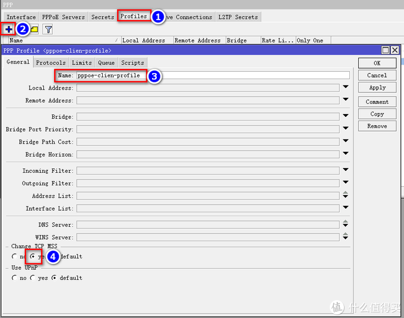

# Ros从入门到精通 篇五

## Ros端口转发及完美回流，配合DDNS，简直无孔不入！！！----下篇

**创作立场声明：**家用Ros从入门到精通系列教程最新开放的专栏，本篇更多的是针对准备入门或刚入门的新手朋友观看，老白与大佬不喜勿喷哦，同时也建议各位多给建议，再次感谢大家。

**追加修改(2020-05-05 10:50:05):**
补充说明： IP--Firewall创建好jump回流指令后，双击进入指令，点击右侧菜单栏Comment,我们需要创建一个注释，输入dynamic_nat（与scripts的命名一致），这步非常重要，不添加注释IP无法自动更新。

## 前言

1. 大家好，我是大[斑马](https://pinpai.smzdm.com/1859/)，曾经踩坑无数，如今填平归来，作为一枚老白，谈不上技术人才，仅凭一腔热血及[爱好](https://pinpai.smzdm.com/35731/)给大家带来一些分享总结，望大家多多支持哈，不喜勿喷，手下留情，多多指导，相互学习，感谢。
2. 今天开始给大家带来家用Ros从入门到精通系列教程，分别为[《Ros下载与安装》](https://post.smzdm.com/p/awx0x282/)、[《Ros基本配置及拨号上网》](https://post.smzdm.com/p/ag8782mm/)、[《Ros DDNS设置》](https://post.smzdm.com/p/ax0202l9/)、《Ros端口转发设置及完美回流方案（2种方案）》、《Ros VPN设置及使用（L2TP与IKEV2）》、《未完待续》。
3. 本系列所有教程里有原创也有引用，引用部份会注明出处，在此感谢填坑路上遇到的各路大神，感谢！同时作为个人总结与分享也希望大伙多多指导，交流与相互学习比啥都重要，你说对吧？

## 引言

在前面的教程中，分别教会了大家如何**建立Ros**、如何**简单配置Ros使其正确上网**以及**Ros利用阿里云域名绑定动态IP（DDNS）**，还不清楚的朋友可以先去看我前面的教程：

[**Ros从入门到精通 篇一：#家用Ros系列教程# 篇一：Ros安装，奶妈级，适合刚接触软路由的同学，轻松上手**](https://post.smzdm.com/p/awx0x282)小编注：此篇文章来自#原创新人#活动，成功参与活动将获得额外50金币奖励。前言大家好，我是大斑马，曾经踩坑无数，如今填平归来，作为一枚老白，谈不上技术人才，仅凭一腔热血及爱好给大家带来一些分享总结，望大家多多支持哈，不喜勿喷，手下留情，多多指导，相互学习，感谢。今天开始给大家带来家用Ros从入门到精[BIgZeBra](https://zhiyou.smzdm.com/member/7255256373/)|*赞*57*评论*32*收藏*315[查看详情](https://post.smzdm.com/p/awx0x282)

[**Ros从入门到精通 篇二：#家用Ros系列教程#篇二：Ros基本配置及拨号上网，简单易懂，一看就会，开始起飞！！！**](https://post.smzdm.com/p/ag8782mm)小编注：此篇文章来自#原创新人#活动，成功参与活动将获得额外50金币奖励。前言大家好，我是大斑马，曾经踩坑无数，如今填平归来，作为一枚老白，谈不上技术人才，仅凭一腔热血及爱好给大家带来一些分享总结，望大家多多支持哈，不喜勿喷，手下留情，多多指导，相互学习，感谢。今天开始给大家带来家用Ros从入门到精[BIgZeBra](https://zhiyou.smzdm.com/member/7255256373/)|*赞*30*评论*19*收藏*76[查看详情](https://post.smzdm.com/p/ag8782mm)

[**Ros从入门到精通 篇三：#家用Ros系列教程#篇三：Ros之DDNS设置；外网轻松访问；全世界回家的先决条件。**](https://post.smzdm.com/p/ax0202l9)小编注：此篇文章来自#原创新人#活动，成功参与活动将获得额外50金币奖励。前言大家好，我是大斑马，曾经踩坑无数，如今填平归来，作为一枚老白，谈不上技术人才，仅凭一腔热血及爱好给大家带来一些分享总结，望大家多多支持哈，不喜勿喷，手下留情，多多指导，相互学习，感谢。今天开始给大家带来家用Ros从入门到精[BIgZeBra](https://zhiyou.smzdm.com/member/7255256373/)|*赞*15*评论*34*收藏*100[查看详情](https://post.smzdm.com/p/ax0202l9)

通过**《篇三：Ros之DDNS配置》**教程我们已经成功绑定了我们的动态IP，无论IP如何改变，都可以利用我们的域名无孔不入，本篇可以说是篇三的下集，要想实现无孔不入（外网访问内网以及即将面世的篇五：Ros的VPN设置，全世界回家），除了需要域名作为地址外，还需要做内网的端口转发以及回流，所以本篇有承上启下的作用哦，请大家耐心看完，因为。。。非常重要啊！！！

## 教程开始 

本篇Ros端口转发及完美回流将介绍2种方法，这2种方法是目前我试过N种方法中，**最奏效的**，因此分享给大家，方法分别为：

1. **Ros自带的cloud功能实现端口转发及回流（上篇内容）**
2. **Ros的Jump命令实现端口转发及回流（下篇内容）**

### 特此申明：

这两种方法**均非本人首创**，但经本人**优化调整，效果更好**。前人栽树，后人乘凉。方法1，感谢[**vediotalk**](https://www.vediotalk.com/)**大神**，提供了很好的思路，但是回流还有些小问题，因为做了补充优化；方法2，感谢**blanksign大神**（国内无相关链接），同样提供了很好的思路，但是大神是技术型人才，一心专研技术，没有更多的精力做出好的教程，所以我根据blanksign大神的思路，做了全面的分解动作，并在其中做了些许优化调整。总之再次感谢[**vedio talk**](https://www.vediotalk.com/)与**blanksign**两位大神，感谢！！

## 本篇为下篇，着重介绍方法二

### Ros的Jump命令实现端口转发及回流

此方法适用于**任何版本的Ros系统****，****没有版本限制，更没有功能上的局限**，非常好用，效果也是杠杠的哦，废话不多说，我们正式开始。

同样，我们用**winbox**软件进入Ros后台：

然后点击**IP-Firewall**：

上菜单栏点击**nat**，然后点击**加号**：

在弹出来的界面点击**General**，**Chain选项选择dstnat**：

接着在上菜单栏选择Action，然后在下面的**Action选择jump**，在往下找到**Jump Targer**输入一个名称，这里大家随意，我填**port-nat**，最后点击OK：

接下来我们去建立一条脚本，点击**System-Scripts**：

在上菜单栏点击**Scripts**，然后点击**加号**，在弹出来的界面中，**Name**输入一个名称，**这个名称很重要，一定要记住**，我建议新手朋友跟我一样就行，省的后面还要改脚本，我这里填入**dynamic_nat**，在下面的代码框输入我给大家提供的脚本代码：

> :global addold
>
> :global addnew
>
> :set addnew [/inter[face](https://pinpai.smzdm.com/51904/) get [/interface find name="**pppoe-out1**"] running]
>
> :if ($addnew=true) do={
>
> :set addold [/ip address get [/ip address find dynamic=yes interface="**pppoe-out1**"] address]
>
> :set addold [:pick $addold 0 ([:len $addold ] -3)]
>
> /ip firewall nat set [/ip firewall nat find comment="**dynamic_nat**"] dst-address=$addold
>
> }

脚本中需要改**3处**地方，分别给大家加粗了，前两处改动的就是你拨号的名称，大家根据自己的命名来修改，看下图：

第三处就是我们新建的这个scripts的名称，如果大家跟我同样的命名，就不需要改了，最后点击OK：

紧接着我们需要让它定时启动，但是这次我们不用定时任务功能（scheduler），我们用**PPP**里的**Profiles**来执行，**这样的好处就是，跟拨号捆绑在一起，只有重新拨号，IP肯定会改变，IP一改变，马上检索到变化并赋值给nat，非常高效及时**，大家跟着我操作。

回到Ros主界面，点击**左菜单栏PPP**：

在弹出的界面点击**Profiles**，然后点加号，接着在**Name**输入名称，这里大家可以随意填写，我写的是**pppoe-clien-profile**，但是可以跟我一样，在下面的**Change TCP MSS勾选yes**，一定要勾选上，别忘了：

然后点击**上菜单栏Scripts**，在下面输入我给大家提供的代码：

> delay 3s
>
> :execute "**dynamic_nat**"

加粗部份需要改成你刚才设置Scripts时的命名，如果大家一直跟我保持一致，就不需要改动了，直接复制进去就好；另外，**这里解释一下这段代码，意思就是每当重新拨号，3秒中后系统就会执行以dynamic_nat命名的Scripts脚本，总的来说，就是跟拨号捆绑在了一起，非常舒服，及时性很高哦**。设置完点击OK即可：

我们一直在强调跟拨号捆绑，但是以上做的设置都是为捆绑做准备，那好，接下来我们把它们捆绑起来，点击左侧菜单栏，点击**Interfaces**：

进入界面后我们选择上菜单栏的**Interface**，然后找到我们的拨号条目，不清楚如何拨号的新手朋友可以去看一下我[篇二](https://post.smzdm.com/p/ag8782mm/)的内容，接着**双击进入**，在上菜单栏找到**Dial Out**，接着在下面的**Profile**选项选择我们刚刚建立的**pppoe-clien-profile**，然后**其他选项不动**，点击OK：

好了，到这里**我们的jump指令设置（实现回流），以及捆绑拨号（实现自动、高效且及时的检索变动IP）**已经完成了，接下来就是做端口转发啦！！！

**我依旧跟《篇四：上篇》一样，以[群晖](https://pinpai.smzdm.com/2315/)web为例。**

跟《篇四：上篇》说的一样，我们后续所有的端口转发都在nat下设置，点击**IP-Firewall**：

点击**nat**，再点击**加号**，在弹出来的页面点击**General**，**Chain**选择刚才我们设置jump时的命名，我之前命名为**port-nat**，选择它，**Protocl选tcp**（常用类型tcp与udp，视你转发的目的为准），**Dst。Por****t输入你外网自定义的端口号，你输入啥你访问的时候域名后就加啥，举例，我这里写5000，那么访问群晖WEB的时候就是**[www.gxvivo.cn:5000：](http://www.gxvivo.cn:5000/)

接着我们点击上菜单栏**Action**，在下面的**Action选择dst-nat**，然后在下面**To Addresses**输入你将要转发项目的内网IP，我的群晖IP是10.10.10.10.，所以把它填进去，根据你的具体情况来填写，**To Port输入你要映射的内网端口，这里的端口可不能乱写，要根据你将要转发的项目规定的端口来填写，群晖WEB的端口是5000，window系统的远程访问端口是3389等等，这些都是项目规定好的端口**，这里要注意哦，最后点击OK：

好了，群晖WEB5000端口转发到外网5000端口就做好啦，你就可以通过**域名:5000** ，在外网访问你的群晖啦，同时，回流也完美设置，你在**内网同样可以**通过域名:5000来访问哦（在内网还用啥域名访问。。。可是有些朋友就是有强迫症哈，不知道你是不是，反正我是。。。）

怕新手朋友看得有写晕，我这里再举一个**端口转发win10的设置**：

我win10做下载机，经常需要在公司远程连接，进行下载任务，所以外网访问我内网虚拟机搭建的win10很重要哦，**win10内网IP为10.10.10.50，外网自定义端口设置为45678，内网远程访问端口为3389。**

## 总结 

1. **本篇《篇四（五）：Ros端口端口转发及完美回流》下篇**，已经结束啦，**建议**朋友们**上篇与下篇都耐心看完**，绝对对你**有所帮助**。如果有任何问题都可以留言给我，我都会一一回复，同时，如果你有更好的方法，或者我的方法有问题，都可以给我留言哦，**分享希望得到认可，同时也希望得到进步**。不忘初心，我还在路上，加油！！！
2. 最后千千千万别忘了**点赞点赞点赞，收藏收藏收藏**，有碎银子也别吝啬哦，哈哈哈哈，再次感谢大家！！！