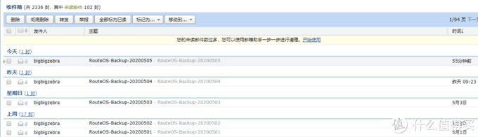
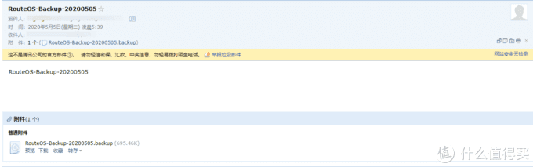
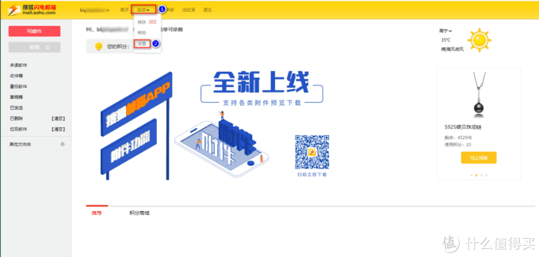
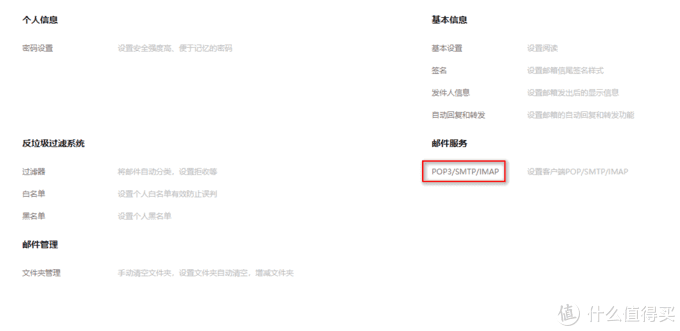
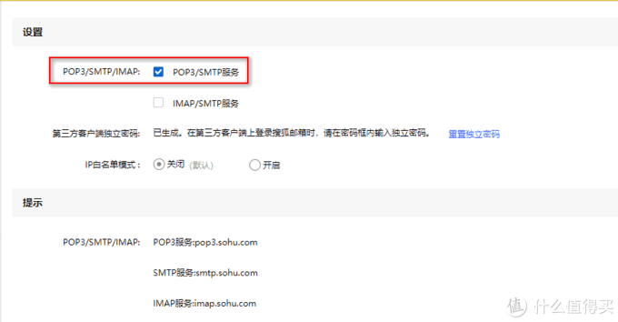
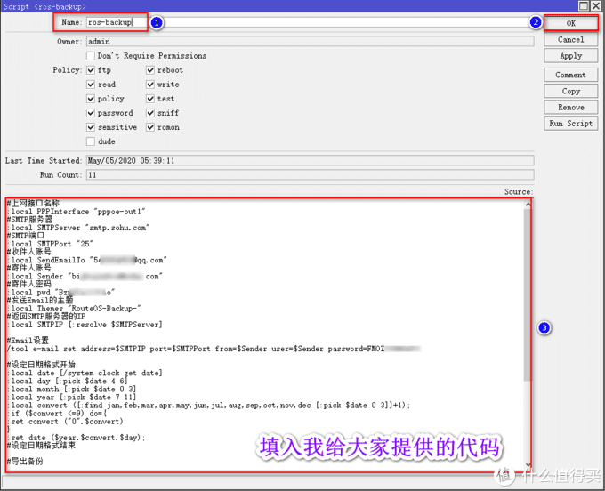
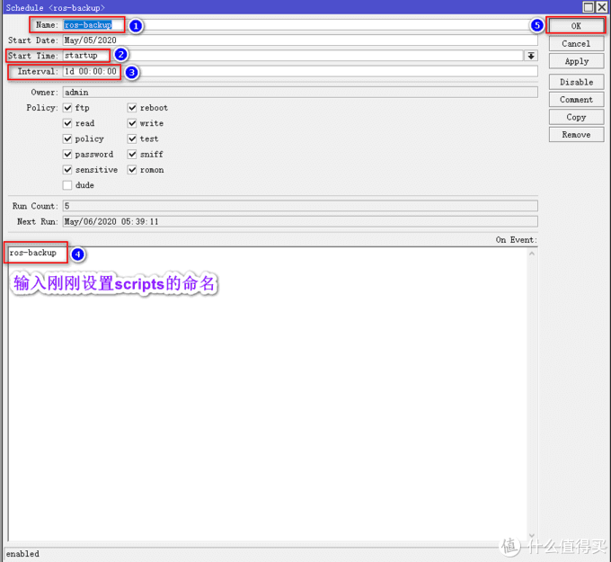
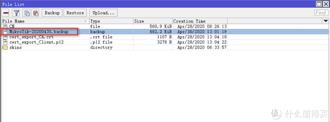
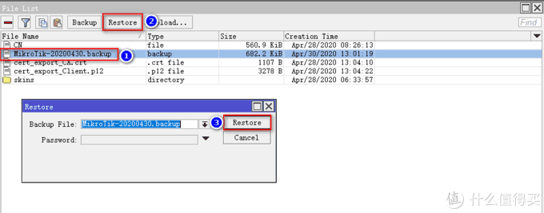

# Ros从入门到精通 篇八

## Ros之系统配置信息备份到邮箱，以备不时之需；一键恢复Ros配置；新手设置1次便可一劳永逸

**创作立场声明：**家用Ros从入门到精通系列教程是最新开放的专栏，本篇更多的是针对准备入门或刚入门的新手朋友，老白与大佬不喜勿喷哦，同时也建议各位多多指导与建议，再次感谢大家。

## 前言

1. 大家好，我是大[斑马](https://pinpai.smzdm.com/1859/)，曾经踩坑无数，如今填平归来，作为一枚老白，谈不上技术人才，仅凭一腔热血及[爱好](https://pinpai.smzdm.com/35731/)给大家带来一些分享总结，望大家多多支持哈，不喜勿喷，手下留情，多多指导，相互学习，感谢
2. 今天开始给大家带来家用Ros从入门到精通系列教程，分别为[《Ros下载与安装》](https://post.smzdm.com/p/awx0x282/)、[《Ros基本配置及拨号上网》](https://post.smzdm.com/p/ag8782mm/)、[《Ros DDNS设置》](https://post.smzdm.com/p/ax0202l9/)、《Ros端口转发设置及完美回流方案：[方案一](https://post.smzdm.com/p/ar0v0x2q/)、[方案二](https://post.smzdm.com/p/awx0xv8m/)》、《Ros之VPN配置及使用： [L2TP](https://post.smzdm.com/p/a3gvokw5/) 与 [IKEV2](https://post.smzdm.com/p/av7zrgg4/) 》、《Ros之系统备份到e-mail》、《Ros之IP变动发送提醒到e-mail》、《Ros之标记的灵活运用》、《Ros之光速DNS[服务器](https://www.smzdm.com/fenlei/fuwuqi/)》、《未完待续》
3. 本系列所有教程里有原创也有引用，引用部份会注明出处，在此感谢填坑路上遇到的各路大神，感谢！同时作为个人总结与分享也希望大伙多多指导，交流与相互学习比啥都重要，你说对吧？

## 引言

在前面的教程中，分别教会了大家如何建立Ros、如何简单配置Ros使其正确上网、Ros利用阿里云域名绑定动态IP（DDNS）、Ros端口转发及完美回流以及Ros如何配置VPN实现全世界回家（L2TP与IKEv2），刚进来的朋友不妨回头看看我之前的文章，一定对你有所帮助哦。

《篇一：Ros安装》：

[**Ros从入门到精通 篇一：#家用Ros系列教程# 篇一：Ros安装，奶妈级，适合刚接触软路由的同学，轻松上手**](https://post.smzdm.com/p/awx0x282)小编注：此篇文章来自#原创新人#活动，成功参与活动将获得额外50金币奖励。前言大家好，我是大斑马，曾经踩坑无数，如今填平归来，作为一枚老白，谈不上技术人才，仅凭一腔热血及爱好给大家带来一些分享总结，望大家多多支持哈，不喜勿喷，手下留情，多多指导，相互学习，感谢。今天开始给大家带来家用Ros从入门到精[BIgZeBra](https://zhiyou.smzdm.com/member/7255256373/)|*赞*57*评论*32*收藏*315[查看详情](https://post.smzdm.com/p/awx0x282)

《篇二：Ros基本配置及拨号上网》：

[**Ros从入门到精通 篇二：#家用Ros系列教程#篇二：Ros基本配置及拨号上网，简单易懂，一看就会，开始起飞！！！**](https://post.smzdm.com/p/ag8782mm)小编注：此篇文章来自#原创新人#活动，成功参与活动将获得额外50金币奖励。前言大家好，我是大斑马，曾经踩坑无数，如今填平归来，作为一枚老白，谈不上技术人才，仅凭一腔热血及爱好给大家带来一些分享总结，望大家多多支持哈，不喜勿喷，手下留情，多多指导，相互学习，感谢。今天开始给大家带来家用Ros从入门到精[BIgZeBra](https://zhiyou.smzdm.com/member/7255256373/)|*赞*30*评论*19*收藏*76[查看详情](https://post.smzdm.com/p/ag8782mm)

《篇三：Ros之DDNS设置》：

[**Ros从入门到精通 篇三：#家用Ros系列教程#篇三：Ros之DDNS设置；外网轻松访问；全世界回家的先决条件。**](https://post.smzdm.com/p/ax0202l9)小编注：此篇文章来自#原创新人#活动，成功参与活动将获得额外50金币奖励。前言大家好，我是大斑马，曾经踩坑无数，如今填平归来，作为一枚老白，谈不上技术人才，仅凭一腔热血及爱好给大家带来一些分享总结，望大家多多支持哈，不喜勿喷，手下留情，多多指导，相互学习，感谢。今天开始给大家带来家用Ros从入门到精[BIgZeBra](https://zhiyou.smzdm.com/member/7255256373/)|*赞*15*评论*34*收藏*100[查看详情](https://post.smzdm.com/p/ax0202l9)

《篇四：Ros端口转发及完美回流--上篇》：

[**Ros从入门到精通 篇四：Ros端口转发及完美回流，配合DDNS，简直无孔不入！！！----上篇**](https://post.smzdm.com/p/ar0v0x2q)前言大家好，我是大斑马，曾经踩坑无数，如今填平归来，作为一枚老白，谈不上技术人才，仅凭一腔热血及爱好给大家带来一些分享总结，望大家多多支持哈，不喜勿喷，手下留情，多多指导，相互学习，感谢。今天开始给大家带来家用Ros从入门到精通系列教程，分别为《Ros下载与安装》、《Ros基本配置及拨号上网》、《R[BIgZeBra](https://zhiyou.smzdm.com/member/7255256373/)|*赞*18*评论*20*收藏*75[查看详情](https://post.smzdm.com/p/ar0v0x2q)

《篇五：Ros端口转发及完美回流--下篇》

[**Ros从入门到精通 篇五：Ros端口转发及完美回流，配合DDNS，简直无孔不入！！！----下篇**](https://post.smzdm.com/p/awx0xv8m)追加修改(2020-05-0510:50:05):补充说明：IP--Firewall创建好jump回流指令后，双击进入指令，点击右侧菜单栏Comment,我们需要创建一个注释，输入dynamic_nat（与scripts的命名一致），这步非常重要，不添加注释IP无法自动更新。前言大家好，我是大斑马，[BIgZeBra](https://zhiyou.smzdm.com/member/7255256373/)|*赞*22*评论*59*收藏*67[查看详情](https://post.smzdm.com/p/awx0xv8m)

《篇六：Ros之VPN配置及使用--L2TP》

[**Ros从入门到精通 篇六：Ros之VPN配置及使用，L2TP连接模式，全世界回家，稳定，高效。**](https://post.smzdm.com/p/a3gvokw5)前言大家好，我是大斑马，曾经踩坑无数，如今填平归来，作为一枚老白，谈不上技术人才，仅凭一腔热血及爱好给大家带来一些分享总结，望大家多多支持哈，不喜勿喷，手下留情，多多指导，相互学习，感谢今天开始给大家带来家用Ros从入门到精通系列教程，分别为《Ros下载与安装》、《Ros基本配置及拨号上网》、《Ro[BIgZeBra](https://zhiyou.smzdm.com/member/7255256373/)|*赞*11*评论*8*收藏*24[查看详情](https://post.smzdm.com/p/a3gvokw5)

《篇七：Ros之VPN配置及使用--IKEv2》

[**Ros从入门到精通 篇七：Ros之VPN配置及使用，IKEv2连接模式，全世界回家，更稳定，更高效，强烈推荐！！！**](https://post.smzdm.com/p/av7zrgg4)前言大家好，我是大斑马，曾经踩坑无数，如今填平归来，作为一枚老白，谈不上技术人才，仅凭一腔热血及爱好给大家带来一些分享总结，望大家多多支持哈，不喜勿喷，手下留情，多多指导，相互学习，感谢今天开始给大家带来家用Ros从入门到精通系列教程，分别为《Ros下载与安装》、《Ros基本配置及拨号上网》、《Ro[BIgZeBra](https://zhiyou.smzdm.com/member/7255256373/)|*赞*31*评论*40*收藏*112[查看详情](https://post.smzdm.com/p/av7zrgg4)

本篇教程主要教大家**如何把我们辛辛苦苦配置的Ros系统设置备份好，并将它自动的定期保存在邮箱中，以备不时之需**，当然备份的方式多种多样，比如直接用esxi生成快照，又或者在esxi中导出备份等等，但是通过我多年使用Ros发现，**通过Ros自带的备份系统进行备份，再通过邮箱系统定期备份到邮箱，再到后来系统恢复，无论是稳定性还是安全性，都是最好的**，这让我让屡试不爽，所以今天我把它备份给大家。

## 教程开始

**老规矩，先上效果图，我的设置是每天备份一次**：

### 1、前提准备： 

1、需要2个邮箱，分别用作**发邮件与收邮件**，也可1个邮箱，同时作为收发邮件；**发送邮件的邮箱经测试sohu、126、163使用起来比较方便，QQ与gmail的设置比较复杂，不建议用**，收件邮箱没有限制，想用什么用什么哦，我个人的使用组合为发件邮箱是sohu，收件邮箱为常用的QQ邮箱，建议大家可以跟我一样哦。

2、需要脚本文件（这里是废话，哈哈，因为我会给大家提供，大家按需修改成自己的即可）

3、跟着操作（保证每一步都正确，那绝对没问题。）

那我们开始吧，冲冲冲！！！

### 2、Ros配置脚本及定时任务 

**首先，发件邮箱需打开POP3/SMTP服务**。我用的sohu邮箱，其他邮箱的设置大同小异，只需进入设置，把POP3/SMTP服务打开即可，**打开POP3/SMTP服务后会弹出一个密钥，这个很重要，需要大家把它保存下来，后面会需要用到**：

发件邮箱设置好后，先不用管它，把它丢一边，我们回到Ros，进行配置。

老规矩，用**winbox**进入Ros后台：

**设置脚本**。进入**System--Scripts**，点击Scripts，点击加号，弹出来的界面中，Name输入一个名称，这里大家随意，但是需要记住，后面我们设置定时任务的时候需要用到，脚本框里输入我给大家提供的代码，代码如下：

> \#上网接口名称
>
> :local PPPInter[face](https://pinpai.smzdm.com/51904/) "**pppoe-out1**"
>
> \#SMTP服务器
>
> :local SMTPServer "**smtp.sohu.com**"
>
> \#SMTP端口
>
> :local SMTPPort "**25**"
>
> \#收件人账号
>
> :local SendEmailTo "**输入你的收件邮箱地址**"
>
> \#寄件人账号
>
> :local Sender "**输入你的发件邮箱地址**"
>
> \#寄件人密码
>
> :local pwd "**输入你的收件邮箱的密码**"
>
> \#发送Email的主题
>
> :local Themes "RouteOS-Backup-"
>
> \#返回SMTP服务器的IP
>
> :local SMTPIP [:resolve $SMTPServer]
>
> 
>
> \#Email设置
>
> /tool e-mail set address=$SMTPIP port=$SMTPPort from=$Sender user=$Sender password=**输入你在邮箱中开启POP3/SMTP服务时弹出来的密钥**
>
> 
>
> \#设定日期格式开始
>
> :local date [/system clock get date]
>
> :local day [:pick $date 4 6]
>
> :local month [:pick $date 0 3]
>
> :local year [:pick $date 7 11]
>
> :local convert ([:find jan,feb,mar,apr,may,jun,jul,aug,sep,oct,nov,dec [:pick $date 0 3]]+1);
>
> :if ($convert <=9) do={
>
> :set convert ("0".$convert)
>
> }
>
> :set date ($year.$convert.$day);
>
> \#设定日期格式结束
>
> 
>
> \#导出备份
>
> /system backup save dont-encrypt=yes name=($Themes.$date);
>
> 
>
> \#延时5秒
>
> :delay 5;
>
> 
>
> \#发送Email设置
>
> /tool e-mail send to=$SendEmailTo from=$Sender subject=("$Themes$date") body=("$Themes$date") file=($Themes.$date)
>
> 
>
> \#延迟20
>
> :delay 20;
>
> 
>
> /file remove ($Themes.$date.".backup")
>
> \#日志提醒
>
> :log warning "系统数据已备份，邮件已发送至($SendEmailTo)"

**代码中，加粗的部份需要修改成你自己的信息。上网接口名称修改成你自己的名称，Ros进入Interfaces便能看到，如果还是不清楚，建议你看一下我篇二的文章哦；如果你跟我一样，用的是sohu邮箱，SMTP服务器与SMTP端口则不需要修改，如果使用的是126或163邮箱，则需要根据邮箱提供的信息修改，详细进入邮箱设置里可以看得到，这里不赘述哦；寄件人账号寄件人密码及收件人账号顾名思义，填入即可，我寄件用的是sohu邮箱，收件用的是我常用的QQ邮箱；最后一处修改为你在邮箱中开启POP3/SMTP服务时弹出来的密钥，这个很重要哦，别忘了。**

最后确认无误，点击OK：

接着，我们设置定时任务。进入**System--Scheduler**，点击加号，Name这里大家随意填写，Start Time选择startup，Interval这里大家根据自己的需求填写，我设置的是1d，意思就是一天备份一次，并发送备份至邮箱，脚本框输入刚刚创建scripts时你的命名，最后确认无误，点击OK：

到这里，设置全部结束，是不是很简单哦。

**从此以后，你的Ros就安全啦，放心的折腾起来吧，出问题咱就恢复，再也不用“从头再来”了。**

### 3、Ros备份恢复 

恢复备份非常简单哦，当你需要恢复的时候，先从我们的邮箱把备份下载到电脑，再从电脑把备份文件拖拽到Ros的Files里，接着选定拖拽进去的Ros备份文件，点击Restore，在弹出界面中再点击Restore，然后Ros会重启，这样就恢复好啦，**这里要注意，一定要选中你的备份文件再点击Restore**：

## 总结

1. 从此以后，你的Ros就安全啦，放心的折腾起来吧，出问题咱就恢复，再也不用“从头再来”了。
2. 本篇《Ros之系统备份到E-mail》，已经结束啦，建议朋友们耐心看完，绝对对你有所帮助。如果有任何问题都可以留言给我，我都会一一回复，同时，如果你有更好的方法，或者我的方法有问题，都可以给我留言哦，分享希望得到认可，同时也希望得到进步。不忘初心，我还在路上，加油！！！
3. **如果你喜欢我的文章，千万别忘了点关注哦，这个对我很重要；你的支持是我前进的动力（最近广[大朋](https://pinpai.smzdm.com/35837/)友支持力度不够啊，动力不足了，哎，难顶），谢谢大家！！**
4. **同时也千万别忘了点赞点赞点赞，收藏收藏收藏，有碎银子也别吝啬哦，哈哈哈哈，再次感谢大家！！！**