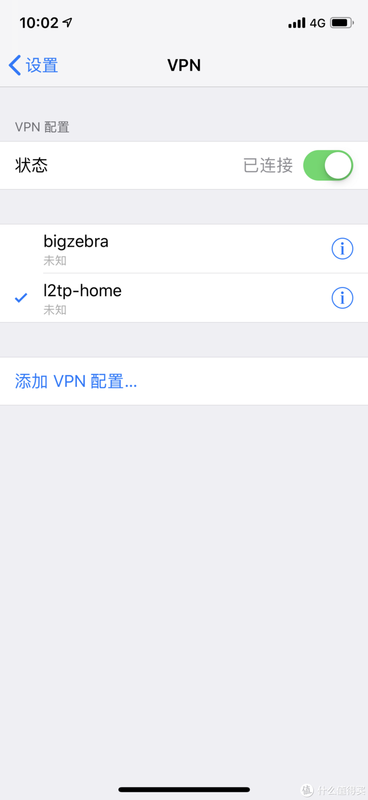
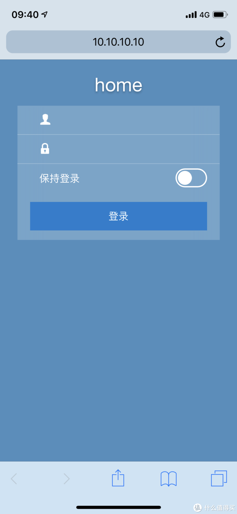
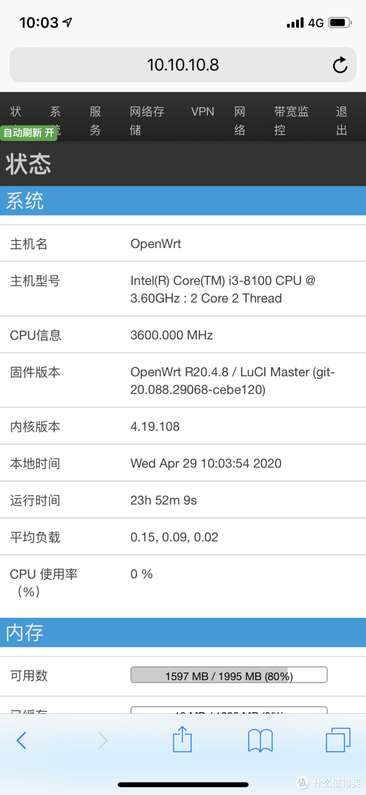
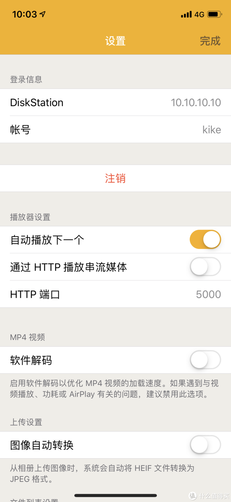
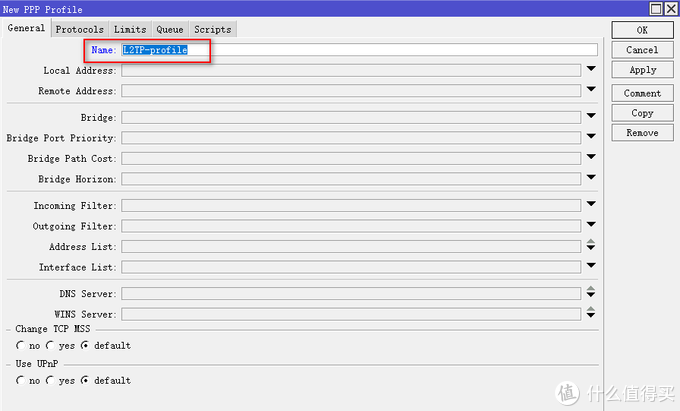
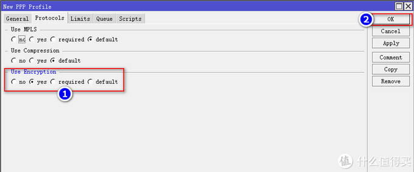
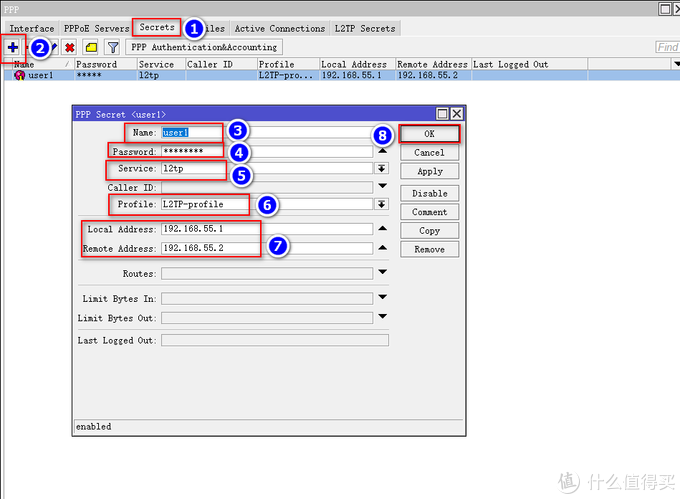
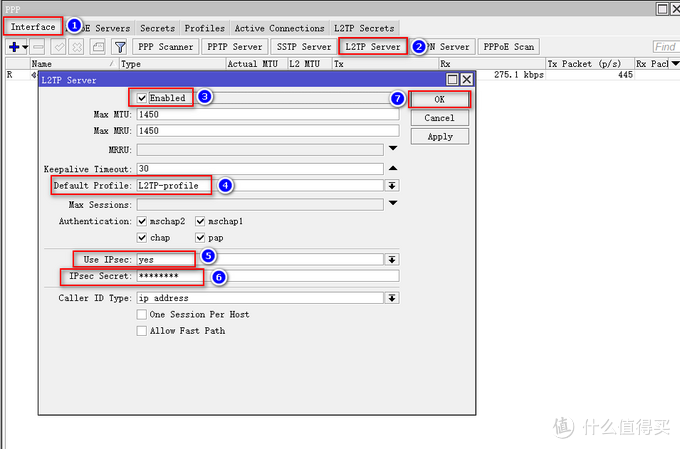
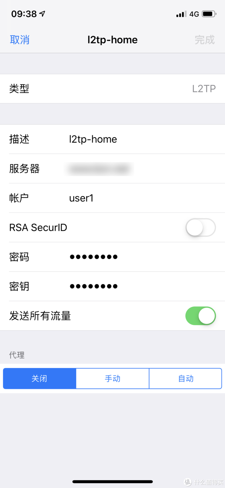

# Ros从入门到精通 篇六

## Ros之VPN配置及使用，L2TP连接模式，全世界回家，稳定，高效。

**创作立场声明：**家用Ros从入门到精通系列教程是最新开放的专栏，本篇更多的是针对准备入门或刚入门的新手朋友，老白与大佬不喜勿喷哦，同时也建议各位多多指导与建议，再次感谢大家。

## 前言

1. 大家好，我是大斑马，曾经踩坑无数，如今填平归来，作为一枚老白，谈不上技术人才，仅凭一腔热血及爱好给大家带来一些分享总结，望大家多多支持哈，不喜勿喷，手下留情，多多指导，相互学习，感谢
2. 今天开始给大家带来家用Ros从入门到精通系列教程，分别为[《Ros下载与安装》](https://post.smzdm.com/p/awx0x282/)、[《Ros基本配置及拨号上网》](https://post.smzdm.com/p/ag8782mm/)、[《Ros DDNS设置》](https://post.smzdm.com/p/ax0202l9/)、《Ros端口转发设置及完美回流方案：[方案一](https://post.smzdm.com/p/ar0v0x2q/)、[方案二](https://post.smzdm.com/p/awx0xv8m/)》、《Ros之VPN配置及使用（L2TP与IKEV2）》、《未完待续》
3. 本系列所有教程里有原创也有引用，引用部份会注明出处，在此感谢填坑路上遇到的各路大神，感谢！同时作为个人总结与分享也希望大伙多多指导，交流与相互学习比啥都重要，你说对吧？

## 引言

**在前面的教程中，分别教会了大家如何建立Ros、如何简单配置Ros使其正确上网、Ros利用阿里云域名绑定动态IP（DDNS）以及Ros端口转发及完美回流，还不清楚的朋友可以先去看我前面的教程：**

[**Ros从入门到精通 篇一：#家用Ros系列教程# 篇一：Ros安装，奶妈级，适合刚接触软路由的同学，轻松上手**](https://post.smzdm.com/p/awx0x282)小编注：此篇文章来自#原创新人#活动，成功参与活动将获得额外50金币奖励。前言大家好，我是大斑马，曾经踩坑无数，如今填平归来，作为一枚老白，谈不上技术人才，仅凭一腔热血及爱好给大家带来一些分享总结，望大家多多支持哈，不喜勿喷，手下留情，多多指导，相互学习，感谢。今天开始给大家带来家用Ros从入门到精[BIgZeBra](https://zhiyou.smzdm.com/member/7255256373/)|*赞*57*评论*32*收藏*315[查看详情](https://post.smzdm.com/p/awx0x282)[**Ros从入门到精通 篇二：#家用Ros系列教程#篇二：Ros基本配置及拨号上网，简单易懂，一看就会，开始起飞！！！**](https://post.smzdm.com/p/ag8782mm)小编注：此篇文章来自#原创新人#活动，成功参与活动将获得额外50金币奖励。前言大家好，我是大斑马，曾经踩坑无数，如今填平归来，作为一枚老白，谈不上技术人才，仅凭一腔热血及爱好给大家带来一些分享总结，望大家多多支持哈，不喜勿喷，手下留情，多多指导，相互学习，感谢。今天开始给大家带来家用Ros从入门到精[BIgZeBra](https://zhiyou.smzdm.com/member/7255256373/)|*赞*30*评论*19*收藏*76[查看详情](https://post.smzdm.com/p/ag8782mm)[**Ros从入门到精通 篇三：#家用Ros系列教程#篇三：Ros之DDNS设置；外网轻松访问；全世界回家的先决条件。**](https://post.smzdm.com/p/ax0202l9)小编注：此篇文章来自#原创新人#活动，成功参与活动将获得额外50金币奖励。前言大家好，我是大斑马，曾经踩坑无数，如今填平归来，作为一枚老白，谈不上技术人才，仅凭一腔热血及爱好给大家带来一些分享总结，望大家多多支持哈，不喜勿喷，手下留情，多多指导，相互学习，感谢。今天开始给大家带来家用Ros从入门到精[BIgZeBra](https://zhiyou.smzdm.com/member/7255256373/)|*赞*15*评论*34*收藏*100[查看详情](https://post.smzdm.com/p/ax0202l9)[**Ros从入门到精通 篇四：Ros端口转发及完美回流，配合DDNS，简直无孔不入！！！----上篇**](https://post.smzdm.com/p/ar0v0x2q)前言大家好，我是大斑马，曾经踩坑无数，如今填平归来，作为一枚老白，谈不上技术人才，仅凭一腔热血及爱好给大家带来一些分享总结，望大家多多支持哈，不喜勿喷，手下留情，多多指导，相互学习，感谢。今天开始给大家带来家用Ros从入门到精通系列教程，分别为《Ros下载与安装》、《Ros基本配置及拨号上网》、《R[BIgZeBra](https://zhiyou.smzdm.com/member/7255256373/)|*赞*18*评论*20*收藏*75[查看详情](https://post.smzdm.com/p/ar0v0x2q)[**Ros从入门到精通 篇五：Ros端口转发及完美回流，配合DDNS，简直无孔不入！！！----下篇**](https://post.smzdm.com/p/awx0xv8m)前言大家好，我是大斑马，曾经踩坑无数，如今填平归来，作为一枚老白，谈不上技术人才，仅凭一腔热血及爱好给大家带来一些分享总结，望大家多多支持哈，不喜勿喷，手下留情，多多指导，相互学习，感谢。今天开始给大家带来家用Ros从入门到精通系列教程，分别为《Ros下载与安装》、《Ros基本配置及拨号上网》、《R[BIgZeBra](https://zhiyou.smzdm.com/member/7255256373/)|*赞*22*评论*59*收藏*67[查看详情](https://post.smzdm.com/p/awx0xv8m)

**本篇主要教大家，Ros采用L2TP的连接模式，如何配置VPN，并在客户端如何完美使用，最终实现全世界回家功能，**话不多说，我们先看效果图：

在[手机](https://www.smzdm.com/fenlei/zhinengshouji/)上连接好VPN，可以使用4G网络通过内网地址访问[群晖](https://pinpai.smzdm.com/2315/)WEB：

也可以访问旁路由Openwrt的后台：

同样，也可以用app访问内网项目，如群晖DS File：

总之，好处多多哦，是不是心动了哈哈，那请跟着我耐心操作起来吧

## 教程开始

### 1、L2TP配置 

**教程开始前，先提个小建议，建议大家在配置时，需要命名的地方全部按照我的教程来，跟我一致哦，这样可以减少错误，以及避免后续一系类的问题。当你完全理解并能融会贯通后，可以选择自己命名。**

老规矩，用**winbox**软件进入Ros后台：

我们先要新建一个Profile。点击**PPP--profiles--加号**，在弹出来的页面我们选择Genneral，在下面的Name输入L2TP-profile：

接着，点击上菜单栏protocols，在下面的Use Encryption勾选yes，确认无误后点OK：

接下来，我们新建一个将来用来登陆的账号。**PPP--Secrets--加号**，Name与Passwall大家随意填写，但是要记住哦，后面我们要用这个账号跟密码登陆VPN的，这里我账号设置为user1，密码为12345678，Servise选l2tp，Profile选我们刚才新建的L2TP-Profile，Local Address是本地IP，这里需要输入一个新的IP段，要与你本地IP段区分开，我本地IP段是10.10.10.X，所以我这里填写192.168.55.X，默认从1开始，所以我填入192.168.55.1，如果大家不理解，建议大家按照我的来填入，Remote Address是远端地址，意思就是你将来用VPN登陆回家的设备，自动分配给他的内网地址，也就是user1这个账号，内网地址是192.168.55.2，其他项不变，确认无误点OK：

同理，如果你需要建立多个账号，在此页面下继续点击加号，然后只需要修改Name、passwall与Remote Address即可，其他不变，举例：我上面建立的账号是user1，Remote Address是192.168.55.2，我再建立一个账号user2，Remote Address是192.168.55.3，这么说明白了吧，总的来说，一个账号就给它分配一个固定的地址，但是必须是同一网段（192.168.55.X），然后填入Remote Address即可。

接着，我们创建一个L2TP的服务。**PPP--Interface--L2TP Server**，在弹出来的界面中，Enabled勾选上，Default Profile选我们刚才新建的L2TP-profile，use Ipsec选yes，Ipsec Secret输入与刚刚建立账号时一样的密码，即为12345678，最后确认无误，点OK：

到这里L2TP的配置已经完成，接下来我们用手机登陆试试，我这里使用[苹果](https://pinpai.smzdm.com/1687/)手机演示，[安卓手机](https://www.smzdm.com/fenlei/androidshouji/)同理（尴尬啊，家里没有安卓设备，等后续我借台手机再补上安卓的详细设置，但是其实差不多的哦）。

### 2、客户端配置及使用

苹果手机为例：

打开**设置--通用--VPN--添加VPN配置**，接入选项卡后，选择L2TP，描述这里随意填写，我天的是L2TP-home，[服务器](https://www.smzdm.com/fenlei/fuwuqi/)输入你通过我《[Ros DDNS设置](https://post.smzdm.com/p/ax0202l9/)》教程中教大家绑定的域名，或者直接输入你的公网IP，账户填入刚才创建的账号，我刚才建立的是user1，密码12345678，密钥就是刚才IPsec Secret输入的密码，我已经要求大家与账号密码一致了，也是12345678，然后其他不动，点击右上角完成：

到这里，所有的设置完成，连接VPN后，便可“回家”啦啦啦啦啦

## 总结 

1. 开心吗，舒服吗，请你大声告诉我，哈哈哈，开个玩笑，其实我想告诉大家，还有更舒服的方式哦，那就是IKEv2，**IKEv2相比于L2TP，稳定性更高，效能更强，所以敬请期待我的篇七哦。**

2. 本篇**《Ros之VPN配置及使用---L2TP》**，已经结束啦，建议朋友们耐心看完，绝对对你有所帮助。如果有任何问题都可以留言给我，我都会一一回复，同时，如果你有更好的方法，或者我的方法有问题，都可以给我留言哦，分享希望得到认可，同时也希望得到进步。不忘初心，我还在路上，加油！！！

3. **如果你喜欢我的文章，千万别忘了点关注哦，这个对我很重要；你的支持是我前进的动力，谢谢大家！！**

4. **同时也千万别忘了点赞点赞点赞，收藏收藏收藏，有碎银子也别吝啬哦，哈哈哈哈，再次感谢大家！！！**

   