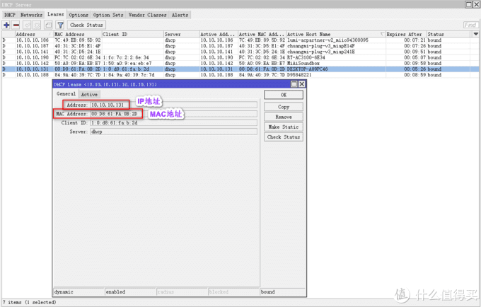
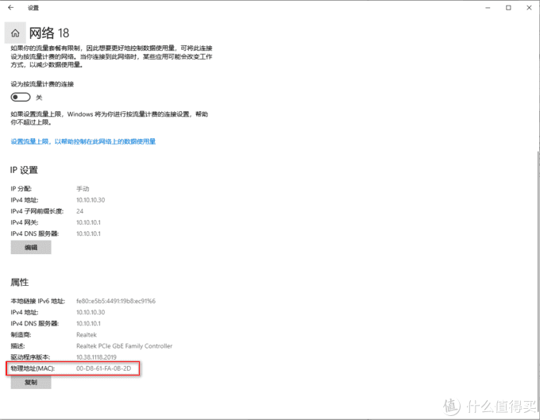
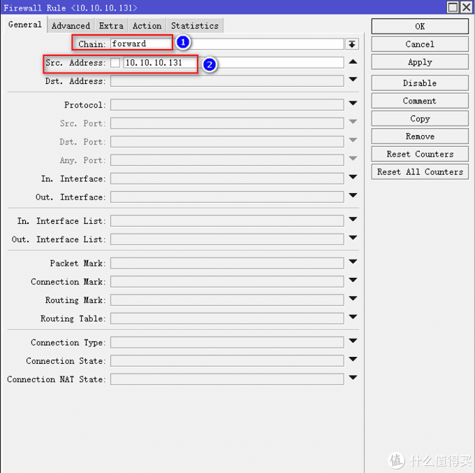
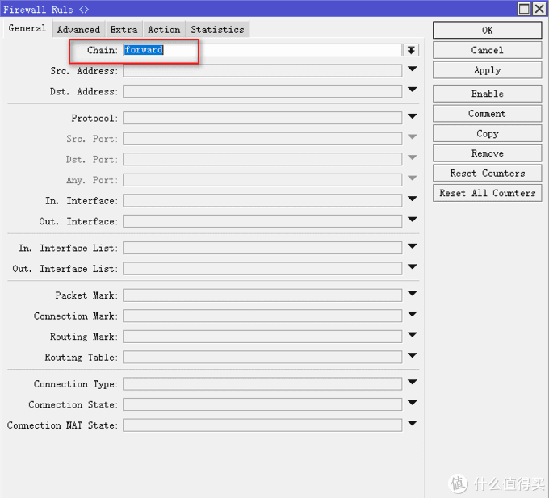
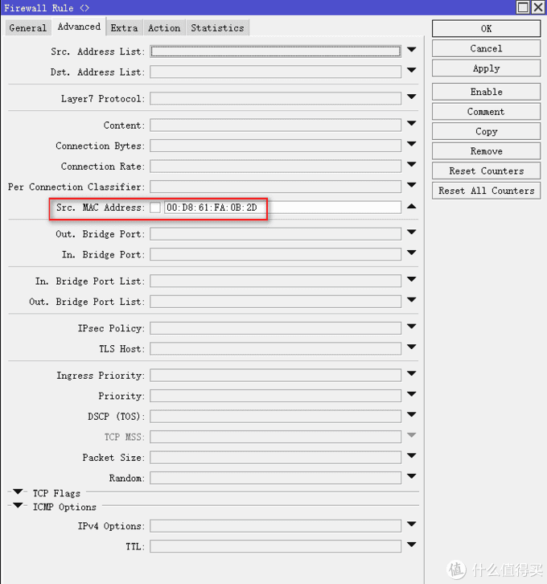
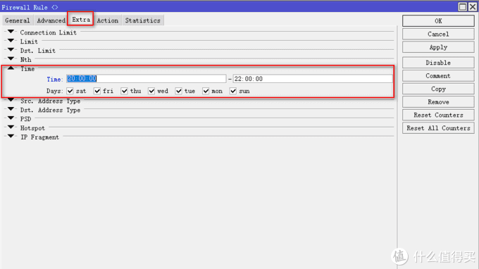
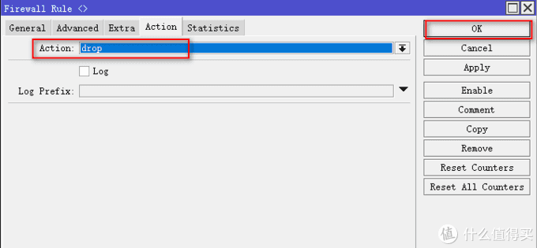
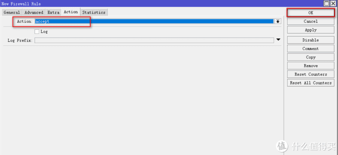
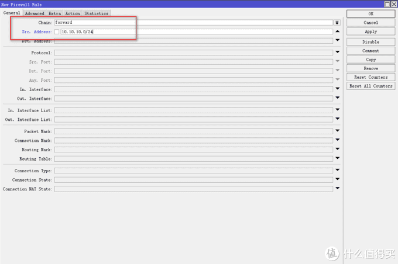

# Ros从入门到精通 篇十

## Ros之黑白名单设置，配合时间段，限制指定设备是否可联网，什么时候可联网。

**创作立场声明：**家用Ros从入门到精通系列教程是最新开放的专栏，本篇更多的是针对准备入门或刚入门的新手朋友，老白与大佬不喜勿喷哦，同时也建议各位多多指导与建议，再次感谢大家。

## 前言

1. 大家好，我是大斑马，曾经踩坑无数，如今填平归来，作为一枚老白，谈不上技术人才，仅凭一腔热血及爱好给大家带来一些分享总结，望大家多多支持哈，不喜勿喷，手下留情，多多指导，相互学习，感谢
2. 今天开始给大家带来家用Ros从入门到精通系列教程，分别为[《Ros下载与安装》](https://post.smzdm.com/p/awx0x282/)、[《Ros基本配置及拨号上网》](https://post.smzdm.com/p/ag8782mm/)、[《Ros DDNS设置》](https://post.smzdm.com/p/ax0202l9/)、《Ros端口转发设置及完美回流方案：[方案一](https://post.smzdm.com/p/ar0v0x2q/)、[方案二](https://post.smzdm.com/p/awx0xv8m/)》、《Ros之VPN配置及使用： [L2TP](https://post.smzdm.com/p/a3gvokw5/) 与 [IKEV2](https://post.smzdm.com/p/av7zrgg4/) 》、《[Ros之系统备份到e-mail](https://post.smzdm.com/p/apz3xp0x/)》、《[Ros之IP变动发送提醒到e-mail](https://post.smzdm.com/p/a992gdw7/)》、《Ros之标记的灵活运用》、《Ros之黑白名单设置》、《Ros之限速设置》、《Ros之光速DNS[服务器](https://www.smzdm.com/fenlei/fuwuqi/)》、《未完待续》
3. 本系列所有教程里有原创也有引用，引用部份会注明出处，在此感谢填坑路上遇到的各路大神，感谢！同时作为个人总结与分享也希望大伙多多指导，交流与相互学习比啥都重要，你说对吧？

## 引言

在前面的教程中，分别教会了大家**如何建立Ros**、**如何简单配置Ros使其正确上网**、**Ros利用阿里云域名绑定动态IP（DDNS）**、**Ros端口转发及完美回流**、**Ros如何配置VPN实现全世界回家（L2TP与IKEv2）**、**Ros的系统配置信息发送至邮箱进行备份**以及**当公网IP发生变动发送提醒到邮箱**。**刚进来的朋友**不妨**回头看看**小老弟之前的[文章](https://zhiyou.smzdm.com/member/7255256373/article/)，**一定对你有所帮助哦。**

**无论你用的是软路由还是硬路由，无论你用的路由是什么系统，在路由里总少不了一种功能，那就是限制上网，也就是黑白名单，在除Ros以外的路由系统中，绝大部分都有图形化的界面，对于设置非常友好且方便，但是对于喜爱且正在使用Ros的朋友就很困扰，所以今天我给大家分享的是在Ros中如何设置黑白名单，并配合时间段参数，限制联网的方法，对于新手朋友，请耐心看完哦。**

## 教程开始

先给大家讲解一下**用法及相关概念**，如下：

**绑定地址的方法**：

1. 通过终端获取的IP地址进行绑定

2. 通过终端的MAC地址进行绑定

   

**设置的命令**：

1. accept为允许访问（白名单）
2. drop为禁止访问（黑名单）

**限制配合时间段**：

1. accept配合时间段，意思是某个时间段允许该设备联网
2. drop配合时间段，意思是某个时间段禁止该设备联网

### 配合时间段的黑白名单设置 

老规矩，用**winbox**软件进入Ros后台：

我们先**查询需要设置黑白名单的设备地址**。**IP--DHCP Server**，点击上菜单栏Leases，找到你需要限制的设备，双击打开，我这里以我电脑为例，我电脑的IP为10.10.10.131，MAC地址为00-D8-61-FA-0B-2D，如图所示：

如果你的终端设备是手动设置的IP，MAC地址需要自己找出来哦，一般在网络设置中都能看到，我以win10为例，给大家找出MAC地址：

正式进行设置。进入**IP--Firewall**，点击上菜单栏**Filter Ruler**，点击加号，在弹出来的界面点击General，下面的Chain选forward，如果你用IP进行绑定，则在Src.Address输入你要限制的设备IP；如果你用MAC地址进行绑定，则Src.Address留空，点击上菜单栏Adwanced，在下面的Src.MAC.Address输入你要限制的设备MAC，**无论你选择哪种方式，Chain都统一选forward，**请看图：

以IP进行捆绑：

以MAC进行捆绑：

接着**设置时间段**。点击上菜单栏**Extra**，点开Time，Time:xxxxxx--xxxxxxx输入你需要限制的时间段，我以晚8点至晚10点为例，注意这里必须用24小时制，下面的Days则是星期一至星期日，根据自己的需求勾选即可：

设置好时间段，我们点击上菜单栏**Action**，在下面的Action选**drop（黑名单，禁止联网）**或**accept（白名单，允许联网）**，下面我已具体例子给大家举例说明：

我的电脑20点--22点禁止联网，则Action选drop，最后确认无误点OK：

我的电脑20点--22点允许联网，则Action选accept，最后确认无误点OK：

到这里，Ros配合时间段的黑白名单设置结束啦，**本篇文章更多的是思路，清晰用法原理后可以灵活配置**，如果需要全局全局设置，只需要在Src.Address输入这个IP段即可，比如10.10.10.0/24，如下图：

好啦，方法告诉大家啦，具体怎么玩，看你自己了哦！！！**下一篇将给大家分享，Ros如何进行限速，以及时段限速，敬请期待哦。**

## 总结

1. 通过黑白名单设置，可以好好的“管教”一下家里的[熊孩子](https://pinpai.smzdm.com/42794/)哦，无论是[手机](https://www.smzdm.com/fenlei/zhinengshouji/)还是电脑，又或者是[其他网络设备](https://www.smzdm.com/fenlei/qitawangluoshebei/)，想啥时候给联网，啥时候不给联网，都是你说了算。（PS：如果你限制的对象是个“高手”，他会自定义IP，那我建议你捆绑MAC地址，这样他就束手无策了。。哈啊哈哈）
2. 本篇《Ros之黑白名单设置》，已经结束啦，建议朋友们耐心看完，绝对对你有所帮助。**如果有任何问题都可以留言给我，我都会一一回复，同时，如果你有更好的方法，或者我的方法有问题，都可以给我留言哦，分享希望得到认可，同时也希望得到进步**。不忘初心，我还在路上，加油！！！
3. **如果你喜欢我的文章，千万别忘了点关注哦，这个对我很重要；你的支持是我前进的动力（最近广[大朋](https://pinpai.smzdm.com/35837/)友支持力度不够啊，动力不足了，哎，难顶），谢谢大家！！**
4. **同时也千万别忘了点赞点赞点赞，收藏收藏收藏，有碎银子也别吝啬哦，哈哈哈哈，再次感谢大家！！！**