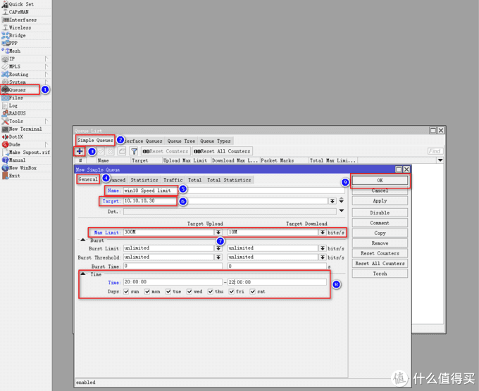

# Ros从入门到精通 篇十一

## Ros之时段限速，限速家里“不听话”的设备；1分钟设置完毕，超简单；Ros掌控，无处不在。

**创作立场声明：**家用Ros从入门到精通系列教程是最新开放的专栏，本篇更多的是针对准备入门或刚入门的新手朋友，老白与大佬不喜勿喷哦，同时也建议各位多多指导与建议，再次感谢大家。

## 前言

1. 大家好，我是大[斑马](https://pinpai.smzdm.com/1859/)，曾经踩坑无数，如今填平归来，作为一枚老白，谈不上技术人才，仅凭一腔热血及[爱好](https://pinpai.smzdm.com/35731/)给大家带来一些分享总结，望大家多多支持哈，不喜勿喷，手下留情，多多指导，相互学习，感谢

2. 今天开始给大家带来家用Ros从入门到精通系列教程，分别为[**《Ros下载与安装》**](https://post.smzdm.com/p/awx0x282/)**、**[**《Ros基本配置及拨号上网》**](https://post.smzdm.com/p/ag8782mm/)**、**[**《Ros DDNS设置》**](https://post.smzdm.com/p/ax0202l9/)**、《Ros端口转发设置及完美回流方案：**[**方案一**](https://post.smzdm.com/p/ar0v0x2q/)**、**[**方案二**](https://post.smzdm.com/p/awx0xv8m/)**》、《Ros之VPN配置及使用：** [**L2TP**](https://post.smzdm.com/p/a3gvokw5/) **与** [**IKEV2**](https://post.smzdm.com/p/av7zrgg4/) **》、《**[**Ros之系统备份到e-mail**](https://post.smzdm.com/p/apz3xp0x/)**》、《**[**Ros之IP变动发送提醒到e-mail**](https://post.smzdm.com/p/a992gdw7/)**》、《Ros之标记的灵活运用》、《**[**Ros之黑白名单设置**](https://post.smzdm.com/p/aekennpk/)**》、《Ros之限速设置》、《Ros之光速DNS[服务器](https://www.smzdm.com/fenlei/fuwuqi/)》、**《未完待续》

3. 本系列所有教程里有原创也有引用，引用部份会注明出处，在此感谢填坑路上遇到的各路大神，感谢！同时作为个人总结与分享也希望大伙多多指导，交流与相互学习比啥都重要，你说对吧？

   

## 引言

在前面的教程中，分别教会了大家**如何建立Ros、如何简单配置Ros使其正确上网、Ros利用阿里云域名绑定动态IP（DDNS）、Ros端口转发及完美回流、Ros如何配置VPN实现全世界回家（L2TP与IKEv2）、Ros的系统配置信息发送至邮箱进行备份、当公网IP发生变动发送提醒到邮箱以及Ros的黑白名单设置**。**刚进来的朋友**不妨回头看看小老弟之前的[文章](https://zhiyou.smzdm.com/member/7255256373/article/)，**一定对你有所帮助哦。**

上一篇已经给大家分享如何设置黑白名单，提高了Ros的掌控力，那么本篇同样给大家继续分享有关文章--Ros设置限速，继续提升Ros的掌控力；**家里总有一些“不听话”的设备，让你非常头疼，所以话不多说，我们马上“收拾”它们。**

Ros的简单限速，配合时段，设置起来非常的简单，基本上1分钟不到便可解决，大家看我操作哦。

## 教程开始

老规矩。用**winbox**软件进入Ros后台：

进入后台后，点击左侧菜单栏**Queues**，在弹出界面点**[Simple](https://pinpai.smzdm.com/22857/) Queues**，接着点击**加号**，选项**General**，Name填入你的名称，我这里以限速win10为例，所以命名win10 Speed limit，Target输入你打算要限速的设备IP，不清楚如何在Ros查询设备IP的朋友，请先去看我《篇十》，我win10的IP为10.10.10.30，填入即可，Max Limit就是最大限速选项，Target Upload为上行带宽，Target Do[wnl](https://pinpai.smzdm.com/10085/)oad为下行带宽，说得简单些Target Upload就是上传速度，Target Download就是下载速度，我这里以限制win10最大上传为300M，最大下载为10M (上行300M，下行10M？？？你没听错，我就是来搞笑的，哈哈哈，PS：天气太热了，朋友们的热情不够，我懒得重新截图了。。)，最下面的Time点开，time输入你需要限速的时段，我这里设置20点-22点限速，其余时间不限速，下面的Days就是周一至周日，大家按需勾选即可，确认无误点击OK：

**到这里，设置结束啦，一分钟不到，真的非常简单；其实这是最简单的设置，家用来说已经足够了，另外在后续我会出加强版的相关文章--Ros的流控（QoS），一步步来吧。**

**
**

## 总结

1. 通过时段限速设置，终于可以“收拾”家里一些不听话的设备啦，再结合《篇十》黑白名单的设置，Ros也可以像其他有图形化界面的路由系统一样掌控全局哦。
2. 本篇《Ros之时段限速设置》，已经结束啦，建议朋友们耐心看完，绝对对你有所帮助。**如果有任何问题都可以留言给我，我都会一一回复，同时，如果你有更好的方法，或者我的方法有问题，都可以给我留言哦，分享希望得到认可，同时也希望得到进步。**不忘初心，我还在路上，加油！！！
3. **如果你喜欢我的文章，千万别忘了点关注哦，这个对我很重要；你的支持是我前进的动力（最近广**[**大朋**](https://pinpai.smzdm.com/35837/)**友支持力度不够啊，动力不足了，哎，难顶），谢谢大家！！**
4. **同时也千万别忘了点赞点赞点赞，收藏收藏收藏，有碎银子也别吝啬哦，哈哈哈哈，再次感谢大家！！！**