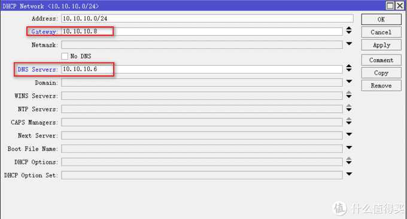
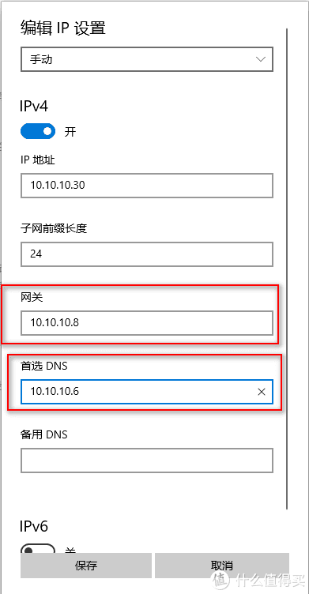
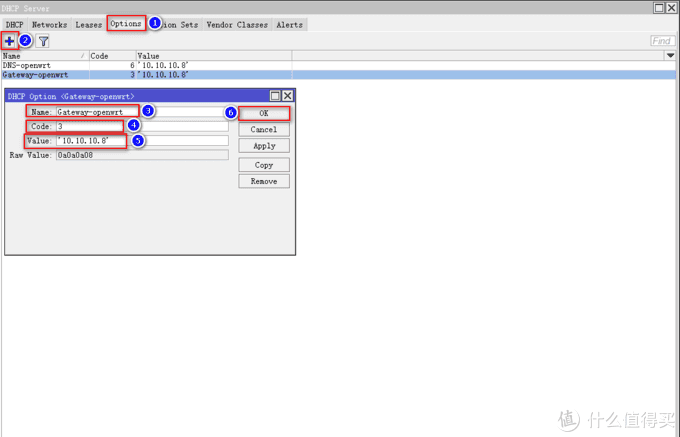
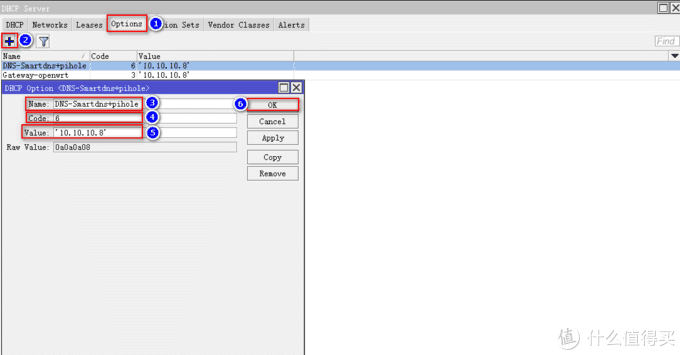
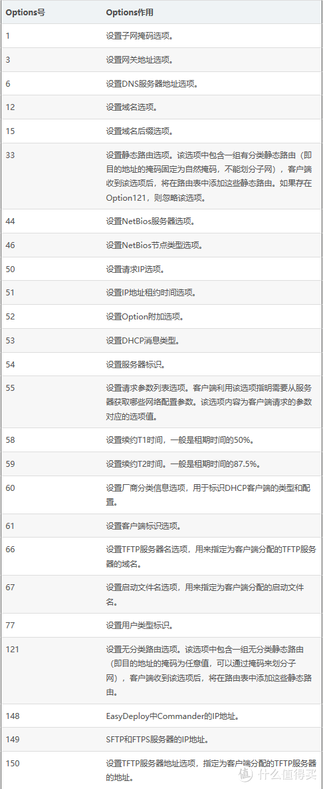
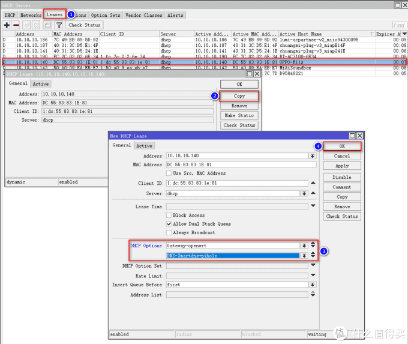

# Ros从入门到精通 篇十二

## Ros之Options设置，多网关，多DNS服务器；高效配合旁路由；免手动设置IP；1分钟完成。

**创作立场声明：**家用Ros从入门到精通系列教程是最新开放的专栏，本篇更多的是针对准备入门或刚入门的新手朋友，老白与大佬不喜勿喷哦，同时也建议各位多多指导与建议，再次感谢大家。

## 前言

1. 大家好，我是大[斑马](https://pinpai.smzdm.com/1859/)，曾经踩坑无数，如今填平归来，作为一枚老白，谈不上技术人才，仅凭一腔热血及[爱好](https://pinpai.smzdm.com/35731/)给大家带来一些分享总结，望大家多多支持哈，不喜勿喷，手下留情，多多指导，相互学习，感谢
2. 今天开始给大家带来家用Ros从入门到精通系列教程，分别为[《Ros下载与安装》](https://post.smzdm.com/p/awx0x282/)、[《Ros基本配置及拨号上网》](https://post.smzdm.com/p/ag8782mm/)、[《Ros DDNS设置》](https://post.smzdm.com/p/ax0202l9/)、《Ros端口转发设置及完美回流方案：[方案一](https://post.smzdm.com/p/ar0v0x2q/)、[方案二](https://post.smzdm.com/p/awx0xv8m/)》、《Ros之VPN配置及使用： [L2TP](https://post.smzdm.com/p/a3gvokw5/) 与 [IKEV2](https://post.smzdm.com/p/av7zrgg4/) 》、《[Ros之系统备份到e-mail](https://post.smzdm.com/p/apz3xp0x/)》、《[Ros之IP变动发送提醒到e-mail](https://post.smzdm.com/p/a992gdw7/)》、《Ros之标记的灵活运用》、《[Ros之黑白名单设置](https://post.smzdm.com/p/aekennpk/)》、《[Ros之限速设置](https://post.smzdm.com/p/alpwxzeg/)》、《Ros之Options设置》、《Ros之光速DNS[服务器](https://www.smzdm.com/fenlei/fuwuqi/)》、《未完待续》
3. 本系列所有教程里有原创也有引用，引用部份会注明出处，在此感谢填坑路上遇到的各路大神，感谢！同时作为个人总结与分享也希望大伙多多指导，交流与相互学习比啥都重要，你说对吧？

## 引言

在前面的教程中，分别教会了大家**如何建立Ros、如何简单配置Ros使其正确上网、Ros利用阿里云域名绑定动态IP（DDNS）、Ros端口转发及完美回流、Ros如何配置VPN实现全世界回家（L2TP与IKEv2）、Ros的系统配置信息发送至邮箱进行备份、当公网IP发生变动发送提醒到邮箱、Ros的黑白名单设置以及Ros的时段限速。**刚进来的朋友不妨**回头看看**小老弟之前的文章，**一定对你有所帮助哦。**

https://post.smzdm.com/xilie/58931/

我又来了哦，最近有些忙，好几天没更新了，好多评论也没来得及回复，望大伙理解哈，同时也再次感谢大伙的支持。

今天主要给大家分享**Ros的Options设置，可以实现多网关、多DNS服务器共存于Ros，配合旁路由，非常方便**，同时也省去了手动修改IP的这个步骤，非常便利。可能很多朋友看到这里还是不太理解，我给大家举个例子。

我电脑IP：10.10.10.30，我的旁路由Openwrt的IP：10.10.10.8，我的光速DNS缓存服务器IP：10.10.10.6，如果我的电脑想要实现各种功能，并且访问速度极快，那我的网关需要改成10.10.10.8，DNS服务器需要改成10.10.10.6，修改的方法大致有2种，一种是直接在Ros的DHCP Server中设置全局的网关与DNS服务器，如下图：

那么，这样设置就有个问题，家里的设备我不想全部都走网关，我只需要我的电脑、[手机](https://www.smzdm.com/fenlei/zhinengshouji/)、iapd走网关即可，其他设备压根不需要，所以就会有第二种方案，那就是手动修改IP咯：

这样的话，电脑、手机、ipad或者还有其他设备都需要手动设置一边，麻烦不说，最主要是自定义IP，当设备多了，有时候自己记不住，造成内网“打架”，IP冲突，非常不爽，对吧？

所以今天给大家介绍一个新的方法，**设置非常简单，而且实用性很高，多种网关与DNS服务器组合方案，让家庭网络网络丰富起来，**同时IP用Ros的DHCP服务器分配，IP改动也没关系，非常安利哦。好，话不多说，我们操作起来吧！！！

## 教程开始 

老规矩，用**winbox**软件进入Ros后台：

进入**IP--DHCP Server**，点击上菜单栏**Options**，点击**加号**。我们先来添加网关，Name大家随意命名，我这里方便查看命名为Gateway-openwrt，Code输入3，Code是Option的功能号，输入不同的数字，功能就不一样，比如3是设置网关，6是设置DNS服务器等等，后面我会给大家整理出一张功能表，大家举一反三即可，那好我们要设置网关，所以Code填入3，Value输入你新网关的IP地址，并用英文状态下' '单引号框起来，这点很重要，一定要加上单引号哦，大家别忘了，我这里输入Openwrt的IP作为网关，目的是为了用Openwrt的功能哦，最后确认无误，点击OK：

同理，我们再点击加号，添加一条新的DNS服务器，需要注意的就是Code输入6，其他设置请看图：

到这里，网关与DNS服务器已经添加好了，另外我给大家附上一张表，上面有Code号对应的功能，大家有需要的可以举一反三哦：

设置好了新的网关与DNS服务器，接着我们需要做一些简单的设置给设备用上，请看操作哦。

进入**IP--DHCP Server**，点击上菜单栏**Leases**，选择你需要修改网关或DNS的设备，我这里以OPPO手机为例，找到设备双击打开，点击右侧Copy，接着在弹出来的界面中，找到DHCP Options，选择刚才设置的网关或DNS服务器，你可以只设置网关，不设置DNS服务器，也可相反，同样也可以都设置上，我这里全部用上，需要添加多条的话，点击右侧向下的小三角即可，确认无误，点击OK：

好啦，到这里设置全部完成，是不是很简单。这样设置完，我的OPPO手机便可以使用旁路由的功能，光速DNS服务器的极致速度，内网中其他设备则默认使用Ros的网关与DNS服务器，这样，不管你如何折腾，也不会影响其他设备的正常上网（保命啊，哈啊哈），另外如果需要其他的功能，大伙可以根据我上面提供的表格自己举一反三哦。

## 总结

1. 通过本篇方法，你的Ros可以现实多种网关与DNS的服务器组合，可玩性变高，并且设置简单快捷，你值得食用哦。
2. **如果你喜欢我的文章，千万别忘了点关注哦，这个对我很重要；你的支持是我前进的动力（最近广****[大朋](https://pinpai.smzdm.com/35837/)****友支持力度不够啊，动力不足了，哎，难顶），谢谢大家！！**
3. **同时也千万别忘了点赞点赞点赞，收藏收藏收藏，有碎银子也别吝啬哦，哈哈哈哈，再次感谢大家！！**