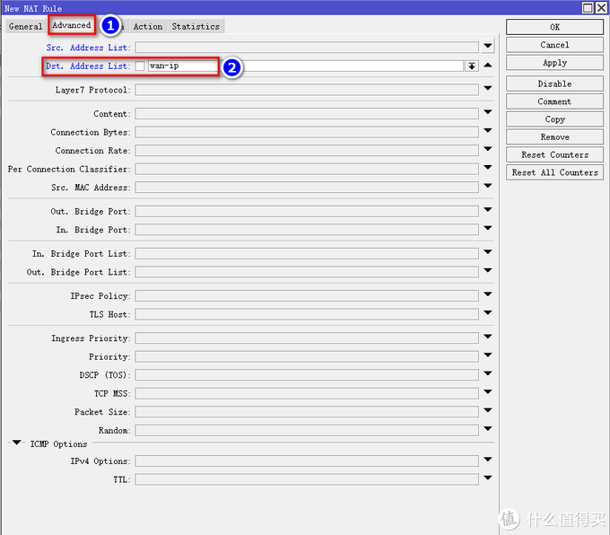

# Ros从入门到精通 篇四

## Ros端口转发及完美回流，配合DDNS，简直无孔不入！！！----上篇

**创作立场声明：**家用Ros从入门到精通系列教程最新开放的专栏，本篇更多的是针对准备入门或刚入门的新手朋友观看，老白与大佬不喜勿喷哦，同时也建议各位多给建议，再次感谢大家。

**更新(2020-05-10 17:56:24):**
为了给文章达到一个真实的设置效果，重新新建了一个Ros，截图过于心急，一顿操作截图、操作截图，所以出现了些失误，抱歉了各位。 文中有一处地方出错了，大家按我追加的内容修改一下即可，再次感谢大家支持。 原文： 回到IP-Firewall，点击nat，然后点击加号，以后所有需要端口转发的都在nat中设置，我这里以转发群晖5000端口为例，在弹出来的页面点击General，Chain选srcnat，Protocl选tcp（常用类型tcp与udp，视你转发的目的为准），Dst。Port输入你外网自定义的端口号，你输入啥你访问的时候域名后就加啥，举例，我这里写5000，那么访问群晖WEB的时候就是www.gxvivo.cn:5000： 出错内容：Chain选srcnat 修改为：Chain选dstnat 大家请注意哦！！！

## 前言

1. 大家好，我是大[斑马](https://pinpai.smzdm.com/1859/)，曾经踩坑无数，如今填平归来，作为一枚老白，谈不上技术人才，仅凭一腔热血及[爱好](https://pinpai.smzdm.com/35731/)给大家带来一些分享总结，望大家多多支持哈，不喜勿喷，手下留情，多多指导，相互学习，感谢。
2. 今天开始给大家带来家用Ros从入门到精通系列教程，分别为[《Ros下载与安装》](https://post.smzdm.com/p/awx0x282/)、[《Ros基本配置及拨号上网》](https://post.smzdm.com/p/ag8782mm/)、[《Ros DDNS设置》](https://post.smzdm.com/p/ax0202l9/)、《Ros端口转发设置及完美回流方案（2种方案）》、《Ros VPN设置及使用（L2TP与IKEV2）》、《未完待续》。
3. 本系列所有教程里有原创也有引用，引用部份会注明出处，在此感谢填坑路上遇到的各路大神，感谢！同时作为个人总结与分享也希望大伙多多指导，交流与相互学习比啥都重要，你说对吧？

## 引言

在前面的教程中，分别教会了大家如何**建立Ros**、如何**简单配置Ros使其正确上网**以及**Ros利用阿里云域名绑定动态IP（DDNS）**，还不清楚的朋友可以先去看我前面的教程：

[**Ros从入门到精通 篇一：#家用Ros系列教程# 篇一：Ros安装，奶妈级，适合刚接触软路由的同学，轻松上手**](https://post.smzdm.com/p/awx0x282)小编注：此篇文章来自#原创新人#活动，成功参与活动将获得额外50金币奖励。前言大家好，我是大斑马，曾经踩坑无数，如今填平归来，作为一枚老白，谈不上技术人才，仅凭一腔热血及爱好给大家带来一些分享总结，望大家多多支持哈，不喜勿喷，手下留情，多多指导，相互学习，感谢。今天开始给大家带来家用Ros从入门到精[BIgZeBra](https://zhiyou.smzdm.com/member/7255256373/)|*赞*57*评论*32*收藏*315[查看详情](https://post.smzdm.com/p/awx0x282)

[**Ros从入门到精通 篇二：#家用Ros系列教程#篇二：Ros基本配置及拨号上网，简单易懂，一看就会，开始起飞！！！**](https://post.smzdm.com/p/ag8782mm)小编注：此篇文章来自#原创新人#活动，成功参与活动将获得额外50金币奖励。前言大家好，我是大斑马，曾经踩坑无数，如今填平归来，作为一枚老白，谈不上技术人才，仅凭一腔热血及爱好给大家带来一些分享总结，望大家多多支持哈，不喜勿喷，手下留情，多多指导，相互学习，感谢。今天开始给大家带来家用Ros从入门到精[BIgZeBra](https://zhiyou.smzdm.com/member/7255256373/)|*赞*30*评论*19*收藏*76[查看详情](https://post.smzdm.com/p/ag8782mm)

[**Ros从入门到精通 篇三：#家用Ros系列教程#篇三：Ros之DDNS设置；外网轻松访问；全世界回家的先决条件。**](https://post.smzdm.com/p/ax0202l9)小编注：此篇文章来自#原创新人#活动，成功参与活动将获得额外50金币奖励。前言大家好，我是大斑马，曾经踩坑无数，如今填平归来，作为一枚老白，谈不上技术人才，仅凭一腔热血及爱好给大家带来一些分享总结，望大家多多支持哈，不喜勿喷，手下留情，多多指导，相互学习，感谢。今天开始给大家带来家用Ros从入门到精[BIgZeBra](https://zhiyou.smzdm.com/member/7255256373/)|*赞*15*评论*34*收藏*100[查看详情](https://post.smzdm.com/p/ax0202l9)

通过《篇三：Ros之DDNS配置》教程我们已经成功绑定了我们的动态IP，无论IP如何改变，都可以利用我们的域名无孔不入，本篇可以说是篇三的下集，要想实现无孔不入（外网访问内网以及即将面世的篇五：Ros的VPN设置，全世界回家），除了需要域名作为地址外，还需要做内网的端口转发以及回流，所以本篇有承上启下的作用哦，请大家耐心看完，因为。。。非常重要啊！！！

## 教程开始 

本篇Ros端口转发及完美回流将介绍**2种**方法，这2种方法是目前我试过N种方法中，**最奏效的**，因此分享给大家，方法分别为：

1. **Ros自带的cloud功能实现端口转发及回流**（**上篇内容**）
2. **Ros的Jump命令实现端口转发及回流**（**下篇内容**）

### 特此申明：

这两种方法**均非本人首创**，但**经本人优化调整，效果更好**。前人栽树，后人乘凉。方法1，感谢[**vediotalk**](https://www.vediotalk.com/)**大神**，提供了很好的思路，但是回流还有些小问题，因为做了补充优化；方法2，感谢**blanksign大神**（国内无相关链接），同样提供了很好的思路，但是大神是技术型人才，一心专研技术，没有更多的精力做出好的教程，所以我根据blanksign大神的思路，做了全面的分解动作，并在其中做了些许优化调整。总之再次感谢[**vedio talk**](https://www.vediotalk.com/)与**blanksign**两位大神，感谢！！

## 本篇为上篇，着重介绍方法一

### Ros自带的icloud功能实现端口转发及回流

此方法有**一个前提**，就是你所使用的**Ros版本**与我篇一教程中使用的是同一个版本，也就是**chr的版本**，因为只有chr才**自带Cloud功能**，才能实现端口转发及回流，如果你使用的Ros版本不是chr版本，是X86X64之类的版本，请跳过此方法，直接看方法二即可。

同样，首先用**winbx**软件进入Ros后台：

进入Ros后台后点击**IP-Cloud**：

进入Cloud界面，我们要把**DDNS Enabled与Update Time勾选上**，然后**复制DNS Name这条域名**，后续我们需要使用到，然后点击OK：

设置完Cloud，我们点击**IP-Firewall**，设置一条地址：

然后在上菜单栏选择**Address lists**：

接着点击加号进入设置页面，Name这里大家随意填写，我填wan-ip（这里与vedio tall大神命名的一样，以此致敬），然后把刚才我们复制的DDNS Name**复制到Address选项里**，最后点OK：

紧接着，回到我们**IP-Firewall**的界面，我们先设置回流，在上菜单栏点击**nat**，然后点击**加号**：

弹出来的界面点击**General**，在下面的**Chain选择srcnat**，**src.Address**输入你的**内网IP端**，我这里是10.10.10.0段，后面加上/24，意思就是这个IP段都被授权进入端口，具体为什么后面加/24，请看我篇二，里面有详细解释，然后在下面的**Out.Inter[face](https://pinpai.smzdm.com/51904/)**选择你的**内网网口**：

接着点击**Action**，选择**masquerade**，最后点击OK：

**设置完回流**，我们开始**设置端口转发**。

回到**IP-Firewall**，点击**nat**，然后点击**加号**，以后所有需要端口转发的都在nat中设置，我这里以转发[群晖](https://pinpai.smzdm.com/2315/)5000端口为例，在弹出来的页面点击**General**，**Chain选srcnat**，**Protocl选tcp**（常用类型tcp与udp，视你转发的目的为准），Dst。Port输入你外网自定义的端口号，你输入啥你访问的时候域名后就加啥，举例，我这里写5000，那么访问群晖WEB的时候就是[www.gxvivo.cn:5000：](http://www.gxvivo.cn:5000/)

接着点击上菜单栏**Avanced**，在下面的**Dst.Address List**选择刚刚我们为Cloud创建的Address，刚刚我命名**wan-ip**，我们点选它：

我们继续，在上菜单栏选择**Action**，在下面**To Addresses**输入你将要转发项目的**内网IP**。我的群晖IP是10.10.10.10.，所以把它填进去，根据你的具体情况来填写，**To Port**输入你要映射的**内网端口**，这里的端口可不能乱写，要根据你将要转发的项目规定的端口来填写，群晖WEB的端口是5000，window系统的远程访问端口是3389等等，这些都是项目规定好的端口，这里要注意哦，最后点击OK：

好了，群晖WEB5000端口转发到外网5000端口就做好啦，你就可以通过**域名:5000** ，在外网访问你的群晖啦，同时，回流也完美设置，你在内网同样可以通过**域名:5000**来访问哦（在内网还用啥域名访问。。。可是有些朋友就是有强迫症哈，不知道你是不是，反正我是。。。）。

怕新手朋友看得有写晕，我这里再举一个端口转发win10的设置：

我win10做下载机，经常需要在公司远程连接，进行下载任务，所以外网访问我内网虚拟机搭建的win10很重要哦，**win10内网IP为10.10.10.50，外网自定义端口设置为45678，内网远程访问端口为3389。**

## 总结 

1. 本篇**《篇四：Ros端口端口转发及完美回流》上篇**，已经结束啦，希望朋友们耐心看完哦，如果有任何问题都可以留言给我，我都会一一回复，同时，如果你有更好的方法，或者我的方法有问题，都可以给我留言哦，分享希望得到认可，同时也希望得到进步。不忘初心，我还在路上，加油！！！
2. 如果你使用的Ros不是chr版本，请看我《篇四：Ros端口端口转发及完美回流》下篇，里面有你需要的答案哦。
3. 最后千千千万别忘了**点赞点赞点赞，收藏收藏收藏**，有碎银子也别吝啬哦，哈哈哈哈，再次感谢大家！！！