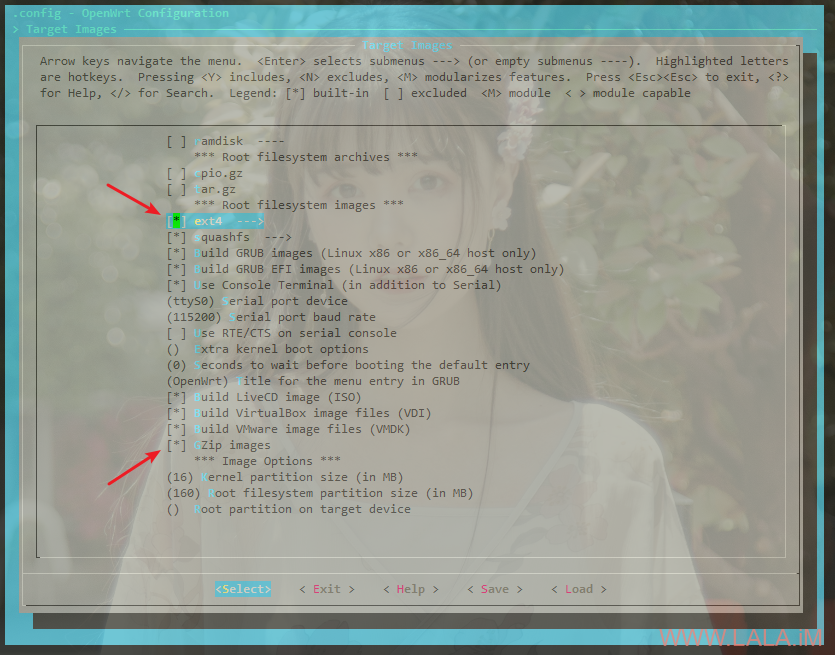
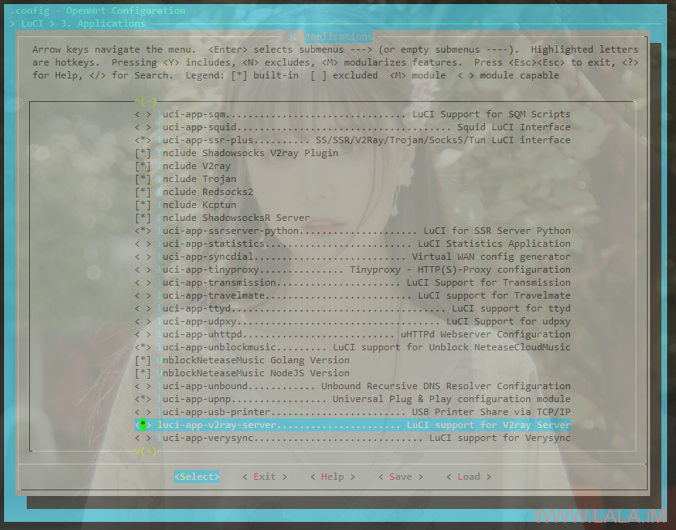
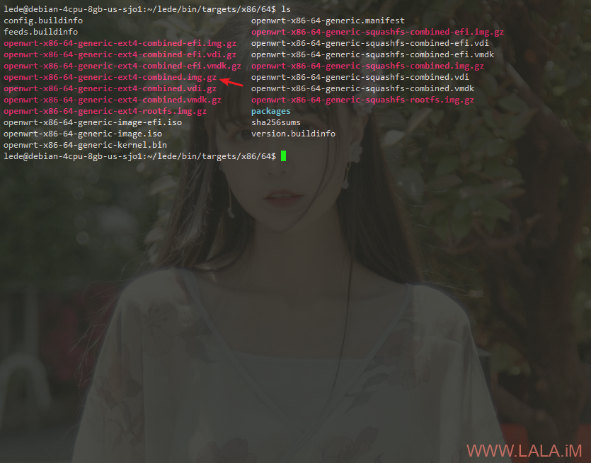
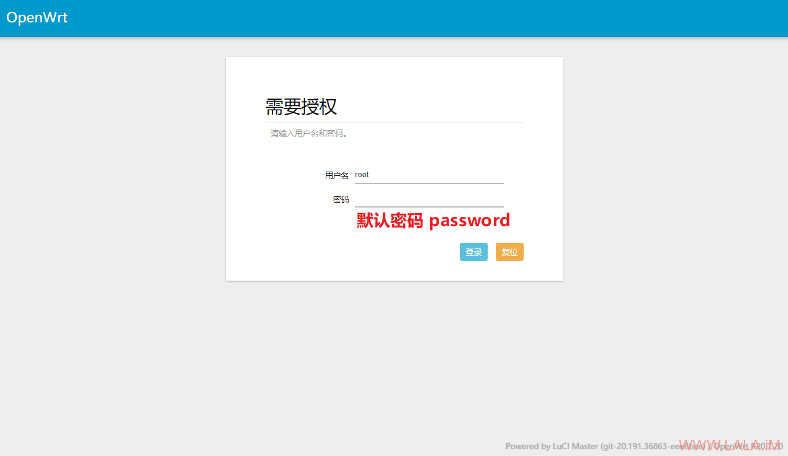
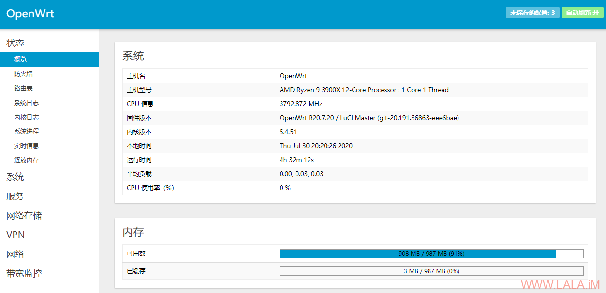
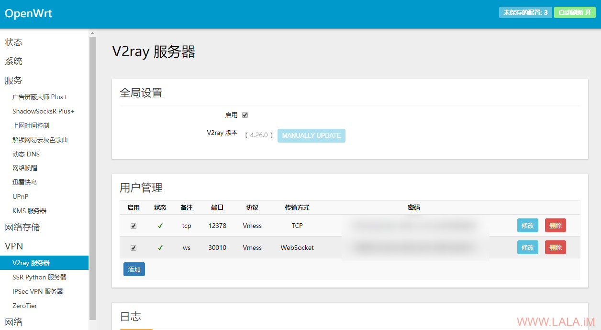

## VPS安装Lean OpenWrt

https://lala.im/7247.html


这个OpenWrt固件就相当于是一个全家桶，里面有各种常用的工具和服务，比如V2Ray/SSR/qBittorrent/BBR之类的，还有很多就不一一列举了。。

如果你不想在VPS内装这装那，那直接装一个OpenWrt应该是不错的选择~

理论上本文的这个方法可以在任何基于KVM架构的VPS上安装。不需要VNC，也不需要救援系统。

VPS原系统可以是CentOS/Debian/Ubuntu，我这里拿Debian10演示。

如果你的VPS是用DHCP配置网络的，那可以直接用我编译好的固件：

https://drive.google.com/file/d/1ULeYW8zh-z-tvB2qZ8dOTb6caWL057ld/view?usp=sharing

如果不支持DHCP是静态配置的网络，那就需要自己编译固件了。

文章目录


# 编译固件

其实编译的文章我很久前水过了，但这次涉及到要更改网络配置，所以完全从头开始吧。

首先安装依赖：

```
apt -y install asciidoc autoconf autopoint build-essential flex \
git git-core gawk gettext libncurses5-dev libz-dev lib32gcc1 \
libc6-dev-i386 libglib2.0-dev libglib2.0-dev libssl-dev libelf-dev \
libtool msmtp p7zip p7zip-full qemu-utils subversion texinfo uglifyjs upx genisoimage rsync
```

安装screen，开一个新会话守护一下ssh：

```
apt -y install screen
screen -S buildlede
```

创建一个普通用户/切到这个用户内：

```
useradd -r -m -s /bin/bash lede
su lede
```

拉取源码/进入到源码的顶级目录：

```
cd && git clone https://github.com/coolsnowwolf/lede.git
cd lede
```

新建一个config目录：

```
mkdir -p files/etc/config
```

新建一个network文件：

```
nano files/etc/config/network
```

如果你的VPS是DHCP自动分配IP的话，那么写入如下配置：

```
config interface 'loopback'
        option ifname   'lo'
        option proto    'static'
        option ipaddr   '127.0.0.1'
        option netmask  '255.0.0.0'

config interface 'wan'
        option ifname   'eth0'
        option proto    'dhcp'

config interface 'lan'
        option type     'bridge'
        option ifname   'eth1'
        option proto    'static'
        option ipaddr   '192.168.1.1'
        option netmask  '255.255.255.0'
        option ip6assign '60'
```

否则更改wan口的配置为如下所示：

```
config interface 'wan'
        option ifname   'eth0'
        option proto    'static'
        option ipaddr   '公网IP'
        option gateway  '网关IP'
        option netmask  '子网掩码'
        list dns        '8.8.8.8'
```

由于这个固件的防火墙默认会禁止外网访问，所以还需要修改一下防火墙的配置。

新建如下配置文件：

```
nano files/etc/config/firewall
```

写入如下配置：

```
config zone
        option name    'wan'
        list network   'wan'
        list network   'wan6'
        option input   'ACCEPT'
        option output  'ACCEPT'
        option forward 'ACCEPT'
        option masq    '1'
        option mtu_fix '1'
```

彩蛋：

```
nano feeds.conf.default
```

去掉如下注释：

```
src-git helloworld https://github.com/fw876/helloworld
```

下载和安装一些需要用到的包：

```
./scripts/feeds update -a
./scripts/feeds install -a
```

打开菜单选择编译前的设置项：

```
make menuconfig
```

首先进到Target Images，按下图把箭头所指的选上：

[](https://lala.im/wp-content/uploads/2020/07/lala.im_2020-07-30_19-38-04.png)

接下来在LuCI-Applications选择你要安装的软件，例如下图选择的这些：

[](https://lala.im/wp-content/uploads/2020/07/lala.im_2020-07-30_19-42-06.png)

配置好后保存退出，下载dl库：

```
make -j4 download V=s
```

注：建议用国外机器，国内网络问题可能会有很多下载失败，导致后续编译出问题。

开始编译：

```
make -j4 V=s
```

注：j4是线程数，你的CPU核心多就直接拉满。

编译好的固件在如下目录保存：

```
bin/targets/x86/64
```

这目录内会有很多固件，我们只需要如图箭头所指的那一个：

[](https://lala.im/wp-content/uploads/2020/07/lala.im_2020-07-30_19-48-50.png)

# 安装OpenWrt

首先把我们刚才编译好的固件传到要安装的VPS内：

```
scp openwrt-x86-64-generic-ext4-combined.img.gz root@127.0.0.1:/root
```

复制到/目录，然后重命名一下：

```
cp openwrt-x86-64-generic-ext4-combined.img.gz /imlala.img.gz
```

接着在要安装的VPS内下载这个内核：

```
apt -y update
apt -y install wget
wget --no-check-certificate https://downloads.x-wrt.com/rom/x-wrt-8.0-b202007251036-x86-64-generic-initramfs-kernel.bin
```

备份：

https://drive.google.com/file/d/1oiGxjuGmATUO15YcMNIGRxwn8cNauvpX/view?usp=sharing

然后看这台VPS当前使用的内核版本和具体的文件名：

```
uname -r
ls /boot
```

例如我这台VPS的完整内核文件名是vmlinuz-4.19.0-5-amd64，那么直接覆盖掉：

```
cp x-wrt-8.0-b202007251036-x86-64-generic-initramfs-kernel.bin /boot/vmlinuz-4.19.0-5-amd64
```

最后在/目录下新建一个shell脚本文件：

```
nano /x-wrt-install-vps.sh
```

写入如下内容：

```
BDEV=vda

vmroot=/tmp/block
mkdir -p $vmroot
mount /dev/${BDEV}1 $vmroot || exit 0
cp $vmroot/imlala.img.gz /tmp/imlala.img.gz && {
	cd /
	umount $vmroot
	sync
	(zcat /tmp/imlala.img.gz) > /dev/$BDEV && reboot
}
```

注：其中BDEV=vda，后面的vda是你的VPS硬盘名，可以通过df -h查看。

给脚本执行权限后直接重启：

```
chmod +x /x-wrt-install-vps.sh
reboot
```

大概等3分钟就可以通过你的VPS公网IP访问到管理面板了：

[](https://lala.im/wp-content/uploads/2020/07/lala.im_2020-07-30_20-01-44.png)

我在buyvm的小鸡内测试正常：

[](https://lala.im/wp-content/uploads/2020/07/lala.im_2020-07-30_20-20-36.png)

V2Ray等其他server的配置都可以在面板内进行设置：

[](https://lala.im/wp-content/uploads/2020/07/lala.im_2020-07-30_20-05-29.png)

最后：

Q：为什么不直接用x-wrt的固件？

A：因为x-wrt没有“你懂的”功能。

Q：好像很麻烦的样子？

A：如果你的机器支持DHCP，根本不麻烦，就算不支持DHCP要自己编译的话麻烦一点也是值得的，因为这个方法不需要VNC，也不需要救援系统，况且编译还可以添加你自己喜欢的功能。

参考文献：

https://openwrt.org/docs/guide-developer/build-system/use-buildsystem#custom_files
https://openwrt.org/zh-cn/doc/uci/firewall
https://blog.x-wrt.com/docs/install-on-vps2