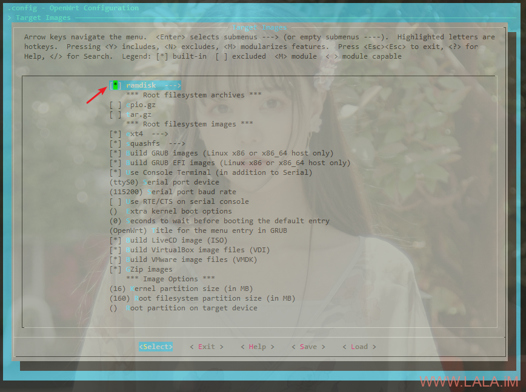

## VPS安装OpenWrt的一点补充

https://lala.im/7257.html


这是关于之前那篇VPS安装OpenWrt文章的一点补充。

之前我是利用了别人编译好的initramfs，后来想了想既然我要装的固件都是自己编译的，那何必不自己也连同initramfs也编译了呢，然后还可以做一些定制。

目的：做一个和x-wrt具有相同能力的initramfs固件，既可以把固件安装在VPS上。

关于编译的依赖啥的，这些就不重复叙述了，有需要的可以参考：


首先在编译的时候选上ramdisk，这样就可以编译initramfs固件：

[](https://lala.im/wp-content/uploads/2020/08/lala.im_2020-08-02_15-58-02.png)

然后要实现这个功能其实很简单，在原来的基础上，自定义一个shell脚本，让它开机的时候查找我们的安装脚本然后运行即可：

```
nano files/etc/rc.local
```

一个实现的例子：

```
install=$(find / -name imlala.sh)
mv $install /tmp
sh /tmp/imlala.sh
exit 0
```

initramfs是一个跑在内存里面的固件，启动后它会自动把机器的硬盘挂载到/mnt，所以这里可以直接用find去找我们保存在硬盘上的安装脚本，然后移动到/tmp目录（实际上这个tmp目录在内存里面）。最后执行脚本。

在要安装openwrt的vps上，在任意目录下新建一个名为imlala.sh的shell脚本，文件名必须是这个，或者你要改的话要和固件rc.local内查找的名字对应：

```
nano /imlala.sh
```

写入如下内容即可：

```
#!/bin/sh
disk=vda
cp /mnt/${disk}1/imlala.img.gz /tmp/imlala.img.gz
umount /mnt/${disk}1
gunzip -c /tmp/imlala.img.gz | dd of=/dev/${disk} && reboot
```

注：

1.disk=vda，后面的vda换成你的硬盘名字。

2.imlala.img.gz是你要装的OpenWrt固件，固件需要你自己下载保存在/目录下。

给脚本执行权限：

```
chmod +x /imlala.sh
```

之前直接把openwrt的initramfs替换掉原系统的内核感觉有点暴力，所以我们也可以新建一个grub菜单：

```
nano /etc/grub.d/40_custom
```

写入如下配置：

```
menuentry 'openwrt' {
set root='hd0,msdos1'
linux /boot/openwrt-x86-64-generic-initramfs-kernel.bin
initrd /boot/initrd.img-4.19.0-5-amd64
}
```

注：

1.openwrt-x86-64-generic-initramfs-kernel.bin是你自己编译好的initramfs。

2.initrd.img-4.19.0-5-amd64是你原系统内使用的initrd。

之后更改grub的默认启动项：

```
nano /etc/default/grub
```

改为你的菜单名字：

```
GRUB_DEFAULT="openwrt"
```

更新grub使其生效，重启开始安装：

```
update-grub
reboot
```