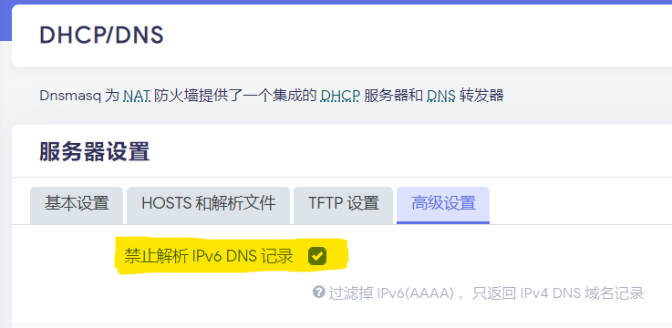

## openwrt ipv6与gfwlist（多图）

https://wp.buddhas.top/archives/linux/openwrt/494/openwrt-ipv6%e4%b8%8egfwlist.html


### 基本思路

创建独立的DHCPv6 Server和IPv6 DNS Server，接管主openwrt的DHCPv6服务，对国内IPv6 DNS解析，解决主openwrt中ipv6与gfwlist模式的兼容问题。
DHCPv6 Server和IPv6 DNS Server完全可以用你喜欢的lxc单独实现，基于简单便捷的理由，我直接使用lxc openwrt，创建新openwrt（用做dhcpv6 server），在新openwrt中安装mosdns（用做ipv6 dns server）。
设置完成后能正常使用gfwlist模式和访问国内ipv6网站（虽然不能过test-ipv6.com测试）。


### 主openwrt的设置

[](https://oss.buddhas.top/wordpress/2021/04/dnsmasq.png)主

> openwrt禁止解析IPv6 DNS记录


[](https://oss.buddhas.top/wordpress/2021/04/lan.png)

> 使用内置的IPv6管理


[](https://oss.buddhas.top/wordpress/2021/04/lan-dhcp-ipv6.png)

> 主openwrt的lan接口，设置Router Discovery (RD) server，禁用DHCPv6服务，通告IPv6 DNS服务器为新openwrt的链路本地地址


### 新openwrt的设置

[](https://oss.buddhas.top/wordpress/2021/04/创建新接口.png)

> 创建新接口，名称随意（示例为lan6），协议选择DHCPv6客户端，自定义接口@lan（ifname）


[](https://oss.buddhas.top/wordpress/2021/04/lan6基本设置页.png)

[](https://oss.buddhas.top/wordpress/2021/04/lan6高级设置页.png)

[](https://oss.buddhas.top/wordpress/2021/04/lan6物理设置页.png)

[](https://oss.buddhas.top/wordpress/2021/04/lan6防火墙设置页.png)


### 新接口一般配置

[](https://oss.buddhas.top/wordpress/2021/04/lan高级设置页.png)

> 使用内置的IPv6管理


[](https://oss.buddhas.top/wordpress/2021/04/lan基本设置页1.png)

> lan接口基本设置，ip6assign模式


[](https://oss.buddhas.top/wordpress/2021/04/lan基本设置页2.png)

> lan接口基本设置，另一种模式：禁用ip6assign并设置ip6gw为主openwrt的链路本地地址


[](https://oss.buddhas.top/wordpress/2021/04/lan接口dhcp-ipv6设置.png)

> 开启DHCPv6服务


[](https://oss.buddhas.top/wordpress/2021/04/接口总览.png)

> 接口总览


### mosdns

https://github.com/IrineSistiana/mosdns/wiki#openwrt-init-脚本安装教程

[](https://oss.buddhas.top/wordpress/2021/04/禁用dnsmasq的DNS服务.png)禁

> 用dnsmasq的DNS服务，让mosdns接管。

```shell
root@openwrt-ipv6:~# ll /etc/mosdns/
drwxr-xr-x 2 root root 7 Apr 17 14:47 ./
drwxr-xr-x 30 root root 77 Apr 17 14:56 ../
-rw-r--r-- 1 root root 1730 Apr 11 14:00 config.yaml
-rw-r--r-- 1 root root 490 Apr 11 13:29 config.yaml.bak
-rw-r--r-- 1 root root 5293025 Apr 17 06:03 geoip.dat
-rw-r--r-- 1 root root 4300517 Apr 17 06:03 geosite.dat
-rwxr-xr-x 1 root root 0 Apr 11 13:29 mosdns.log*

# /etc/mosdns/config.yaml
log:
  level: error
  file: './mosdns.log'
library: []
plugin:
 
  ################# 服务插件 ################
 
  - tag: main_server
    type: server
    args:
      entry:
        - main_sequence
      server:
        - addr: '[::]:53'
          protocol: udp
        - addr: '[::]:53'
          protocol: tcp
 
  ################# 可执行插件 ################
 
  - tag: main_sequence
    type: sequence
    args:
      exec:
        - if:
            - query_is_ad_domain  #已知的广告域名
          exec:
            - _block_with_nxdomain  #屏蔽（生成Rcode为3(NXDOMAIN:域名不存在)应答）
            - _end
 
        - if:
            - query_is_non_local_domain  #已知的非国内域名
          exec:
            - forward_remote  #转发远程服务器（主openwrt）解析
            - _end
 
        - if:
            - query_is_local_domain  #已知的国内域名
            - '!_query_is_common'  #和不常见的请求类型
          exec:
            - forward_local  #本地服务器解析
            - _end
 
        # 剩下的未知域名用IP分流
        - forward_local  #先请求转发至本地服务器
        - if:
            - response_has_local_ip  #如果(本地)应答包含国内IP
          exec:
            - _end  #就直接采用结果
        - forward_remote  #否则去请求远程服务器的结果
 
  - tag: forward_local  #转发至本地服务器的插件
    type: forward
    args:
      upstream:
        - addr: 2400:3200::1  #阿里云公共DNS
        - addr: 2001:da8::666  #清华大学TUNA IPv6 DNS服务器
        - addr: https://doh.pub/dns-query  #DNSPod DNS+
        - addr: 119.29.29.29  #DNSPod DNS+
 
  - tag: forward_remote  #转发至远程服务器（主openwrt）的插件
    type: forward
    args:
      upstream:
        - addr: 192.168.10.253 #主openwrt地址
 
  ################ 匹配器插件 #################
 
  - tag: query_is_ad_domain
    type: query_matcher
    args:
      domain:
        - 'ext:./geosite.dat:category-ads-all'
 
  - tag: query_is_local_domain
    type: query_matcher
    args:
      domain:
        - 'ext:./geosite.dat:cn'
        - 'ext:./geosite.dat:category-scholar-!cn'
 
  - tag: query_is_non_local_domain
    type: query_matcher
    args:
      domain:
        - 'ext:./geosite.dat:geolocation-!cn'
        - 'ext:./geosite.dat:google-scholar'
 
  - tag: response_has_local_ip
    type: response_matcher
    args:
      ip:
        - 'ext:./geoip.dat:cn'
 
include: []
```

[公共DNS服务器汇总](https://dns.iui.im/)

张贴在[OpenWrt](https://wp.buddhas.top/archives/category/linux/openwrt)