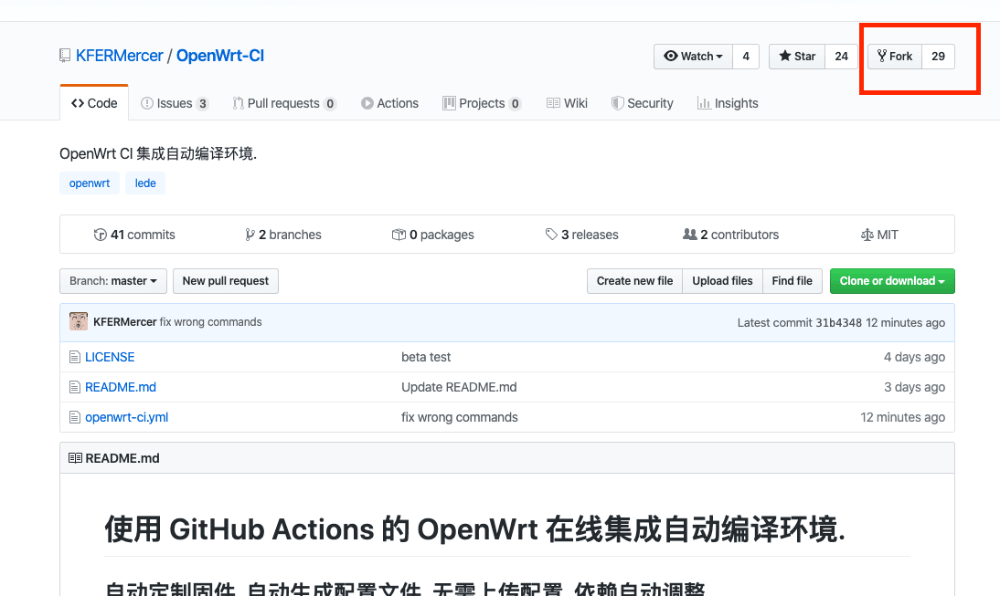
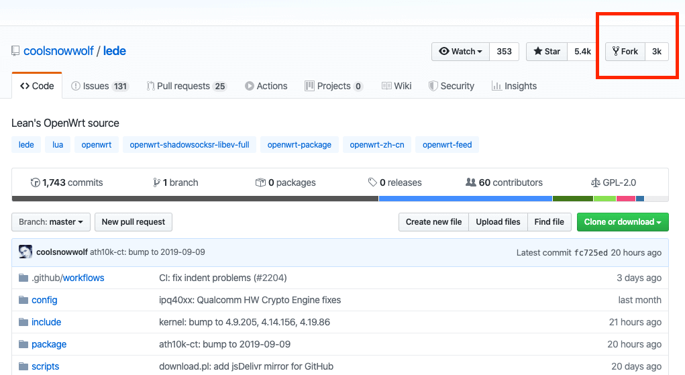
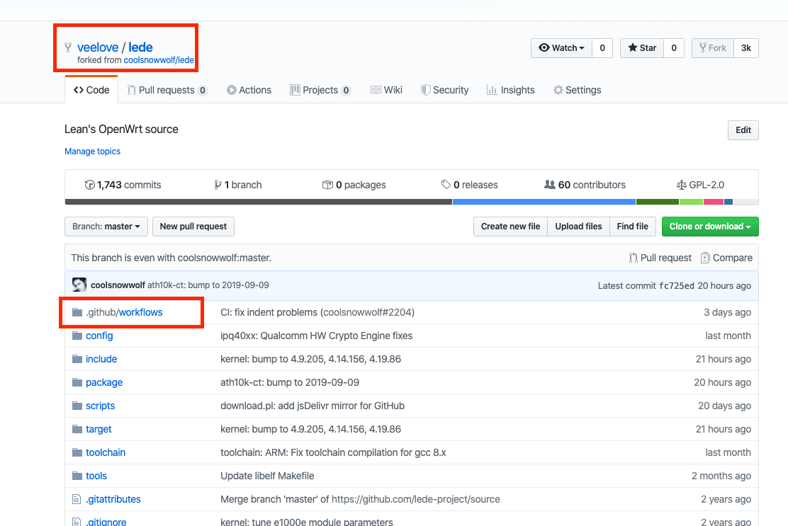
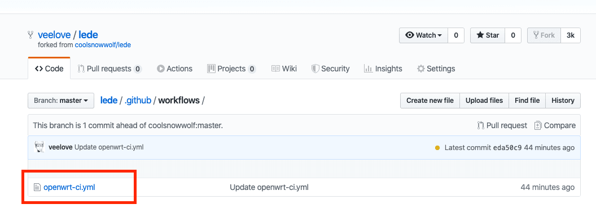
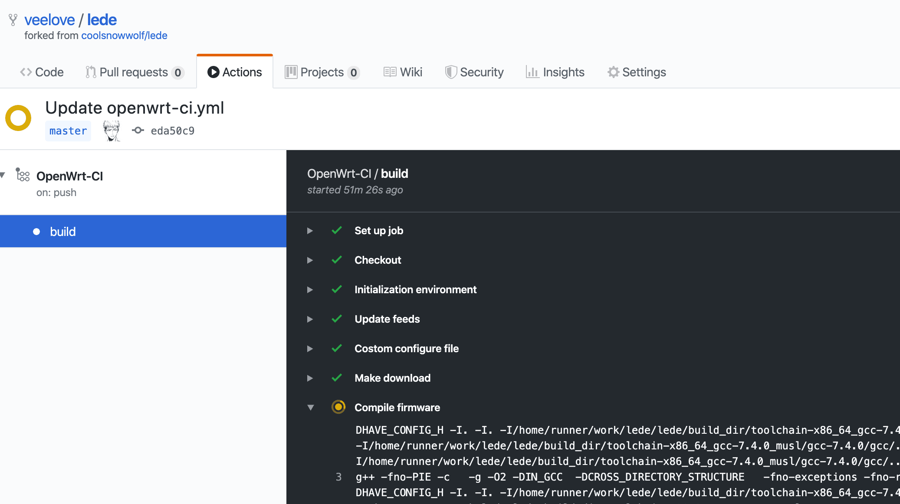
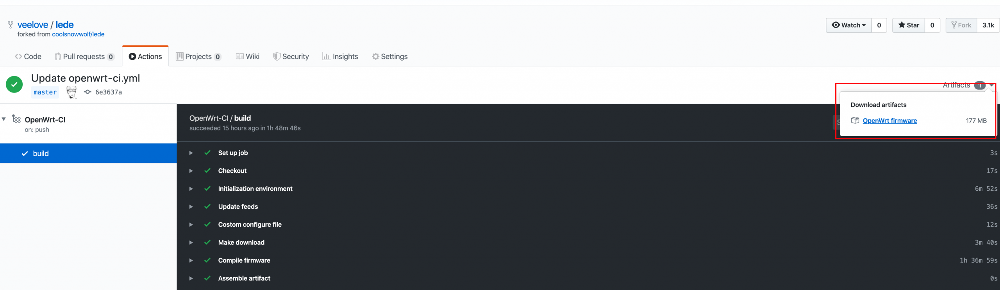

# 利用GitHub ACTIONS 在线云编译大雕的OpenWRT固件

有很多朋友都想编译一个合适自己使用的OpenWRT固件，这样的好处就是只保留了自己需要使用的插件，非常精简，那么就需要自己搭建一个编译环境。但是并不是每个人都会搭建，现在有一个很便捷的方案，就是利用GitHub ACTIONS 在线云编译。一起来看看吧：

------

## 一、注册GitHub账号

官网地址：https://github.com/

## 

## 

## 二、~~激活GitHub ACTIONS功能~~（此步骤已经不需要做，直接到项目里面点击Action选项卡，就可以跳转到激活页面了）

激活地址：https://github.com/features/actions/signup

## 

## 

## 三、fork 一建脚本项目

https://github.com/KFERMercer/OpenWrt-CI

[](https://wp.qiniu.gxnas.com/wp-content/uploads/2019/12/559e60266e26d3429413caefffec7e7e.png)

## 

## 四、fork L大的LEDE源码

https://github.com/coolsnowwolf/lede




## 

## 五、进入L大源码目录.github/workflows/

[](https://wp.qiniu.gxnas.com/wp-content/uploads/2019/12/2fc392bc6e31426ab0496b45cdaf4940.png?imageView2/1/w/2224/h/1486/q/90#)

## 

## 

## 六、打开openwrt-ci.yml，编辑代码（如需要添加其他的主题或者插件，可参考第九和第十条）

[](https://wp.qiniu.gxnas.com/wp-content/uploads/2019/12/714026c2422a5458643369cd0508da75.png)


```
#
# This is free software, lisence use MIT.
# 
# Copyright (C) 2019 P3TERX <https://p3terx.com>
# Copyright (C) 2019 KFERMercer <KFER.Mercer@gmail.com>
# 
# <https://github.com/KFERMercer/OpenWrt-CI>
#

name: OpenWrt-CI

on:
  push:
    branches: 
      - master
  # schedule:
  #   - cron: 0 20 * * *
  # release:
  #   types: [published]

jobs:
  build:
    runs-on: ubuntu-latest

    steps:
      - name: Checkout
        uses: actions/checkout@master
        with:
          ref: master

      - name: Initialization environment
        env:
          DEBIAN_FRONTEND: noninteractive
        run: |
          docker rmi `docker images -q`
          echo "Deleting files, please wait ..."
          sudo rm -rf \
            /usr/share/dotnet \
            /etc/mysql \
            /etc/php
          sudo -E apt-get -y purge \
            azure-cli \
            ghc* \
            zulu* \
            hhvm \
            llvm* \
            firefox \
            google* \
            dotnet* \
            powershell \
            openjdk* \
            mysql* \
            php*
          sudo -E apt-get update
          sudo -E apt-get -y install build-essential asciidoc binutils bzip2 gawk gettext git libncurses5-dev libz-dev patch unzip zlib1g-dev lib32gcc1 libc6-dev-i386 subversion flex uglifyjs git-core gcc-multilib p7zip p7zip-full msmtp libssl-dev texinfo libglib2.0-dev xmlto qemu-utils upx libelf-dev autoconf automake libtool autopoint device-tree-compiler
          sudo -E apt-get -y autoremove --purge
          sudo -E apt-get clean

      - name: Update feeds
        run: |
          ./scripts/feeds update -a
          ./scripts/feeds install -a

      - name: Costom configure file
        run: |
          rm -f ./.config*
          touch ./.config

          #
          # ========================固件定制部分========================
          # 

          # 
          # 如果不对本区块做出任何编辑, 则生成默认配置固件. 
          # 

          # 以下为定制化固件选项和说明:
          #

          #
          # 有些插件/选项是默认开启的, 如果想要关闭, 请参照以下示例进行编写:
          # 
          #          =========================================
          #         |  # 取消编译VMware镜像:                   |
          #         |  cat >> .config <<EOF                   |
          #         |  # CONFIG_VMDK_IMAGES is not set        |
          #         |  EOF                                    |
          #          =========================================
          #

          # 
          # 以下是一些提前准备好的一些插件选项.
          # 直接取消注释相应代码块即可应用. 不要取消注释代码块上的汉字说明.
          # 如果不需要代码块里的某一项配置, 只需要删除相应行.
          #
          # 如果需要其他插件, 请按照示例自行添加.
          # 注意, 只需添加依赖链顶端的包. 如果你需要插件 A, 同时 A 依赖 B, 即只需要添加 A.
          # 
          # 无论你想要对固件进行怎样的定制, 都需要且只需要修改 EOF 回环内的内容.
          # 

          # 编译x64固件:
          # cat >> .config <<EOF
          # CONFIG_TARGET_x86=y
          # CONFIG_TARGET_x86_64=y
          # CONFIG_TARGET_x86_64_Generic=y
          # EOF

          # 固件压缩:
          # cat >> .config <<EOF
          # CONFIG_TARGET_IMAGES_GZIP=y
          # EOF

          # 编译UEFI固件:
          # cat >> .config <<EOF
          # CONFIG_EFI_IMAGES=y
          # EOF

          # IPv6支持:
          # cat >> .config <<EOF
          # CONFIG_PACKAGE_dnsmasq_full_dhcpv6=y
          # CONFIG_PACKAGE_ipv6helper=y
          # EOF

          # 多文件系统支持:
          # cat >> .config <<EOF
          # CONFIG_PACKAGE_kmod-fs-nfs=y
          # CONFIG_PACKAGE_kmod-fs-nfs-common=y
          # CONFIG_PACKAGE_kmod-fs-nfs-v3=y
          # CONFIG_PACKAGE_kmod-fs-nfs-v4=y
          # CONFIG_PACKAGE_kmod-fs-ntfs=y
          # CONFIG_PACKAGE_kmod-fs-squashfs=y
          # EOF

          # USB3.0支持:
          # cat >> .config <<EOF
          # CONFIG_PACKAGE_kmod-usb-ohci=y
          # CONFIG_PACKAGE_kmod-usb-ohci-pci=y
          # CONFIG_PACKAGE_kmod-usb2=y
          # CONFIG_PACKAGE_kmod-usb2-pci=y
          # CONFIG_PACKAGE_kmod-usb3=y
          # EOF

          # 常用LuCI插件选择:
          # cat >> .config <<EOF
          # CONFIG_PACKAGE_luci-app-adbyby-plus=y
          # CONFIG_PACKAGE_luci-app-aria2=y
          # CONFIG_PACKAGE_luci-app-baidupcs-web=y
          # CONFIG_PACKAGE_luci-app-docker=y
          # CONFIG_PACKAGE_luci-app-frpc=y
          # CONFIG_PACKAGE_luci-app-hd-idle=y
          # CONFIG_PACKAGE_luci-app-kodexplorer=y
          # CONFIG_PACKAGE_luci-app-minidlna=y
          # CONFIG_PACKAGE_luci-app-openvpn=y
          # CONFIG_PACKAGE_luci-app-openvpn-server=y
          # CONFIG_PACKAGE_luci-app-qbittorrent=y
          # CONFIG_PACKAGE_luci-app-ssr-plus_INCLUDE_Kcptun=y
          # CONFIG_PACKAGE_luci-app-ssr-plus_INCLUDE_Shadowsocks=y
          # CONFIG_PACKAGE_luci-app-ssr-plus_INCLUDE_ShadowsocksR_Server=y
          # CONFIG_PACKAGE_luci-app-ssr-plus_INCLUDE_ShadowsocksR_Socks=y
          # CONFIG_PACKAGE_luci-app-ssr-plus_INCLUDE_V2ray=y
          # CONFIG_PACKAGE_luci-app-ttyd=y
          # CONFIG_PACKAGE_luci-app-v2ray-server=y
          # CONFIG_PACKAGE_luci-app-verysync=y
          # CONFIG_PACKAGE_luci-app-webadmin=y
          # CONFIG_PACKAGE_luci-app-wireguard=y
          # CONFIG_PACKAGE_luci-app-wrtbwmon=y
          # EOF

          # LuCI主题:
          # cat >> .config <<EOF
          # CONFIG_PACKAGE_luci-theme-argon=y
          # CONFIG_PACKAGE_luci-theme-netgear=y
          # EOF

          # 常用软件包:
          # cat >> .config <<EOF
          # CONFIG_PACKAGE_curl=y
          # CONFIG_PACKAGE_htop=y
          # CONFIG_PACKAGE_nano=y
          # CONFIG_PACKAGE_screen=y
          # CONFIG_PACKAGE_tree=y
          # CONFIG_PACKAGE_vim-fuller=y
          # CONFIG_PACKAGE_wget=y
          # EOF

          # 取消编译VMware镜像以及镜像填充 (不要删除被缩进的注释符号):
          # cat >> .config <<EOF
          # # CONFIG_TARGET_IMAGES_PAD is not set
          # # CONFIG_VMDK_IMAGES is not set
          # EOF

          # 
          # ========================固件定制部分结束========================
          # 

          sed -i 's/^[ \t]*//g' ./.config
          make defconfig

      - name: Make download
        run: |
          make download -j8
          find dl -size -1024c -exec ls -l {} \;
          find dl -size -1024c -exec rm -f {} \;

      - name: Compile firmware
        run: |
          echo -e "$(nproc) thread build."
          make -j$(nproc) V=s

      - name: Assemble artifact
        run: |
          rm -rf ./artifact/
          mkdir -p ./artifact/
          find ./bin/targets/ -name "*combined*img*" | xargs -i mv -f {} ./artifact/
          find ./bin/targets/ -name "*sysupgrade*bin*" | xargs -i mv -f {} ./artifact/

      - name: Upload artifact
        uses: actions/upload-artifact@master
        with:
          name: OpenWrt firmware
          path: ./artifact/
```

## 

## 

## 七、找到LEDE项目的ACTIONS，查看编译过程

[](https://wp.qiniu.gxnas.com/wp-content/uploads/2019/12/b7a1440e97d59ac05a6d78ecbd1063fc.png)

[](https://wp.qiniu.gxnas.com/wp-content/uploads/2019/12/94a68891bf6e9110085c8b1a03d939b3.png?imageView2/1/w/5120/h/1048/q/90#)


[](https://wp.qiniu.gxnas.com/wp-content/uploads/2019/12/1658301c46d180793e5cb9bf90a2316a.png?imageView2/1/w/4148/h/2324/q/90#)


## 

## 

## 八、编译完成后下载固件

[](https://wp.qiniu.gxnas.com/wp-content/uploads/2019/12/c80ec309df3bf91aaddb831133fa89eb.png)

 

## 九、自定义插件主题代码

```
 - name: 自定义插件主题。
        run: |
          cd package
          mkdir openwrt-packages
          cd openwrt-packages
          git clone https://github.com/openwrt-develop/luci-theme-atmaterial.git
          git clone https://github.com/Ameykyl/luci-app-koolproxyR
          git clone https://github.com/rosywrt/luci-theme-rosy
```

## 

## 十、LuCi Applications软件包说明

```
LuCI —> Applications —> luci-app-accesscontrol #访问时间控制
LuCI —> Applications —> luci-app-adblock #ADB广告过滤
LuCI —> Applications —> luci-app-adbyby-plus #广告屏蔽大师Plus +
LuCI —> Applications —> luci-app-adbyby #广告过滤大师（已弃）
LuCI —> Applications —> luci-app-adkill #广告过滤（已弃）
LuCI —> Applications —> luci-app-advanced-reboot #Linksys高级重启
LuCI —> Applications —> luci-app-ahcp #支持AHCPd
LuCI —> Applications —> luci-app-aliddns #阿里DDNS客户端
LuCI —> Applications —> luci-app-amule #aMule下载工具
LuCI —> Applications —> luci-app-aria2 # Aria2下载工具
LuCI —> Applications —> luci-app-arpbind #IP/MAC绑定
LuCI —> Applications —> luci-app-asterisk #支持Asterisk电话服务器
LuCI —> Applications —> luci-app-attendedsysupgrade #固件更新升级相关
LuCI —> Applications —> luci-app-autoreboot #支持计划重启
LuCI —> Applications —> luci-app-bcp38 #BCP38网络入口过滤(不确定)
LuCI —> Applications —> luci-app-bird4 #Bird 4(未知)
LuCI —> Applications —> luci-app-bird6 #Bird 6(未知)
LuCI —> Applications —> luci-app-bmx6 #BMX6路由协议
LuCI —> Applications —> luci-app-bmx7 #BMX7路由协议
LuCI —> Applications —> luci-app-caldav #联系人
LuCI —> Applications —> luci-app-cjdns #加密IPV6网络相关
LuCI —> Applications —> luci-app-clamav #ClamAV杀毒软件
LuCI —> Applications —> luci-app-commands #Shell命令模块
LuCI —> Applications —> luci-app-cshark #CloudShark捕获工具
LuCI —> Applications —> luci-app-ddns #动态域名 DNS
LuCI —> Applications —> luci-app-diag-core #core诊断工具
LuCI —> Applications —> luci-app-dnscrypt-proxy #DNSCrypt解决DNS污染
LuCI —> Applications —> luci-app-dnscrypt-dnsforwarder #DNSForwarder防DNS污染
LuCI —> Applications —> luci-app-dnspod #DNSPod
LuCI —> Applications —> luci-app-dump1090 #民航无线频率(不确定)
LuCI —> Applications —> luci-app-dynapoint #DynaPoint(未知)
LuCI —> Applications —> luci-app-e2guardian #Web内容过滤器
LuCI —> Applications —> luci-app-filetransfer #文件传输
LuCI —> Applications —> luci-app-firewall #添加防火墙
LuCI —> Applications —> luci-app-flowoffload #Turbo ACC FLOW转发加速
LuCI —> Applications —> luci-app-freifunk-diagnostics #freifunk组件 诊断(未知)
LuCI —> Applications —> luci-app-freifunk-policyrouting #freifunk组件 策略路由(未知)
LuCI —> Applications —> luci-app-freifunk-widgets #freifunk组件 索引(未知)
LuCI —> Applications —> luci-app-frpc #内网穿透 Frp
LuCI —> Applications —> luci-app-fwknopd #Firewall Knock Operator服务器
LuCI —> Applications —> luci-app-guest-wifi #WiFi访客网络
LuCI —> Applications —> luci-app-hd-idle #硬盘休眠
LuCI —> Applications —> luci-app-hnet #Homenet Status家庭网络控制协议
LuCI —> Applications —> luci-app-kooldns #virtual服务器 ddns替代方案（已弃）
LuCI —> Applications —> luci-app-koolproxy #KP去广告（已弃）
LuCI —> Applications —> luci-app-lxc #LXC容器管理
LuCI —> Applications —> luci-app-meshwizard #网络设置向导
LuCI —> Applications —> luci-app-minidlna #完全兼容DLNA / UPnP-AV客户端的服务器软件
LuCI —> Applications —> luci-app-mjpg-streamer #兼容Linux-UVC的摄像头程序
LuCI —> Applications —> luci-app-mmc-over-gpio #添加SD卡操作界面（已弃）
LuCI —> Applications —> luci-app-multiwan #多拨虚拟网卡（已弃）
LuCI —> Applications —> luci-app-mwan #MWAN负载均衡
LuCI —> Applications —> luci-app-mwan3 #MWAN3分流助手
LuCI —> Applications —> luci-app-n2n_v2 #N2N内网穿透 N2N v2 virtual服务
LuCI —> Applications —> luci-app-nft-qos #QOS流控 Nftables版（已弃）
LuCI —> Applications —> luci-app-ngrokc #Ngrok 内网穿透（已弃）
LuCI —> Applications —> luci-app-nlbwmon #网络带宽监视器
LuCI —> Applications —> luci-app-noddos #NodDOS Clients 阻止DDoS攻击
LuCI —> Applications —> luci-app-ntpc #NTP时间同步服务器
LuCI —> Applications —> luci-app-ocserv #OpenConnect virtual服务
LuCI —> Applications —> luci-app-olsr #OLSR配置和状态模块
LuCI —> Applications —> luci-app-olsr-services #OLSR服务器
LuCI —> Applications —> luci-app-olsr-viz #OLSR可视化
LuCI —> Applications —> luci-app-ocserv #OpenConnect virtual服务（已弃）
LuCI —> Applications —> luci-app-openvirtual #Openvirtual客户端
LuCI —> Applications —> luci-app-openvirtual-server #易于使用的Openvirtual服务器 Web-UI
LuCI —> Applications —> luci-app-oscam #OSCAM服务器（已弃）
LuCI —> Applications —> luci-app-p910nd #打印服务器模块
LuCI —> Applications —> luci-app-pagekitee #Pagekite内网穿透客户端
LuCI —> Applications —> luci-app-polipo #Polipo代理(是一个小型且快速的网页缓存代理)
LuCI —> Applications —> luci-app-pppoe-relay #PPPoE NAT穿透 点对点协议(PPP)
LuCI —> Applications —> luci-app-p p t p-server #virtual服务器 p p t p
LuCI —> Applications —> luci-app-privoxy #Privoxy网络代理(带过滤无缓存)
LuCI —> Applications —> luci-app-qos #流量服务质量(QoS)流控
LuCI —> Applications —> luci-app-radicale #CalDAV/CardDAV同步工具
LuCI —> Applications —> luci-app-ramfree #释放内存
LuCI —> Applications —> luci-app-rp-pppoe-server #Roaring Penguin PPPoE Server 服务器
LuCI —> Applications —> luci-app-samba #网络共享(Samba)
LuCI —> Applications —> luci-app-samba4 #网络共享(Samba4)
LuCI —> Applications —> luci-app-sfe #Turbo ACC网络加速(开启Fast Path转发加速)
LuCI —> Applications —> luci-app-s-s #SS兲朝上网（已弃）
LuCI —> Applications —> luci-app-s-s-libes #SS-libev服务端
LuCI —> Applications —> luci-app-shairplay #支持AirPlay功能
LuCI —> Applications —> luci-app-siitwizard #SIIT配置向导 SIIT-Wizzard
LuCI —> Applications —> luci-app-simple-adblock #简单的广告拦截
LuCI —> Applications —> luci-app-simple-softethervirtual #SoftEther virtual服务器 NAT穿透（已弃）
LuCI —> Applications —> luci-app-splash #Client-Splash是无线MESH网络的一个热点认证系统
LuCI —> Applications —> luci-app-sqm #流量智能队列管理(QOS)
LuCI —> Applications —> luci-app-squid #Squid代理服务器
——————————————————————————————-
LuCI —> Applications —> luci-app-S-S R-plus #S-S R兲朝上网Plus+
LuCI —> Applications —> luci-app-S-S R-plus —> Include s-s New Versiong #新SS代理
LuCI —> Applications —> luci-app-S-S R-plus —> Include V2ray #V2Ray透明代理
LuCI —> Applications —> luci-app-S-S R-plus —> Include Kcptun #Kcptun代理
LuCI —> Applications —> luci-app-S-S R-plus —> Include s-sR Server #S-S R客户端
LuCI —> Applications —> luci-app-S-S R-plus —> Include s-sR Socks and Tunnel #S-S R代理
——————————————————————————————-
LuCI —> Applications —> luci-app-S-S R-pro #S-S R-Pro
LuCI —> Applications —> luci-app-S-S Rserver-python #s-sR Python服务器
LuCI —> Applications —> luci-app-statistics #流量监控工具
LuCI —> Applications —> luci-app-syncdial #多拨虚拟网卡(原macvlan)
LuCI —> Applications —> luci-app-tinyproxy #Tinyproxy是 HTTP(S)代理服务器
LuCI —> Applications —> luci-app-transmission #BT下载工具
LuCI —> Applications —> luci-app-travelmate #旅行路由器
LuCI —> Applications —> luci-app-ttyd #网页终端命令行
LuCI —> Applications —> luci-app-udpxy #udpxy做组播服务器
LuCI —> Applications —> luci-app-uhttpd #uHTTPd Web服务器
LuCI —> Applications —> luci-app-unbound #Unbound DNS解析器
LuCI —> Applications —> luci-app-upnp #通用即插即用UPnP(端口自动转发)
LuCI —> Applications —> luci-app-usb-printer #USB 打印服务器
LuCI —> Applications —> luci-app-v2ray-pro #V2Ray透明代理
LuCI —> Applications —> luci-app-vlmcsd #KMS服务器设置
LuCI —> Applications —> luci-app-vnstat #vnStat网络监控(图表)
LuCI —> Applications —> luci-app-virtualbypass #virtual BypassWebUI 绕过virtual设置
LuCI —> Applications —> luci-app-vsftpd #FTP服务器
LuCI —> Applications —> luci-app-watchcat #断网检测功能与定时重启
LuCI —> Applications —> luci-app-webadmin #Web管理页面设置
LuCI —> Applications —> luci-app-webshell #网页命令行终端（已弃）
LuCI —> Applications —> luci-app-wifischedule #WiFi 计划
LuCI —> Applications —> luci-app-wireguard #virtual**服务器 WireGuard状态
LuCI —> Applications —> luci-app-wireless-regdb #WiFi无线
LuCI —> Applications —> luci-app-wol #WOL网络唤醒
LuCI —> Applications —> luci-app-wrtbwmon #实时流量监测
LuCI —> Applications —> luci-app-xlnetacc #迅雷快鸟
LuCI —> Applications —> luci-app-zerotier #ZeroTier内网穿透
```

 

原文地址：https://www.vediotalk.com/archives/6561