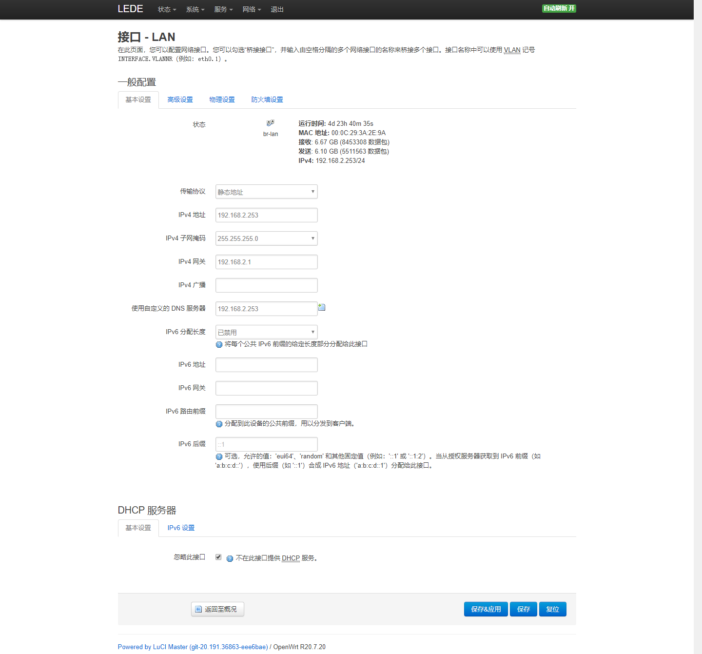
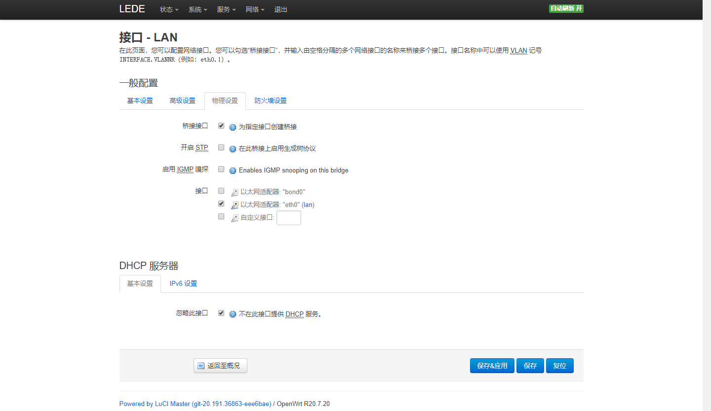
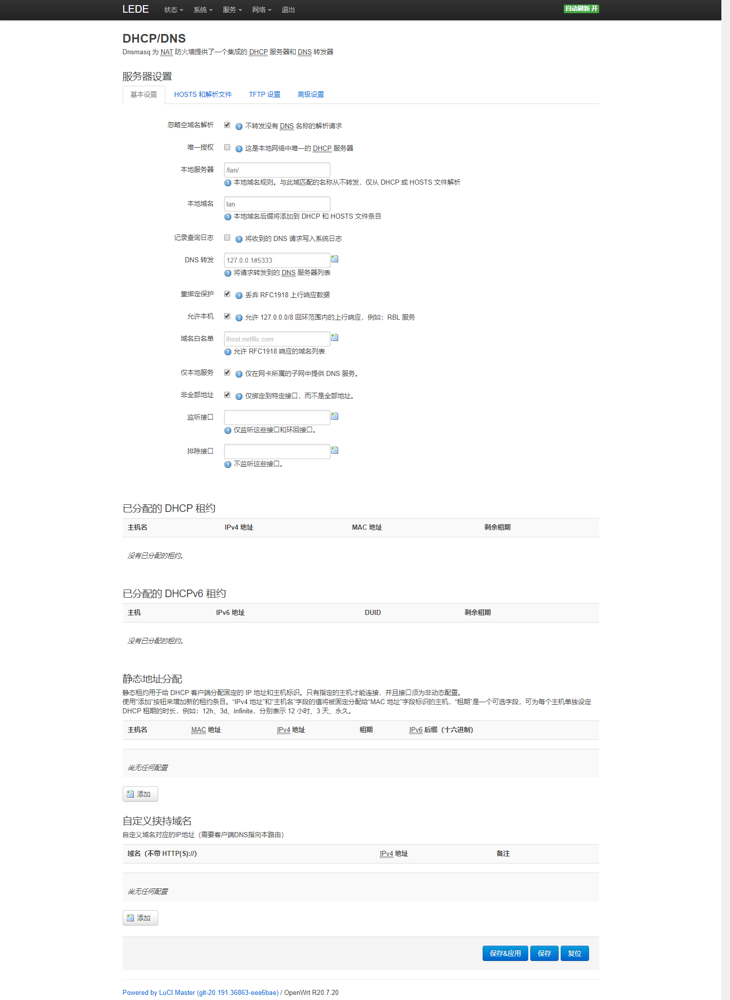
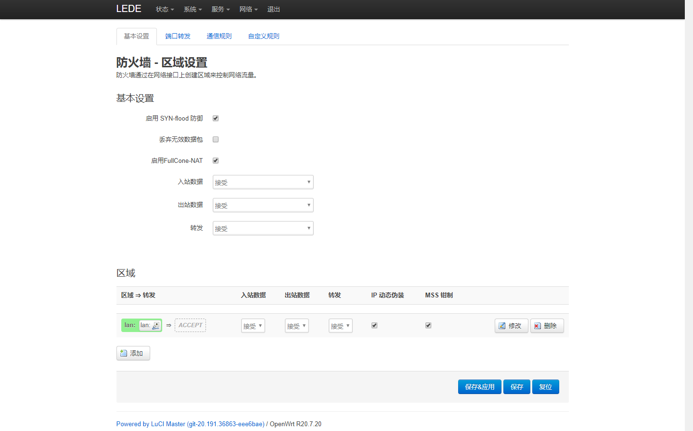
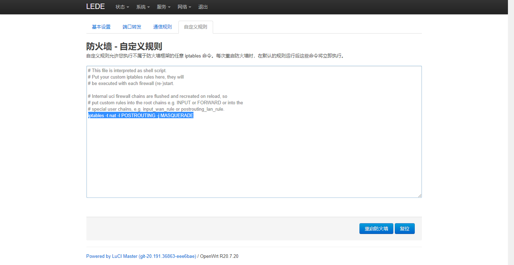
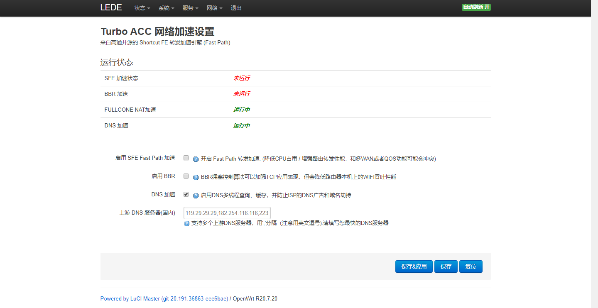
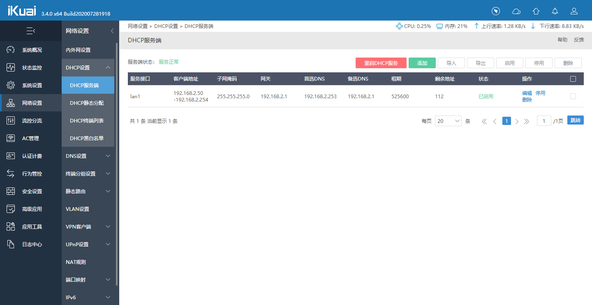
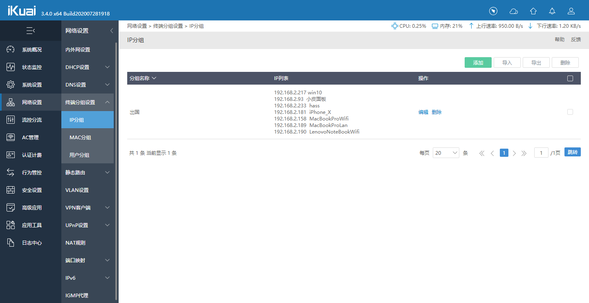
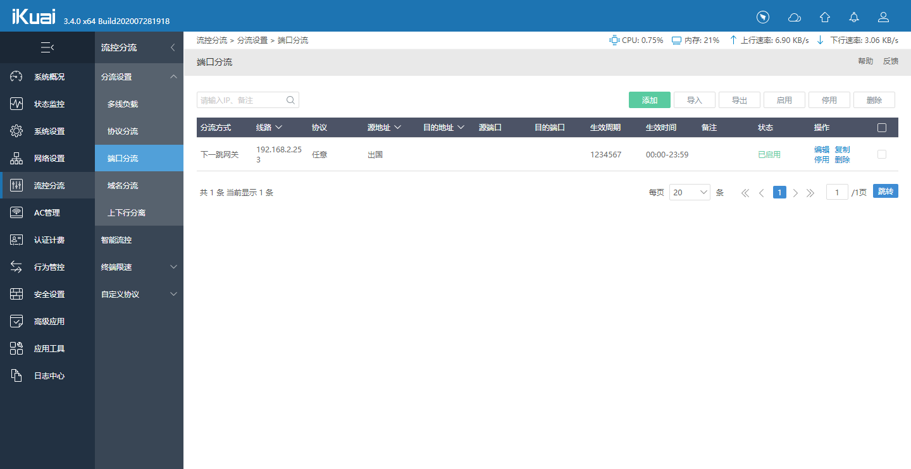

# 爱快当主路由负责拨号,dhcp分配,出国组判断,openwrt当出国旁路由

### 效果:

爱快负责拨号/dhcp/分流.(配置出国组的ip设备走openwrt的gw出国线路)
openwrt负责出国.

### openwrt设置:

网络->接口.只留一个lan.接爱快lan
使用静态地址,这里设置253,网关填写爱快网关192.168.2.1地址,dns填写openwrt自己192.168.2.253,忽略此接口dhcp



网络->DHCP/DNS

网络->防火墙

防火墙自定义规则添加

```
iptables -t nat -I POSTROUTING -j MASQUERADE
```


网络->Turbo ACC 网络加速设置


### 爱快设置:

网络设置->DHCP设置->DHCP服务端
这里首选dns填写openwrt地址192.168.2.253,备选填自己192.168.2.1

网络设置->终端分组设置->IP分组
添加需要出国的ip设备

流控分流->分流设置->端口分流
分流方式为[下一跳网关],线路地址填openwrt的地址192.168.2.253,协议任意,源地址ip添加出国组.然后自己保存.


Done!
以后有设备需要出国,将ip加入出国组即可.openwrt出国设置推荐用gfw列表模式,这样访问国内网站还是直连不会出国.