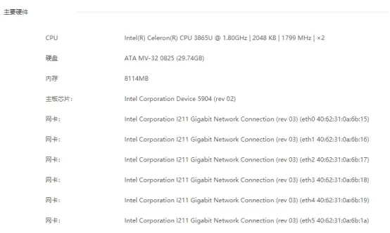
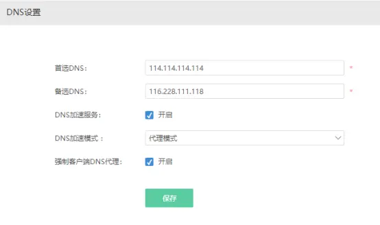

# 爱快路由器+Padavan实现无感科学的外出与回家

一、硬件需求（非必须下方的配置，只是我当前使用的设备如此而已）

\1. 主路由：Intel(R) Celeron(R) CPU 3865U，8G内存，32G杂牌SSD，6网口，刷爱快官方固件。1300RMB左右。

\2. 辅助路由：矿渣newifi3D2,512M内存，已刷灯大padavan。280RMB左右。

\3. （可选，不做介绍）：不使用辅助路由，需要在主路由内刷虚拟机，并在虚拟机内同时安装爱快和LEDE。此方法需要更高性能的主路由，以及更大容量的内存，爱快版本要在3.3以上。

二、云端需求

\1. 一个稳定的酸酸或者v2瑞。

三、爱快路由设置

\0.  爱快刷好机，得给连接爱快的电脑设置一个固定IP：192.168.1.10，然后访问网页192.168.1.1。用户名密码admin,admin。

\1. 爱快路由内设置两个wan口：wan1和wan2,wan1对应的网口连接运营商的光猫，wan2对应的网口连接辅助路由的LAN网口。根据运营商的情况，设置wan1口接入方式（拨号或DHCP获取），设置wan1为默认网关，设置wan2口为DHCP获取。

 

\2. 自行设置爱快其他网口功能。我是直接设置成了链路桥接，几个口都是一个网段lan1。

 

\3. 自己设置内网lan1地址：我是设置的192.168.3.1

\4. 断爱快电源，重新上电，修改电脑IP为192.168.3.10，网页访问192.168.3.1

\5. 设置DHCP服务端

 

\6. 设置DNS设置，首选DNS为114.114.114.114，备用DNS随意，我这边选的本地运营商DNS。

\7. 检查主路由是否可以正常连接外网。

 

四、辅助路由设置

\1. 辅助路由WAN口连接主路由任意LAN口。（这样就有两根线把路由器互相连起来了：辅助路由WAN-主路由被设置成lan1口的网口；辅助路由LAN-主路由被设置成wan2口的网口）

 

\2. 电脑网线插辅助路由LAN口，设置电脑网卡为自动获取IP，刚刷好机的padavan的IP好像是192.168.128.1，浏览器访问此IP。（如果不是，自行在电脑网卡上查看网关IP）

 

\3. 根据需求，自行设置WIFI（我觉得关了比较好，毕竟这个路由器所有流量全部科学的外出了，回家的流量也会强制外出，所以WIFI关闭比较好，除非有特殊需求）

\4. 保证主路由已经可以上网，使用当前电脑通过辅助路由连接外网看看能否正常工作。

\5. 浏览器访问辅助路由IP，自行设置酸酸或者v2瑞，注意，需要将透明代理和本地代理全部走代理流量（v2瑞），或者工作模式设置为全局代理（酸酸）。

\6. 观察辅助路由的系统日志，检查酸酸或者v2瑞是否启动成功。

\7. 使用这台电脑进行科学的外出，检查是否工作正常。

五、爱快分流设置

\1. 下载文件（https://raw.githubusercontent.com/hq450/fancyss/master/rules/gfwlist.conf）

\2. 保存下面的代码为1.py

\#设置区域开始
wanname = 'wan2' #设置wan口名字，第2路wan口爱快会自动命名为wan2，所以一般用wan2就可以了
\#设置区域结束
with open('gfwlist.conf','r') as f:
  gfwlist_txt = f.read()
pos1 = 0
pos2 = 0
data = []
while True:
  pos1 = gfwlist_txt.find('ipset=/.', pos2)
  if pos1 == -1:
    break
  pos2 = gfwlist_txt.find('/gfwlist', pos1)
  data.append(gfwlist_txt[pos1+8:pos2])
print(data)
write = []
for i in range(int(len(data)/500)):
  writedata = 'id='+str(i+1)+" "+'enabled=yes comment='+str(i+1)+' domain='
  for ii in data[500*i+1:500*(i+1)]:
    writedata = writedata+ii+','
  writedata = writedata[:len(writedata)-1]
  writedata = writedata+' interface='+wanname+' src_addr= week=1234567 time=00:00-23:59'
  write.append(writedata)
if len(data)//500 !=0:
  writedata = 'id=' + str(i + 2) + " " + 'enabled=yes comment=' + str(i + 2) + ' domain='
  for ii in data[500 * (i+1) + 1:]:
    writedata = writedata + ii + ','
  writedata = writedata[:len(writedata) - 1]
  writedata = writedata + ' interface='+wanname+' src_addr= week=1234567 time=00:00-23:59'
  write.append(writedata)
finaldata = ''
for i in write:
  finaldata = finaldata+i +'\n'
print(finaldata)
with open('stream.txt','w') as f:
  f.write(finaldata)

\3. 安装python3.7,并将1.py和gfwlist.conf放在一个文件夹内。

\4. 启动cmd，切换到上面的文件夹，输入python3 1.py。得到stream.txt

\5. 打开爱快路由访问页面，点’流控分流’-’分流设置’-’域名分流’，点导入按钮，选择刚才生成的那个stream.txt文件。

\6. 电脑网线插回爱快路由器上，电脑进行科学的外出，检查是否工作正常。

六、一些说明

\1. 对于v2瑞来说，辅助路由器的性能决定了速度，一些弱鸡路由器是无法带起v2瑞的，此时可以采用如下方法：弱鸡路由器刷padavan，爱快内虚拟机装ubuntu，并安装v2瑞客户端，设置好http或者sock代理，padavan使用transock功能，透明代理访问这个http或者sock代理即可，具体可自行研究。

\2. 前面下载的gfwlist.conf网址，会定期更新其内容，可定期自行更新爱快内的域名分流内容。