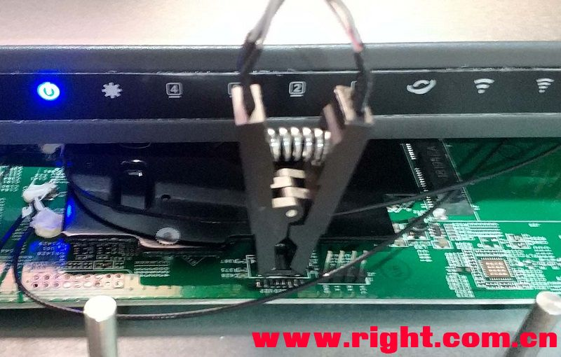
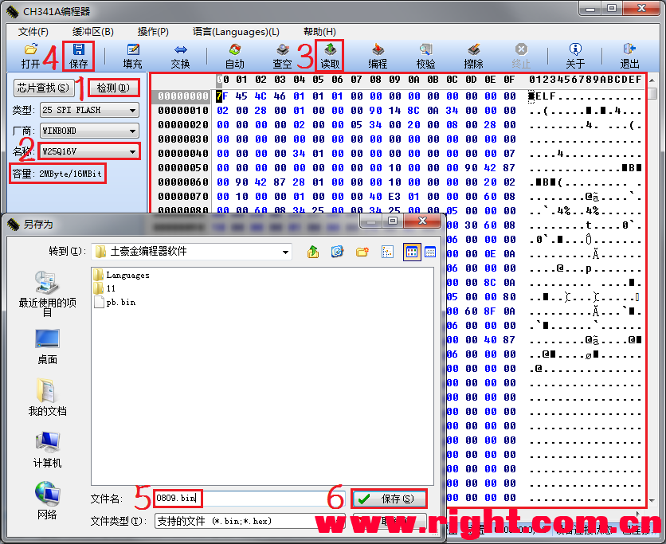
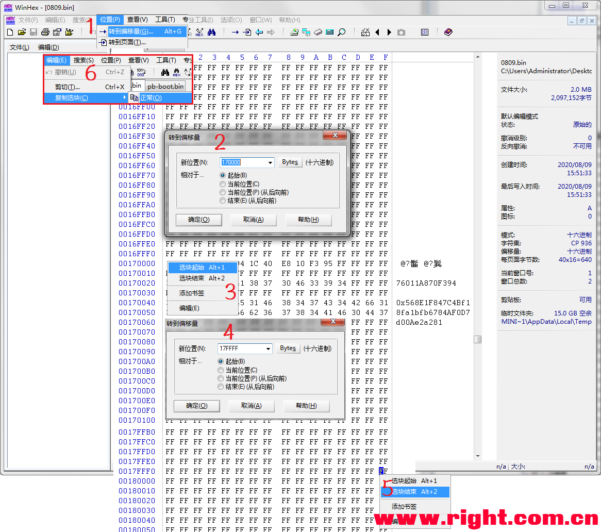
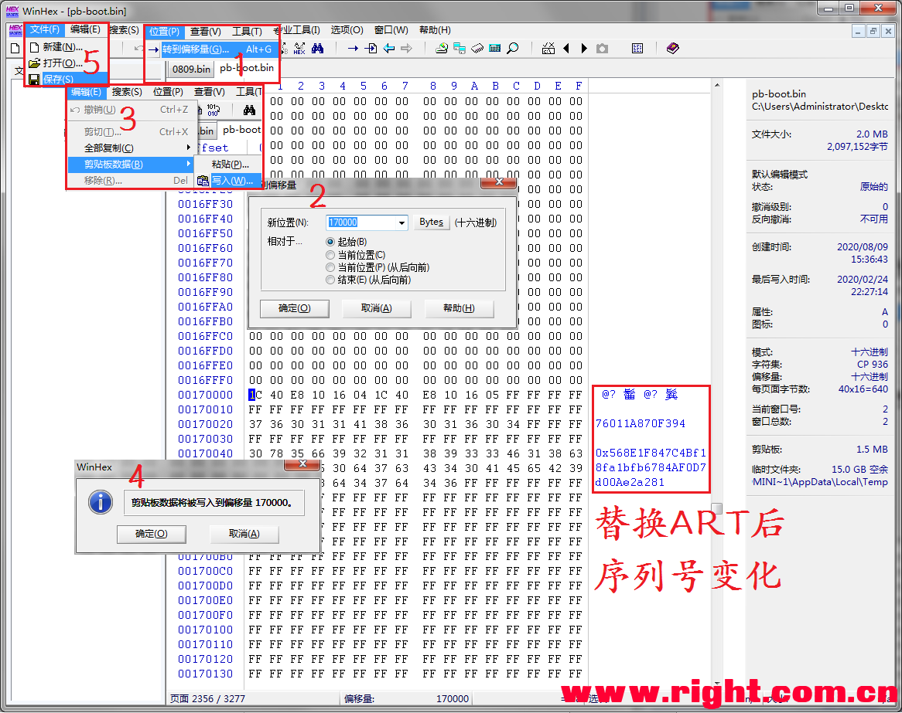
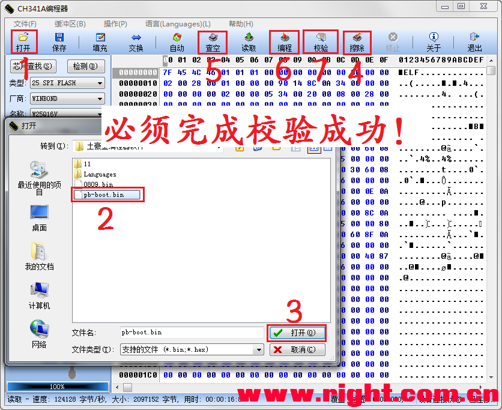

# 竞斗云 R619AC救砖教程

本教程仅限于刷机变砖，竞斗云硬件没问题。需要购买编程器，可以拆芯片可以上夹子。1.接好线路

2.点击检测，识别出16MB芯片。修改产品名称为2MB，只要读取SPI芯片的包含ART数据前面2M文件即可。读取后保存下固件。

3、把读取下来的文件的170000-17FFFF部分的64KB ART文件复制到已经扩容好的pb-boot文件（opboot一样也可以），替换好后保存下。

4.编程器将包含ART文件的Pb-boot固件写入路由器。
