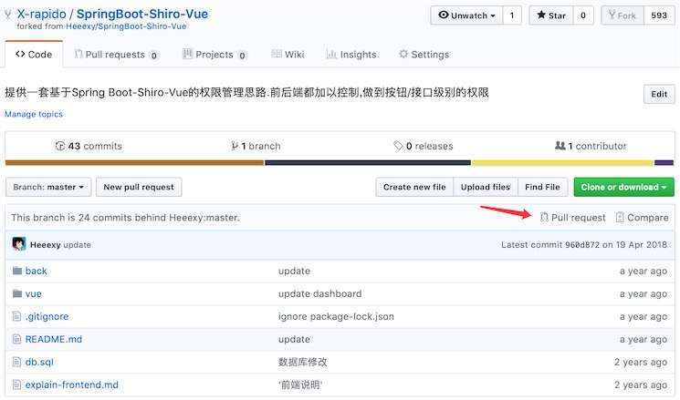
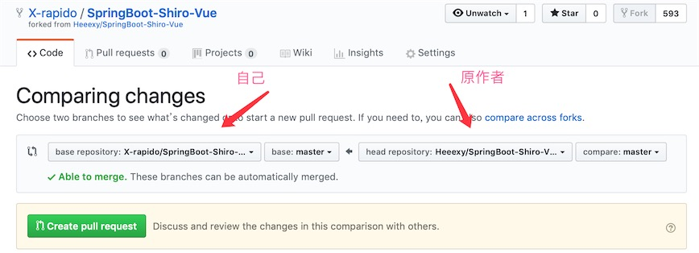
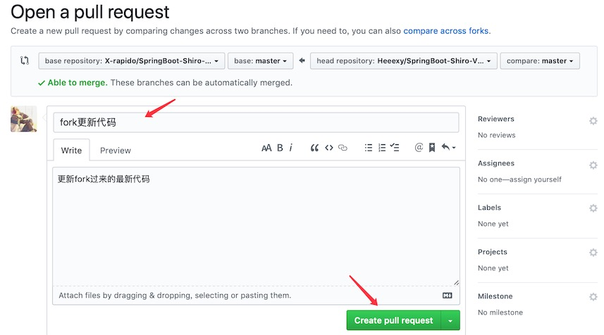
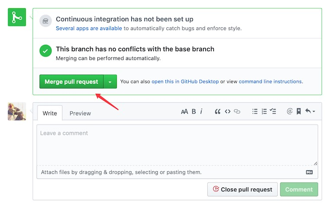
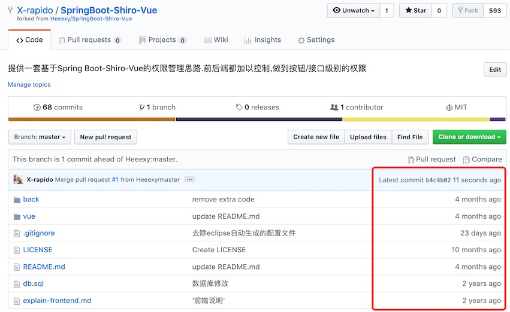
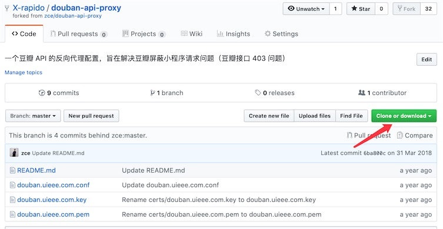

# GitHub上fork原项目，保持和原作者同步的代码更新

### 一、场景

在GitHub上我们会去fork别人的一个项目，这就在自己的Github上生成了一个与原作者项目互不影响的副本，自己可以将自己Github上的这个项目再clone到本地进行修改，修改后再push，只有自己Github上的项目会发生改变，而原作者项目并不会受影响，避免了原作者项目被污染。但经过一段时间，有可能作者原来的代码变化很大，你想接着在他最新的代码上修改，这时你需要合并原作者的最新代码过来，让你的项目变成最新的。

### 二、解决方法 

这里我演示使用两种方式来更新最新代码。

#### 方式一：从github上进行操作然后更新

登录自己的github账号，在fork的项目内点击 “New pull request”：

[](http://www.ibloger.net/zb_users/upload/2019/05/201905081557300420310037.jpg)

将 base fork 改成自己github上fork后的项目，head fork 改成原项目，如果base fork选择了自己fork完的项目后变成两个都是master，可以点一下“compare across forks” 

[](http://www.ibloger.net/zb_users/upload/2019/05/201905081557300439530324.jpg)

 点击“Create pull request”进入页面，填写信息后提交

[](http://www.ibloger.net/zb_users/upload/2019/05/201905081557300476450677.jpg)

点击“Merge pull request”合入代码

[](http://www.ibloger.net/zb_users/upload/2019/05/201905081557300501502722.jpg)

这时候回到自己github账号下fork的项目code下看commits可以看到原项目新提交的内容都已经合过来了

[](http://www.ibloger.net/zb_users/upload/2019/05/201905081557300558211688.jpg)

这时候在本地执行"git pull"就可以更新到最新的代码了

####  方法二、通过命令行fetch拉取原仓库更新

1、拉取最新代码到本地电脑

Bash

```bash
git clone git@github.com:X-rapido/douban-api-proxy.git
```

[](http://www.ibloger.net/zb_users/upload/2019/05/201905081557300598108644.jpg)

2、配置当前fork的仓库的原仓库地址

Bash

```bash
git remote add upstream <原仓库github地址>
```

3、查看当前仓库的远程仓库地址和原仓库地址

Bash

```bash
git remote -v
```

4、获取原仓库的更新。使用fetch更新，fetch后会被存储在一个本地分支upstream/master上。upstream是创建的分支名，随意

Bash

```bash
git fetch upstream
```

5、合并到本地分支。切换到本地master分支，合并upstream/master分支。

Bash

```bash
git merge upstream/master
```

6、这时候使用git log就能看到原仓库的更新了。

Bash

```bash
git log
```

7、如果需要自己github上的fork的仓库需要保持同步更新，执行git push进行推送

BASIC

```basic
git push origin master
```

操作日志如下

Bash

```bash
➜  git clone git@github.com:X-rapido/douban-api-proxy.git
Cloning into 'douban-api-proxy'...
...

➜  cd douban-api-proxy
➜  douban-api-proxy git:(master) git remote -v
origin  git@github.com:X-rapido/douban-api-proxy.git (fetch)
origin  git@github.com:X-rapido/douban-api-proxy.git (push)

➜  douban-api-proxy git:(master) git remote add upstream https://github.com/zce/douban-api-proxy.git

➜  douban-api-proxy git:(master) git remote -v
origin  git@github.com:X-rapido/douban-api-proxy.git (fetch)
origin  git@github.com:X-rapido/douban-api-proxy.git (push)
upstream    https://github.com/zce/douban-api-proxy.git (fetch)
upstream    https://github.com/zce/douban-api-proxy.git (push)

➜  douban-api-proxy git:(master) git fetch upstream
remote: Enumerating objects: 12, done.
remote: Counting objects: 100% (12/12), done.
remote: Compressing objects: 100% (10/10), done.
remote: Total 13 (delta 5), reused 2 (delta 2), pack-reused 1
Unpacking objects: 100% (13/13), done.
From https://github.com/zce/douban-api-proxy
* [new branch]      master     -> upstream/master

➜  douban-api-proxy git:(master) git merge upstream/master
...

➜  douban-api-proxy git:(master) git log
...

➜  douban-api-proxy git:(master) git push origin master
...
```