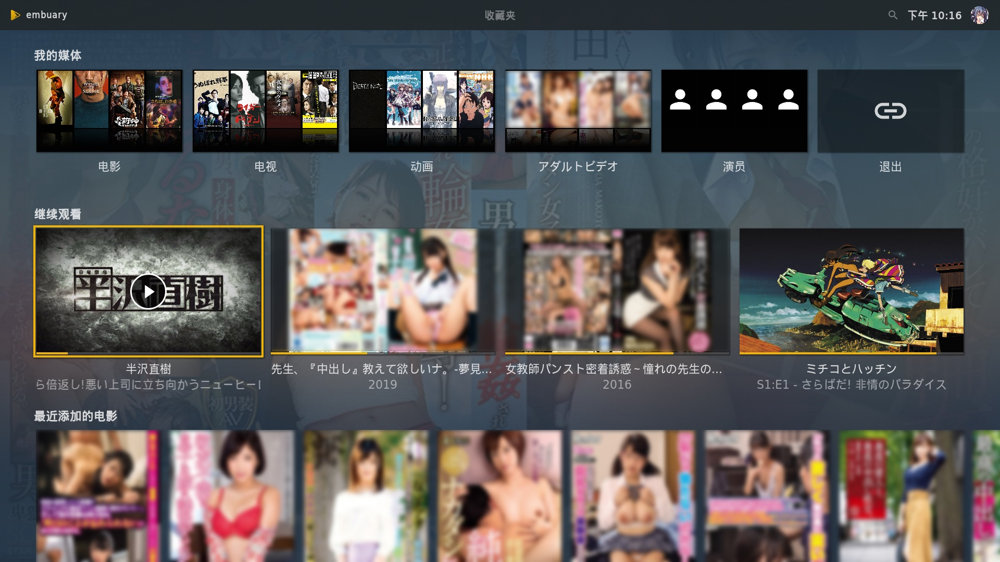

## 利用AV Data Capture+Jellyfin+Kodi打造更优雅的本地AV（毛片）+普通影片媒体库

https://pockies.github.io/2020/01/09/av-data-capture-jellyfin-kodi/


**W A R N I N G ！**

- **※阅读正文前请保持房间明亮，并年满18岁。**

去年年初。

为了向**日本广大劳动妇女**献上赞歌的我，从无到有折腾了一番——

**——[《利用EverAver+Emby+Kodi打造本地AV（毛片）媒体库》](https://pockies.github.io/2019/03/25/everaver-emby-kodi/)**

相信不少朋友已经跟随文章，搭建起了自己的媒体中心。

然而随着评论反馈与自己日常使用，一些历史遗留问题逐渐显露，令人如鲠在喉。

一年过去。

**——来自人类的伟大智慧，已经让我们拥有了更加先进的生产力工具。**


**——是时候开启科技革命了！**

本文将在[上篇文章的基础上](https://pockies.github.io/2019/03/25/everaver-emby-kodi/)，提供以下更新：

- 更优雅的抓取AV元数据；
- 如何打造普通影视（动画/电影/电视剧）媒体库；
- 从Emby迁移到Jellyfin；
- 更优雅的媒体库播放姿势（Windows与Android盒子的客户端解决方案）。

无论您是搭建本地媒体库，还是影片归类管理，相信都能在文中找到更加合适的工具。

请善用文章右侧的`CATALOG`快速跳转至您需要的教程。

请结合上篇文章[《利用EverAver+Emby+Kodi打造本地AV（毛片）媒体库》](https://pockies.github.io/2019/03/25/everaver-emby-kodi/)一起食用。

# 元数据（里）/ AV Data Capture

*（关于什么是`元数据`，请参考[上篇文章的说明](https://pockies.github.io/2019/03/25/everaver-emby-kodi/#元数据--everaver)，这里不再赘述。）*

去年我们抓取AV`元数据`使用的是[EverAver](https://everaver.blogspot.com/?zx=2aeb97a65a8c97a9)。


这个软件功能丰富，可编辑性强，**但却有几个致命缺陷：**

1. 一次只能抓取一部作品。
2. 无法抓取“多集作品”。
3. 由于数据来自日本通贩网站，在“其他国家”使用经常抽风。

**这让拥有庞大影片数量的群众苦不堪言。**

不过——

> “只要活着就有好事发生”。

我的[上篇文章](https://pockies.github.io/2019/03/25/everaver-emby-kodi/)意外让更加广大的人民群众，意识到了自己对“毛片媒体库”的强烈~~生理需求~~。

而人群之中，又意外出现了救世勇者。

**——伟大的开发者。**

并最终带来了更加强力的AV`元数据`抓取工具。

**——[AV Data Capture](https://github.com/yoshiko2/AV_Data_Capture)。**

#### 关于AV Data Capture


软件本身只有三个文件，甚至连“UI”都没有（只有命令行窗口）。

不过扮猪吃虎，功能强大。

由于软件针对Emby开发（附带支持plex/kodi/jellyfin），直接解决了以下痛点：

- 支持一键**批量识别并抓取多部作品**，几乎无错。

  （本次迁移媒体库累计抓取1920部影片，只有两部抓取后标题信息不全。）

- 可以识别并抓取“多集作品”，再也不用[手动修改NFO](https://pockies.github.io/2019/03/25/everaver-emby-kodi/#修改nfo合并多集作品)。

- 得益于数据来自J██bus，国内使用更加快速稳定。

- 得益于数据来自J██bus，抓取后的`元数据`自带标签，并支持在媒体库中显示背景墙。

  

  （[EverAver](https://everaver.blogspot.com/?zx=2aeb97a65a8c97a9)抓取的`元数据`同样齐全，但由于没有针对特定媒体库做特定优化，存在部分信息无法显示的问题。）

可以说。

AV Data Capture不仅提供了更加便捷，精准，全面的`元数据`抓取体验；

而在针对媒体库软件进行优化，并显示出最完整的`元数据`信息之后——

**——Emby/Jellyfin的媒体库终于进化成了完全体。**

#### 配置AV Data Capture

虽然[AV Data Capture](https://github.com/yoshiko2/AV_Data_Capture)可以“开箱即用”。

不过为了后期媒体库的管理，最好还是先行配置一番。

在[Gayhub](https://github.com/yoshiko2/AV_Data_Capture/releases)下载并解压后会得到三个文件：


打开`config.ini`，默认内容与对应说明如下：

```
[common]
main_mode = 1
failed_output_folder = failed （识别失败时的输出目录，不需要修改）
success_output_folder = JAV_output （元数据抓取完成后的输出目录，不需要修改）

[proxy]
proxy = 127.0.0.1:1081 （配置代理，如果你没有代理，请把“=”后的自带的ip清空）
timeout = 10
retry = 3

[Name_Rule]
location_rule = actor+'/'+number （输出文件夹的层级与文件夹命名规则）
naming_rule = number+'-'+title （nfo内的命名规则，即媒体库里显示的影片名）

[update]
update_check = 1 （检测软件更新，1为开启，0为关闭）

[media]
media_warehouse = emby （默认emby，请修改为你的媒体库软件，jellyfin选emby即可）
#emby plex kodi

[escape]
literals = \

[movie_location]
path = 
```

推荐将`[Name_Rule]`部分修改为如下内容：

```
[Name_Rule]
location_rule = '#'+actor+'/'+'['+year+'] '+title+' ['+number+']'
naming_rule = title
```

这样输出后的“文件夹层级”会和我在[上篇文章](https://pockies.github.io/2019/03/25/everaver-emby-kodi/#明确文件夹层级)推荐的层级类似，便于后期影片管理：

```
硬盘根目录/顶层文件夹
---#演员名字（第一层子文件夹）
------[发行年份] 影片标题 [番号]（第二层子文件夹）
------------番号.avi
```


如果你想自己设定`[Name_Rule]`规则，请参考软件的[说明页面](https://pockies.github.io/2020/01/09/av-data-capture-jellyfin-kodi/[https://github.com/yoshiko2/AV_Data_Capture#2配置configini](https://github.com/yoshiko2/AV_Data_Capture#2配置configini))。

至于`config.ini`的其他部分，请根据自身情况修改。

#### 使用AV Data Capture

- **视频文件名的要求**

由于软件是自动批量识别。

所以务必保证你的影片文件名上，**至少有一个完整的番号。**

如果无法识别，请手动把文件名修改为对应番号。

好在现在靠谱放流的默认命名都比较干净，**如图所示的文件名都能直接识别：**


- **“多集作品”的文件名要求。**

直接在每一集的番号后，按照对应集数添加“cd1”，“cd2”，“cd3”即可。

软件会自动识别+并入nfo。

（看上篇文章的反馈，有很多人**找不到多集作品的其他分集在哪**，请点击跳转至文末查看具体说明。）


- **开始使用**

解决完视频文件名之后就能正式使用了。

将所有视频放到软件的同级目录，双击`AV_Data_Capture.exe`即可。


软件会自动识别同目录下的视频文件，并按照我们此前设定的规则，将抓取完元数据的文件输出到`output`文件夹。


整个元数据抓取也至此结束。

------

接下来只需在以前用[EverAver](https://everaver.blogspot.com/?zx=2aeb97a65a8c97a9)抓取的片库里，搜索“.mp4”之类的视频扩展名。

将它们剪切到[AV Data Capture](https://github.com/yoshiko2/AV_Data_Capture)的程序文件夹，并重新抓取`元数据`，便一键完成了整个媒体库的重新构建和迁移。


对比此前用[EverAver](https://everaver.blogspot.com/?zx=2aeb97a65a8c97a9)一部一部抓取，1000部影片抓了整整一周的体验。

[AV Data Capture](https://github.com/yoshiko2/AV_Data_Capture)仅仅一个拖拽视频的动作，便能在几小时内完成2000部影片的`元数据`抓取。

**——什么叫“驱散乌云见太阳”！**

**——这就叫“翻身农奴把歌唱”！**

唯有热泪两行，能表达我对开发者同志的感激之情。


# 元数据（表）/ 自带刮削器

难得建立了媒体库，却只用来放AV，难免大材小用。

而对普通动画 / 电影 / 电视剧媒体库，存在需求的人也不在少数。

所以这里将一并给出搭建教程。

#### 建立分类文件夹

为了便于本地管理，以及添加媒体库后内容不混杂在一起。

请事先按剧种建好大分类文件夹后，再进行后续操作：


#### 普通影片的元数据抓取

主流的`元数据`抓取姿势有两种：

- **[tinyMediaManager](https://www.tinymediamanager.org/download/)**

  tmm应该是目前功能最全面的抓取工具。

  但整个软件的使用体验却异常繁琐，难受，操蛋，反人类，还需要额外安装一个java才能运行。

  ~~大家都这么忙，谁想折腾这破玩意？~~

  直接弃用。

- Emby与Jellyfin的自带刮削器

  以Jellyfin为例，其内置刮削器已经自带[TheMovieDb](https://www.themoviedb.org/)和[TheTVDB](https://thetvdb.com/)。

  这两个DB站足以所有普通动画 / 电影 / 电视剧的抓取需求（反正你用tmm也是从这俩站抓）。

  并且只需修改视频文件名，`元数据`就能全程自动抓，快捷又省心。

  所以本段将主要介绍刮削器的使用。

#### 普通影片的命名规则

所有影片文件，都必须采用该片的**英文名**才能识别。

**——所以改名之前，务必先上[TheMovieDb](https://www.themoviedb.org/)和[TheTVDB](https://thetvdb.com/)搜索该片，确定对应英文名。**

而按照Jellyfin的官方[命名指南](https://jellyfin.org/docs/general/server/media/movies.html)（Emby通用）。

媒体库软件将影视分类为`Movies`与`Shows`两个大类：

- [**Movies（电影）**](https://jellyfin.org/docs/general/server/media/movies.html)

  基础命名规则如下：

  ```
  电影英文名 （上映年份）.mp4
  ```

  如果你想同时保留一部影片的不同版本（如1080p版，720p版，导演剪辑版），则需建立一级文件夹：

  ```
  影片英文名 （上映年份）/这是文件夹
  ---电影英文名 （上映年份） - 1080P.mp4
  ---电影英文名 （上映年份） - 720P.mp4
  ---电影英文名 （上映年份） - Directors Cut.mp4
  ```

  实例如下：

  

- **[Shows（动画，电视剧）](https://jellyfin.org/docs/general/server/media/shows.html)**

  由于剧集通常有多集，多季，OVA番外，剧场版之类的东西，所以相对电影复杂点。

  基础命名规则如下：

  ```
  剧集英文名 （上映年份）/这是文件夹
  ---Specials /这是文件夹，存放OVA，特典，剧场版之类
  ------剧集英文名 S00E01.mp4
  ------剧集英文名 S00E02.mp4
  ------......
  ---Season 01 /这是文件夹，有几季就建几个文件夹
  ------剧集英文名 S01E01.mp4
  ------剧集英文名 S01E01.mp4
  ------......
  ---Season 02 /同上
  ------剧集英文名 S02E01.mp4
  ------剧集英文名 S02E02.mp4
  ------......
  ```

  其中`Specials`里，视频文件后的`S00`表示这是“特典”，后面的`E01`代表“第几个特典”。

  请根据[TheTVDB](https://thetvdb.com/)里的数据确定你的ova视频的编号。

  如《攻壳机动队》，进入它的[TheTVDB页面](https://www.thetvdb.com/series/ghost-in-the-shell-stand-alone-complex)，在右边大封面下会有一个剧集目录：

  

  点进`Specials`，便能看见所有ova/番外/剧场版的对应编号。

  

  `Season`文件夹同理，`S01`表示第一季，`S01E01`则表示第一季的第一集。

  电视剧文件名总会自带集数，所以`Season`文件夹里的东西只需批量重命名即可。

  实例如下：

  

#### 使用[ReNamer](http://www.den4b.com/products/renamer)批量重命名

电影通常只有一部，手动改下文件名就行。

**——但动画/电视动不动几十集，一个个改岂不要了老命？**

自然需要批量重命名工具，这里推荐[ReNamer](http://www.den4b.com/products/renamer)。

以《半泽直树》为例，在[TheTVDB](https://www.thetvdb.com/series/naoki-hanzawa)搜索确定英文名，并建好本地文件夹层级后开始修改。


打开[ReNamer](http://www.den4b.com/products/renamer)，将视频文件拖进软件窗口：


点击添加规则：


[ReNamer](http://www.den4b.com/products/renamer)支持的规则相当丰富，**甚至支持正则**。

不过改个电视剧而已，“替换”+“移除”就够用了：


[ReNamer](http://www.den4b.com/products/renamer)支持结果预览，确认无误后点击“重命名”按钮即可完成重命名。

~~（截图里我手滑把代表季数的S01打成了E01，导致后来抓取`元数据`失败，大家不要学我，这是反面教材。）~~

#### 添加影片到媒体库

进入Emby/Jellyfin的控制台，按图设定默认元数据抓取语言（我选的日语）。


点击添加媒体库，打开右上角的“显示高级设置”。


根据你的影片类型选择`内容类型`并勾选正确的DB站：

- 电影的`内容类型`选`电影`，DB站勾选[TheMovieDb](https://www.themoviedb.org/)，**并取消勾选其他所有DB站**；

- 动画/电视剧的`内容类型`选`电视节目`，DB站勾选[TheTVDB](https://thetvdb.com/)，**并取消勾选其他所有DB站**；

- 无论电影/动画/电视剧。

  请在`选媒体资料储存方式`一项里勾选`Nfo`，并勾选`将媒体图像保存到媒体所在文件夹`；

  `实时监控`视情况开启，个人选择了关闭。


剩下就是等待媒体库扫描完成。

如果这都有无法识别/识别错误/信息抓取不全的漏网之鱼，在Emby/Jellyfin里手动“识别”/“刷新”即可：


识别完成后，诸如封面/演员/简介/媒体评分/海报/单集预览/单集简介之类的信息便一应俱全：


抓取的`元数据`则作为NFO和图片，保留在了你的视频文件夹。


需要迁移/重装/使用其它媒体库时，也就不用重新抓取`元数据`了。

打造**普通影片媒体库**的教程至此结束。

# 服务端 / Jellyfin替代Emby

经过一年发展，我们不仅拥有了更强力的AV`元数据`抓取工具。

去年个人[给予厚望](https://pockies.github.io/2019/03/25/everaver-emby-kodi/#emby与plex)的[Jellyfin](https://jellyfin.org/)选手，也终于从草履虫进化成了类人猿：

- 更加稳定的服务端。
- Android/Android TV客户端[上线](https://repo.jellyfin.org/releases/client/)。
- IOS客户端开始[测试](https://testflight.apple.com/join/TcFUEVEb)。
- Kodi插件[放出](https://repo.jellyfin.org/releases/client/kodi/)。

**简而言之——**

**——“它能用了！”**

~~是时候和Emby这个到处设限制，会员[买断120刀](https://emby.media/premiere.html)还**从不打折**的辣鸡玩意儿说再见了。~~

#### 安装

我的山寨“NAS”系统用的LTSC 2019，所以只说Win下的安装。

进入Jellyfin的[官方源](https://repo.jellyfin.org/releases/server/windows/stable/)。

**——如果你的系统是64位。**

请直接下载载点里的exe安装包，目前版本为`jellyfin_v10.4.3-x64.exe `。

双击安装一路下一步，x64版Jellyfin目前已经和Emby无异，开箱即用。

安装完成后，直接参考[《利用EverAver+Emby+Kodi打造本地AV（毛片）媒体库》](https://pockies.github.io/2019/03/25/everaver-emby-kodi/)里[Emby服务端的部分（点击跳转）](https://pockies.github.io/2019/03/25/everaver-emby-kodi/#安装emby并添加媒体库)进行配置即可。

本文接下来折腾x86版的部分可以跳过。

**——如果你的系统和我一样是32位。**

就只能下载~~后娘养的~~行x86“便携版”了，目前版本为`jellyfin_10.4.3.portable_windows-x86.zip`。

下载后解压，双击里面的`install.bat`，会弹出安装对话框：


可以自定义安装位置/媒体库位置/创建桌面快捷方式之类，按需调整后点击“Install”即可。

安装完成后，双击安装位置里的`jellyfin.exe`便运行了媒体服务：


是的，你没看错。

后娘养的x86版在运行时会有一个**难看的命令行窗口，没有任何图标，并直接占领一个任务栏位置。**

#### 消除x86版的命令行窗口

运行时弹个窗口是**不能忍的**。

**——难看不说，还容易误操作。**

那就得除掉它：

新建一个文本文档，贴入以下内容：

```
Set ws = CreateObject("Wscript.Shell") 
   ws.run "cmd /c 你的安装目录\jellyfin.exe",vbhide
```

如果你安装在了默认位置，那就是：

```
Set ws = CreateObject("Wscript.Shell") 
   ws.run "cmd /c C:\Users\你的用户名\AppData\Roaming\jellyfin\jellyfin.exe",vbhide
```

保存，修改文件名为`Jellyfin.vbs`


启动Jellyfin时双击这个vbs脚本即可，Jellyfin会作为一个**没有窗口的后台进程运行**。

而将`Jellyfin.vbs`脚本扔进开始菜单的`启动`文件夹里，便实现了开机无窗口启动Jellyfin。


x86版Jellyfin的安装至此结束。

剩下就是进web后台添加不同类型的媒体库。

请参考上文添加[普通影视库](https://pockies.github.io/2020/01/09/av-data-capture-jellyfin-kodi/#添加影片到媒体库)的部分。

至于添加AV库和其他配置，同样参考[上篇文章](https://pockies.github.io/2019/03/25/everaver-emby-kodi/)里[Emby服务端的部分（点击跳转）](https://pockies.github.io/2019/03/25/everaver-emby-kodi/#安装emby并添加媒体库)。

大同小异，不再赘述。

# 客户端 / Kodi+Dlna+VLC

去年我的客户端解决方案如下：

- 电视盒子。

  用Kodi加Emby插件。

- PC电脑。

  网页播放/进文件夹用Potplayer播放。

然而无论哪种都比较难受。

- Kodi在电视盒子上运行太重太繁琐；
- PC网页播放遇到无法解码的视频就是抓瞎；
- Potplayer进文件夹有多痛苦就更别提了。

**——于是找了一些体验相对更好的解决方案。**

#### 电视盒子 / Jellyfin TV版+VLC

直接进入Jellyfin的[官方载点](https://repo.jellyfin.org/releases/client/androidtv/)下载apk安装即可。

**免费的TV应用**是我迁移至Jellyfin的主要原因。

~~要知道Emby的TV应用不仅收费，辣鸡新版本还又丑又卡。~~


安装完成并登录账户后，进入应用`设置`，找到`Preferred media player`，将其修改为`External app`。

再安装一个[VLC for Android](https://play.google.com/store/apps/details?id=org.videolan.vlc&hl=en_US)（自带TV界面），便能实现点击影片调用外部播放器VLC硬解播放。

VLC的硬解能力现在相当靠谱——

**——Kodi能放的片VLC也能放；VLC放不了片Kodi一样别想放。**

而Jellyfin TV版+VLC的使用体验如丝般顺滑，吊打Kodi又重又繁琐的配置与操作。

强烈推荐使用。

#### PC播放 / Dlna

**警告，本方案仅适合以下用户：**

- 拥有**大容量内存**，能划出至少16G内存作为内存盘长期挂载；
- 拥有**一块能随便艹的硬盘**，并且**艹坏也无所谓**。

~~（随意Dlna播放出现PC硬盘嗝屁的情况，本人概不负责）。~~

如果你决定后果自负，请进Emby/Jellyfin控制台开启Dlna，选择默认媒体库账户，保存。


打开客户端PC的`设置`，进入`设备`→`添加蓝牙或其他设备`→`添加其他设备`。

选中Emby/Jellyfin的Dlna服务并添加：


然后资源管理器的`此电脑`上会出现该服务。

进入之后便能看见所有媒体库：


同时还能浏览“最近添加”“收藏”“标签”等一系列内容，浏览体验与web端无异。

影片自然一部不少，每一部都有封面+标题，双击即调用本地播放器（如Potplayer）播放——


**——然后你会发现资源管理为了播放影片，愣是把一个个高达四五GB的小电影，1kb不差的往本地Internet临时文件夹（默认在C盘）里复制。**

**——你播放了多少部片子，就等于把多少部片子下载到了本地C盘。**

C硬的读写量可想而知。

**如果看到这里你还打算硬上**，那么请分配一个至少16GB，最好32GB的内存盘/其他硬盘。

`Win+R` 打开“运行”，输入`regedit.exe`，“确定”以打开“注册表编辑器”：


依次展开目录：HKEY_CURRENT_USER\Software \Microsoft\Windows\CurrentVersion\Explorer\Users Shell Folders。


双击里面的`Cache`修改`数值数据`。

假如你的内存盘盘符为“Z”，里面建了个“Cache”文件夹作为新的Internet临时文件夹，那就填入`Z:\Cache`。

“确定”后保存，此时再通过Dlna打开视频文件，就会全部缓存到内存盘里了。

不过用“资源管理器”浏览Dlna服务，每次播放都得等1分钟的复制读条，实在不够优雅：


请打开巨硬自带的“[电影与电视](https://www.microsoft.com/zh-cn/p/电影和电视/9wzdncrfj3p2)”，进入“媒体服务器”进行浏览。


内容浏览上同样没差，并且点击即放，随存随播。

此时的播放体验才终于合格。

#### PC播放 / Kodi

**警告，本方案仅适合以下用户：**

- 拥有一只**手柄**（如xbox/ps4的手柄）作为Kodi“遥控器”。
- 不想用Dlna~~艹硬盘~~的用户。

是的。

我们刚刚在电视盒子上抛弃了Kodi，~~现在又得在PC上装回来。~~

由于PC版的Kodi在手柄支持上存在**迷之BUG**：

- [巨硬商店版的Kodi](https://www.microsoft.com/store/apps/kodi/9nblggh4t892?cid=koditvlinkbadge)接入手柄后可能乱飘，但[win32安装包版的Kodi](https://kodi.tv/download/849)则完美支持。
- 上述情况反过来。

**所以开始配置前，请自行测试哪个版本的Kodi能正确支持你的手柄。**

------

确认手柄支持没问题后，开始配置：

由于PC版Kodi“设置中文”→“添加官方源”→“安装皮肤”的整个配置流程与TV版无异，这里不再赘述。

请参考[《利用EverAver+Emby+Kodi打造本地AV（毛片）媒体库》](https://pockies.github.io/2019/03/25/everaver-emby-kodi/)里[配置Kodi并连接Emby服务器的部分（点击跳转）。](https://pockies.github.io/2019/03/25/everaver-emby-kodi/#客户端--kodi)

而Jellyfin作为Emby的开源分支，配置上也有且只有以下细微区别：

- 添加[“官方源”](https://pockies.github.io/2019/03/25/everaver-emby-kodi/#添加emby官方源并安装插件库)的部分。

  修改为Jellfin的官方源：`https://repo.jellyfin.org/releases/client/kodi/`

  

- 安装[“插件库”](https://pockies.github.io/2019/03/25/everaver-emby-kodi/#添加emby官方源并安装插件库)的部分。

  同样改从Jellfin的官方源里安装：

  

- 安装[“视频插件”](https://pockies.github.io/2019/03/25/everaver-emby-kodi/#安装emby视频插件)的部分。

  自然也成了“按目录进入`Kodi Jellyfin Addons`→`视频插件`→`Jellyfin`。”

  

- Jellyfin甚至能**~~白漂~~**Emby的[Kodi皮肤](https://pockies.github.io/2019/03/25/everaver-emby-kodi/#换上embuary皮肤)。

  直接进入Kodi`插件`→`从库安装`→`所有库`→`界面外观`→`皮肤`，找到Embuary并安装即可：

  

等安装完Embuary皮肤，你也就知道为什么需要手柄了。

**——神TM这皮肤不支持鼠标操作，并弹出一个巨大的“WARNING!”让你禁用鼠标。**


当然了，**手柄控制Kodi的体验肯定是“爽到”，也强烈推荐PC端用手柄控制。**

~~要知道哪怕是支持鼠标的默认Kodi皮肤，鼠标操作的体验也远不止一个操蛋能够形容。~~

安装完Embuary皮肤后，推荐进行界面调整：

- 进入`Embuary设置`→`窗口配置`→`主界面`→`编辑菜单配置`：

  

  按图示顺序，“添加”和“隐藏”项目：

  

- 进入`Embuary设置`→`窗口配置`→`主界面`→`编辑小部件配置`：

  

  按图示顺序，“添加”项目：

  

完成上述调整后，返回首页。

**——你将看到完美的媒体库：**



电影/电视/动画/AV，各个媒体库互不干预，各自独立。

影片信息一应俱全：


而当AV数量上了2000+之后，想要“点播观看”已经过于“低效”。

**——所以再让我们回到首页：**


经过魔改后的首页，会向你**随机推荐**毛片“类型”。

**——再也不用担心某部影片下载后“吃灰”。**

而下面的“类型”，更能直接浏览所有毛片的“类型标签”。

**——品类多样，任君挑选。**


我们在`元数据`阶段抓取的毛片Tag并没白费；

今后也是，只要我们不停下丰富片库的脚步，“按你喜好随机推荐”的道路就会不断延伸——

**所以，所以啊！**

**——不要停下来啊！（指精疲力尽）**

`客户端`的教程至此结束。

# 问题与坑爹

#### “多集”视频在哪看分集？

去年的文章已经说明了在哪观看，但依然有用户找不到……

这里再单独说明一下：

- Emby/Jellyfin的Web页面与客户端，分集会作为“附加部分”显示。

  

- 在Kodi里，分集列表需要点击“播放控件”上的按钮进入。

  

  

#### 如何浏览本地文件夹目录？

以Jellyfin为例，进入控制台→`媒体库`→`显示`。

勾选“显示一个“文件夹”类别用于按文件夹分类浏览你的媒体文件夹”。


返回首页就能看到人口。


#### 倒霉“硬解”与坑爹“编码”

正文开始之前，需要认识一下两位常见的视频编码选手：

1. **HVEC 10bit / h.265 10bit / ma10p**

   叫法很多，但指的是同一个玩意。

   这是一种新进**标准**编码格式，主流电视盒子的SoC**都支持硬解**。

2. **AVC 10bit / h.264 10bit / hi10p**

   叫法很多，也同样都是一个玩意。

   这是一种**太古遗留**的**非标准**编码，绝大多数电视盒子**不能硬解，无法播放**。

压制者一般会把编码标注在视频文件名后，就像这样：


而本次用Jellyfin替换掉Emby的另一大原因，就是Jellyfin能**免费开启硬解**：


我原本计划的最佳PC`客户端`解决方案，自然也是直接NAS硬解+Web播放。

**——然而现实却一个激灵拉了胯。**

我家山寨NAS的CPU（G3250）虽支持牙膏的Quick Sync。

但Jellyfin的硬解，却神TM不支持我这代CPU：


（支持列表如上。）

至少得**Kaby Lake及之后的CPU**，Jellyfin才能硬解播放HVEC 10-bit。

并且无论哪代CPU，**都硬解不了AVC 10-bit**这种**非主流**玩意，甚至**软解都没戏**。

生活就是这么骨感：

- 我的Haswell奔腾，只能软解播放HVEC 10bit，CPU跟着全程顶满100%；

- 而一放AVC 10-bit，岂止CPU顶满100%，画面还2s一卡直接变PPT。

  

也因为**祖国卡通字幕组**贼爱用AVC 10-bit压制BD。

目前的主流电视盒子，尤其用[Amlogic](https://en.wikipedia.org/wiki/Amlogic)家SoC的（如[裴讯N1](http://pockies.github.io/2019/03/07/phicomm-n1/)）无一例外在播放上载了跟头——

**——哪怕SoC解码性能强劲，能轻松硬解4K 60帧的HEVC 10-bit，却死活打不开一个1080P 24帧的AVC 10-bit。**

**——卡得亲妈飞扬。**

只能下片时多留神，看到**AVC 10-bit**绕道走，至于绕不开的——

还能怎么办？

我也很绝望。


**开源软件，海贼片源。**

**——“能用，能看，就不错了。”**

# 2019年终总结

这篇文章其实半年前就该写出来。

上半年[AV Data Capture](https://github.com/yoshiko2/AV_Data_Capture)的开发者同志曾找到我，向我推荐新开发的元数据抓取工具：

- 我答应了人家要写篇东西介绍；

- 我还给软件功能提了一些建议；

- 人还贼耿直的照着建议添加了功能：

  

- 现在整个软件已经相当稳定且靠谱。

而上一篇文章[《利用EverAver+Emby+Kodi打造本地AV（毛片）媒体库》](https://pockies.github.io/2019/03/25/everaver-emby-kodi/)的评论区里，也有越来越多的朋友在询问各种问题。

我却拖到了现在才动笔，实在是非常抱歉。

------

2019是安定平稳的一年，安定平稳到**乏力**。

**以至于无论干什么都少了一股劲儿：**

- 除了拖延至今的本文，我还有十多篇东西写了个大概；

  ——随后永远搁置在了OneDrive里。

- 抛开半途而废的草稿，还有一些东西拍了照片修了图，脑子里也码出了全文；

  ——却一个字没写。

- 更有一堆东西，本想写文介绍；

  ——结果刚举起相机，就没了兴趣。

- 我每月依然会打一大堆Galgame体验版，却无一例外的半途而废；

  ——以至于我在2019愣是**没写过一篇Galgame感想**，因为我一本都没通关。

- 我依然在摄影扫街，不过频度明显不如去年；

  ——2019年我没出过一次远门。

- 我在上半年写了两季度的新番扫雷（[冬](https://pockies.github.io/2019/01/17/2019-winter-anime/)/[春](https://pockies.github.io/2019/04/15/2019-spring-anime/)），与2018年的两个季度（[夏](https://pockies.github.io/2018/07/14/2018-summer-anime/)/[秋](https://pockies.github.io/2018/10/13/2018-autumn-anime/)）凑齐了四季，**随后便再没写过**。

  ——我已经对岛国卡通片失去了兴趣。

- 我一直盘算着买无人机并[空摄废墟](https://www.youtube.com/channel/UCSCsHXyuejvZa3MuBfpM8GA)；

  ——伟大祖国用“禁飞区”实施了劝退。

- 2019我折腾最多的是[生活相关](https://pockies.github.io/tags/#生活)，虽没什么不好——

  ——但我更喜欢作为“生产者”创造东西的感觉，而不是作为“消费者”评测/改造/修复别人的成品。

回顾整个2019，真有一种“佛了”的错觉——

**——生活没有起伏，情感没有波动。**

**过于佛系的我甚至开始了阳台养花：**

- 络石；
- 月季；
- 绣球；
- 蓝雪；
- 石蒜；
- 酢浆草；
- 葡萄风信子；
- 一些多肉；
- 以及长寿花。

这些东西的种植体验，将在开春之后逐一分享。

而2019年最大的收获，也正是通过阳台养花，经历植物的**各种修剪**与**生老枯荣**，一定程度矫正了我的[“损失厌恶”](https://zh.wikipedia.org/wiki/损失规避)。

——患得患失的毛病因此好了不少。

总而言之。

生活还在继续。

——愿2020能更加有趣。