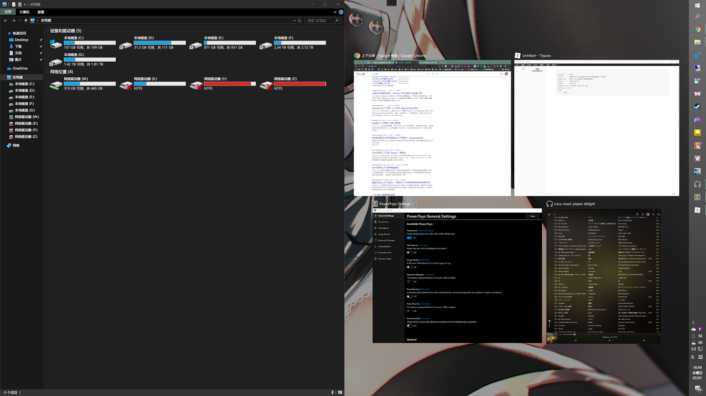
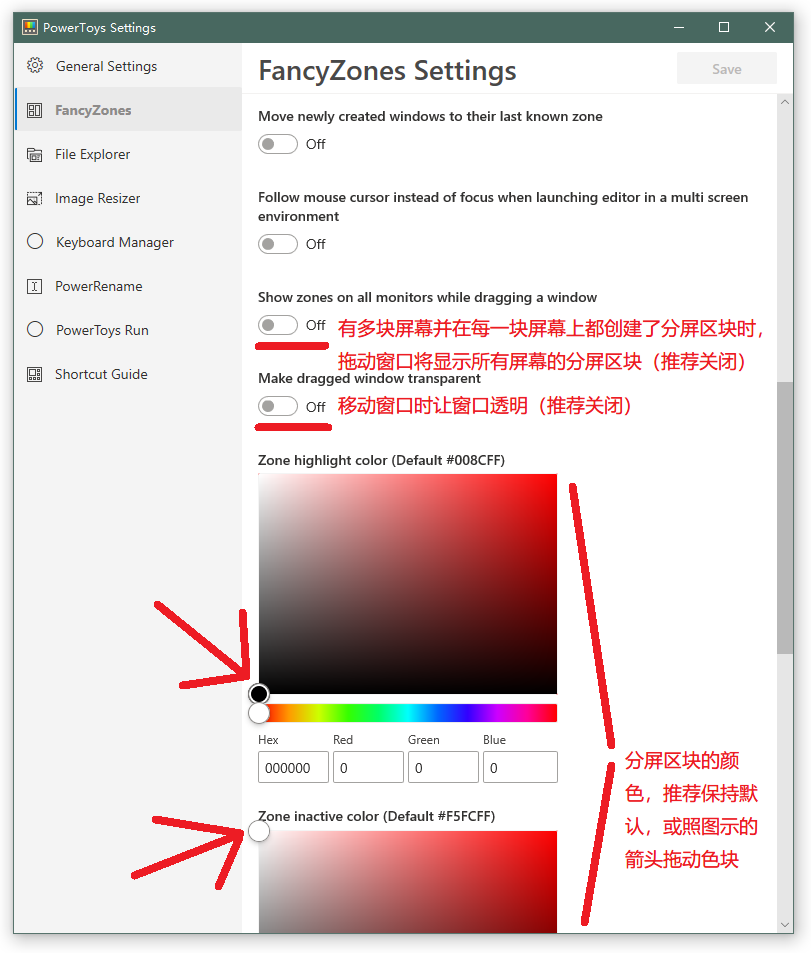

## 利用PowerToys在Windows下实现窗口快速“上下分屏”

https://pockies.github.io/2020/07/02/microsoft-powertoys/

Windows虽名叫“窗子”。

可它默认的“窗口分屏”功能却简陋到了异常：

- 将窗口拖到屏幕的左右边缘，只能实现最基本的**左右二分屏**；
- 屏幕的下边缘由于被任务栏占据，将窗口拖到这里不会触发任何分屏动作，**直接浪费一个触发区；**
- 而“窗口拖到屏幕上边缘”的动作，已经默认被用于触发“窗口最大化”，**又浪费了一个触发区**。

**——Windows也因此完全没法实现一步“上下二分屏”**。

**——而三分屏乃至各种花式分屏，属于想都别想。**

**——因为就连基本的四分屏，都必须借助 `Win+方向键` 的快捷键才能实现。**

在小屏幕+横屏下使用尚能凑合。

可对于带鱼屏/大屏用户，乃至**竖了一块24寸屏幕**当作副屏的我而言——

**仅仅是在竖屏下进行一次“上下分屏”，都需要整整四步+两次快捷键+一次手动调整窗口尺寸的“曲线救国”：**

1. 将想要分屏的窗口拖到目标屏幕；
2. 选中窗口，`win+←`快捷键将窗口分为半屏；
3. 继续选中窗口，`win+↑`将窗口进一步分为1/4屏；
4. 拖动窗口右边缘，手动调整大小，直到铺满上半块屏幕。

**——这已经完全没法用了。**

# 来自巨硬带着爱

既然系统自带不给力，那就得靠万能的第三方想想办法。

**——子曰：“你已经是个成年人了，该学会自己装软件了。”**

在试用了一大堆分屏软件后，我最终选择了[PowerToys](https://github.com/microsoft/PowerToys)，原因无他：

- 界面美观；
- 配置简单；
- 自定义项丰富；
- 更能无缝整合进Windows，只因它**”根苗正红“**的**“田牌”血统**。

**——是的，你没看错。**

点进软件的[Gayhub主页](https://github.com/microsoft/PowerToys)，开发者的名字竟神TM写着**“Microsoft”**。

> [From Microsoft with love](https://github.com/Microsoft).
>
> 来自巨硬带着爱。

——这是一款由**微软亲自部署，亲自开发**的[”合集“性质软件](https://zh.wikipedia.org/wiki/Microsoft_PowerToys)，作用是**扩展自家系统**的高级功能。

且扩展的功能远不止一个“分屏”，堪称丰富：

- FancyZones / 更强大的屏幕分屏；
- File Explorer Add-ons (Preview Panes) / 让资源管理器支持更多文件的预览（如Markdown）；
- Keyboard Manager / 重新分配并自定义windows的默认快捷键；
- PowerRename / 让资源管理器拥有强大的批量重命名功能（支持正则表达式）；
- PowerToys Run / 开启一个类似水果Spotlight的快速搜索框；
- Shortcut Guide / 长按win键，以显示当前窗口支持的快捷键列表。

**“WTF？？？？”**

合着巨硬**也TND知道**自己那破“窗子”功能残缺，甚至自己做了个合集工具来补全。

**还开源在了Gayhub——**

**——而不是通过Windows更新，直接把这些功能整合进系统？？**

.jpg)

**——成年人如我，面对如此风骚操作，也不得不一脸懵逼。**

# PowerToys的分屏教程

正文开始之前必须提醒：

- **软件目前只有英文。**
- **本文将着重介绍软件内的 “FancyZones / 分屏” 功能。**
- **本文将提供“FancyZones / 分屏”功能的部分翻译，并提供育儿级的配置教程。**

如果你对软件的其他功能感兴趣，又看不懂鸟语，请参考/对照[这篇文章](https://zhuanlan.zhihu.com/p/137966563)提供的UI翻译，摸索使用。

#### 基础设置

在[项目页面](https://github.com/Microsoft/powertoys/releases)下载并安装PowerToys。

打开软件的第一页，这里有每一项扩展功能的总开关。

如果你只需要分屏功能（FancyZones ），那最好将`Available PowerToys`下不需要的**功能全部关闭**。

往下滚动会看到`General`项，翻译如图：

**推荐照图配置**，完成配置后点击右上角的`Save`保存。

完成基础设置后，点击左侧列表的`FancyZones`，进入分屏功能的相关设置。

#### 分屏设置

`FancyZones`的**重点功能**翻译如图：

**推荐照图配置**（全部关闭），完成配置后点击右上角的`Save`保存。

部分功能请根据自身习惯，酌情开启。

#### 编辑分屏区块

完成以上设置后，回到这一页的顶部。

点击`Edit zones`，打开**“分屏区块编辑器”**窗口配置你的分屏方式，翻译如下：

**注意：**

- **如果你是多屏用户，这一步请将PowerToys的窗口，拖到你想让PowerToys接管分屏的那块屏幕上，再点击`Edit zones`，这样才能为每块屏幕进行分别的设置。**

软件默认提供了五种窗口排列模式。

根据你的自身需求**选择**，点击`Apply`保存即可开始使用。

效果如图：

而PowerToys为**每一块屏幕**都提供了**最多40个**的分屏区块：

即是说——

**——只要你的屏幕够大，你甚至可以分屏数框框：**

哪怕你对自带的窗口排列方案不满意。

也可以进入“分屏区块编辑器”，点击左下角的`Edit selected lgyout`进行**自定义布局。**

就像这样：

**可以自由调整每个区块的大小，以及添加/删除区块。**

保存即可开始使用。

这里就请各位按照需求，自由发挥了。

PowerToys的分屏教程至此结束。

# 尾巴

#### 双屏下的使用示例

以我个人为例，需求如下：

- 作为主屏幕的32寸横屏，**保持windows的默认分屏方式**；
- 只在24寸的竖屏上，**使用PowerToys实现“上下分屏”**。

所以我在32寸的主显示器上，进行了如下配置：

1. 将分屏的区块数调至最小的“1”；
2. 窗口排列方式选择**“Focus”**；
3. 接着进入**自定义布局**；
4. **删除**仅剩的那个分屏窗口；
5. 保存这个自定义配置。

这样在32寸的主屏上拖拽窗口，将不会调用PowerToys分屏，而是windows默认。

至于24寸的副屏，则直接以默认的**“Rows”**排列方式建立了“上下三分屏”。

最终效果如图：

拖动窗口进目标屏幕即可触发分屏。

而这个“上下三分屏”，实际也并不是**单纯的分三个屏幕**——

**——当你将窗口拖到两个分屏区块之间时，会合并两个区块形成一个2/3屏的大窗口，变成一大一小的上下二分屏。**

- 2/3的高度正合适浏览网页；
- 1/3的高度则正合适播放器。

而当进行多窗口的细碎任务时，自然也能进行三分屏。

这个意料之外的功能不仅令人惊喜，**更实用到了异常。**

**——而触发这一切，只需要简单的动动鼠标，一气呵成！**

这一刻，我不由得湿了，

眼眶。

- 回想我此前使用bug10自带分屏，反复按快捷键并配合鼠标拖拽才**终于实现**仅仅一个窗口分屏的操蛋体验；
- 回想我此前试用了一大堆分屏软件，不是ui丑陋，就是触发费劲，堪称一个比一个烂的坑爹设计。

**——谁能想到，最终完美解决Windows下竖屏“上下分屏”难题的，居然是Microsoft自身。**

> 只有魔法才能击败魔法。

**——也只有巨硬才能完善巨硬本身。**

而PowerToys项目附带的功能，早已包括但不限于“分屏”。

[引用wiki](https://zh.wikipedia.org/wiki/Microsoft_PowerToys)，项目的定义如下：

> **Microsoft PowerToys**是一组[免费](https://zh.wikipedia.org/wiki/免費軟體)的[系统工具](https://zh.wikipedia.org/wiki/系統軟體)软件，由[微软](https://zh.wikipedia.org/wiki/微软)为[Windows](https://zh.wikipedia.org/wiki/Windows)操作系统上的[高级用户](https://zh.wikipedia.org/w/index.php?title=進階使用者&action=edit&redlink=1)设计。
>
> 这些程序为了使生产力达到最高，加入或变更了一些功能，或加入更多自定义选项。

希望未来某天。

PowerToys项目里的实用功能稳定完善，并最终内置进bug10。

毕竟比起印度咖喱翻来覆去为了KPI[瞎几把魔改UI](https://livesino.net/archives/12494.live)，这些真正提高工作效率和使用体验的东西，才是Windows迫切需要的“更新”。

------

倒杯凉水，坐和放宽。

近期完成了桌面硬件升级的我，现在终于完成了软件上的进化。

**——完美解决双屏下分屏难的痛点。**

看着屏幕里纸片美少女几乎“等身大”1：1的紧致大腿与丰满胸部。

——不由得嘴角上扬。

**“啊！爽到！”**