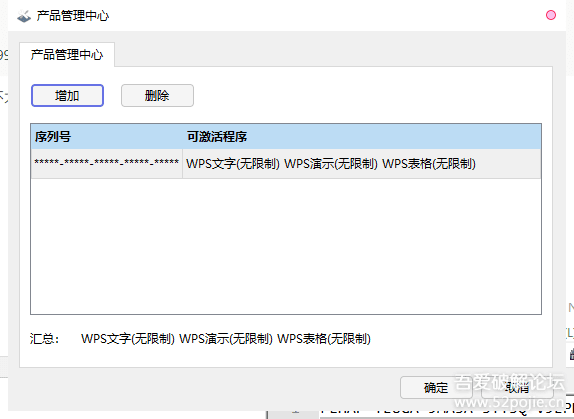

# 解决wps2019专业版密钥失效的分析笔记

https://www.52pojie.cn/thread-1210594-1-1.html

一直在用WPS2019专业版,前段时间发现打字不行,只能复制粘贴.
后来发现密钥过期!

密钥之前说是 永久激活的 694BF-YUDBG-EAR69-BPRGB-ATQXH 重新输入之后 发现确实是无限制的
猜测是软件启动或者进入编辑状态的情况下,对密钥进行了服务器的校验.
于是打开抓包工具,HttpAnalyzerStdV7 抓包发现,当WPS文字进入编辑状态的情况下 触发这个+

> POST /auth/serialNumber HTTP/1.1
> Accept: */*
> Content-Type: application/x-www-form-urlencoded
> User-Agent: Kingsoft client
> Host: cloudservice7.kingsoft-office-service.com
> Cache-Control: no-cache
> Content-Length: 64
>
> serialNumber=694BF-YUDBG-EAR69-BPRGB-ATQXH&platform=PC&deviceId=

> HTTP/1.1 200
> Content-Security-Policy: media-src
> Content-Type: application/json;charset=UTF-8
> Date: Wed, 01 Jul 2020 03:12:48 GMT
> Server: nginx/1.12.1
> Vary: Accept-Encoding
> Vary: Accept-Encoding
> X-Content-Type-Options: nosniff
> X-XSS-Protection: 1; mode=block
> Connection: keep-alive
> Content-Length: 114
>
> {"code":0,"msg":"already expired","data":{"isValid":0,"startTime":1585299998,"endTime":1585299998,"totalTimes":1}}

通过对返回数据的时间戳转换 发现 开始和结束时间 是 2020-03-27 17:06:38 可能是我当时安装的时间,我不太记得了 Msg 提示已经过期.
因为已经过期了,所以先删除许可,重新输入 又提示无限制了
**解决方法1 可以在Hosts加入 127.0.0.1 cloudservice7.kingsoft-office-service.com 解决过期问题.**

但,这不是我们文章的重点,既然,我们已经知道了是通过提交数据进行校验的,那么,接下来,用OD打开WPS 抓包软件不要退出,可以清晰的看到封包什么时候提交的
通过前面测试,得知,新建文档,进行编辑的时候 进行注册码的校验,所以,直接运行wps!
对 WSASend 下断 看下能否拦截到封包信息之类的 
新建一个文档 会断下

esp+0x8对应封包数据指针
我习惯字节形式查看
db [[esp+0x8]+0x4]

按F9放行 看下能否找到 对应的数据
发现新建没有拦截到 等待过程中 发现自动断下 拦截类似数据如下

先记录堆栈,其他都是其次 因为有关系 

发现堆栈中 调用的是 wininet 的API
也就是说WPS通过调用 wininet 实现了一次网页数据的POST提交
可以搜索资料查看一下 wininet 提交数据数据的整个过程
其中 InternetReadFile 是用来读取返回数据的
对这个API下断,重复之前的动作 删除许可 输入许可,重新新建 等待关键

经过新建文档 等待下断之后

117EEDC0  55C57CC4 返回到 acm.55C57CC4 来自 wininet.InternetReadFile
返回上一层 循环下面下断

看到了和抓包数据一致的返回数据

在该函数头部下断 发现了提交的数据,猜测 这个就是用来进行验证的函数
这时候 可以直接对这个函数进行NOP 或者ret 都可以

但是,我们继续,返回上一层 定位到
55C64DF7 |. E8 922DFFFF CALL 55C57B8E ; 这里是访问网页函数
往上找到函数头
55C64D53 /$ 6A 58 PUSH 0x58 ; 函数头部 该函数在 acm.dll 中

操作方法 可以对这个函数头部 进行Ret 或者Nop也可以 自行操作即可
本来附带一些[IDA](https://www.52pojie.cn/thread-675251-1-1.html)分析,但是要吃饭去了:lol

**经过反复测试,我还发现一个很神奇的地方,直接删除  acm.dll 文件也可以实现 授权不过期.**